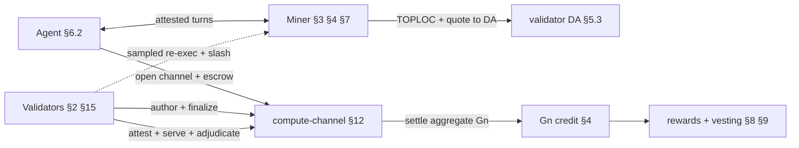
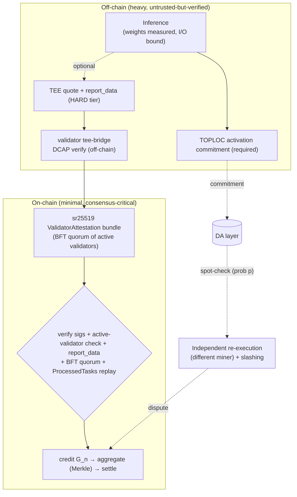
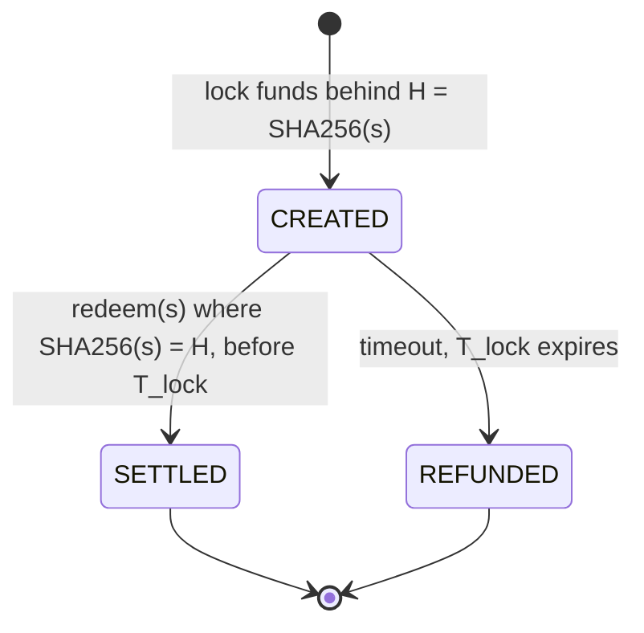

<!-- Published mirror of the FLOP yellowpaper — generated by scripts/publish_yellowpaper.py from flop-labs/flop-core@5faa93d. Do not edit here. -->
> **Published mirror — 0.5 (draft)** (source `flop-core@5faa93d`). This file is generated; corrections are made upstream and re-published. Three publish-time transforms are applied to the spec: Appendix H's `Code path · tracker` column is removed, links into unpublished internal documents (`research/`, `docs/`) are flattened to plain text, and machine-readable `<!-- cite: -->` gate comments are stripped. No normative text is altered. Tracker references of the form `#NNN` point at FLOP's internal engineering tracker, not at issues in this repository. Feedback: open an issue.

<div class="cover">
  <p class="kicker">FLOP Network · Yellow Paper</p>
  <h1 class="mission">Normative specification of the <em>FLOP protocol</em>.</h1>
  <div class="meta">
    <span>Version<b>0.5 (draft)</b></span>
    <span>Status<b>Implementation spec — iterating</b></span>
    <span>Updated<b>2026-07-23</b></span>
  </div>
</div>

> The **implementation specification** of the FLOP Network: notation, message and storage formats,
> extrinsic interfaces, state machines, algorithms, and protocol invariants. This is the authoritative
> reference an implementer builds against. It is the math/spec companion to the
> Whitepaper (conceptual) and Litepaper (overview).
>
> **How to read this document — see [§0](#0-conformance--reading-guide) first.** The section bodies are
> **normative** and describe the *target protocol* using RFC 2119 keywords (**MUST**/**SHOULD**/**MAY**).
> Everything an implementer needs to satisfy conformance lives in the numbered sections and in
> Appendices A (parameters), F (message & storage formats), and G (extrinsic index). Everything that is
> *not* a requirement — design rationale, decision provenance, prior art, formal-proof citations — is
> confined to the **Rationale & sources** trailer at the end of each section, and to Appendix B.
> **Implementation status** (what is built vs. designed) is *not* carried in the normative body; it lives
> in one place, the [Conformance & Status Matrix (Appendix H)](#appendix-h--conformance--implementation-status-matrix).
> **Unresolved values/mechanisms** are numbered stubs in
> [Appendix E — Open Specification Items](#appendix-e--open-specification-items); the body references a
> stub rather than restating an open debate.
>
> **Decision provenance.** Ratified positions are recorded once in
> [`decisions/v0.4.md`](decisions/v0.4.md) (`D-04xx`, MADR-shaped, immutable once merged, superseded by
> ID in later versions). Where a normative rule cites a `D-id`, the citation is *provenance only* — the
> rule itself is stated in full in the body; the reader never needs the decision record to implement.

---

## 0. Conformance & Reading Guide

**Normative keywords.** The keywords **MUST**, **MUST NOT**, **REQUIRED**, **SHALL**, **SHALL NOT**,
**SHOULD**, **SHOULD NOT**, **RECOMMENDED**, **MAY**, and **OPTIONAL** are to be interpreted as in
RFC 2119 / RFC 8174 when, and only when, they appear in capitals. Lower-case uses carry no normative
weight. A statement with no keyword is descriptive context, not a requirement.

**What is normative.** The numbered section bodies (§1–§15), Appendix A (Parameter Reference),
Appendix F (Message & Storage Formats), and Appendix G (Extrinsic Index) are normative. Appendices B
(Sources), C (Miner Lifecycle — a worked walkthrough), D (Fee & Revenue Map — a derived summary),
E (Open Items), and H (Conformance & Status Matrix) are informative except where they restate a
normative rule and cite its home section.

**Section skeleton.** Each protocol section is organized as:
1. **Requirements** — the normative rules (MUST/SHOULD/MAY).
2. **Data structures** — field · type · encoding · constraint (or a pointer into Appendix F).
3. **Interfaces** — extrinsics/functions: signature · origin · preconditions · errors · events (or a
   pointer into Appendix G).
4. **State machine** — states and a transition table, where the section defines one.
5. **Rationale & sources** *(non-normative)* — why the design is as it is, decision IDs, prior art, and
   formal-proof citations. An implementer MAY ignore this trailer.

Not every section needs every part; a part is present only where it carries content.

**Reading the parameters.** Every protocol constant is named in Appendix A, which is generated from
`params/flop-protocol-params.yaml` (the single machine-checked source, gated by
`scripts/check_params.py`). A parameter named in the body links to its row as
[`param_name`](#param-param_name). Concrete figures appearing inline are worked examples; the value of
record is always Appendix A.

**Implementation status is out of band.** This specification describes the protocol FLOP targets, not a
snapshot of the codebase. The build state of each requirement — implemented, in progress, or designed —
is tracked only in [Appendix H](#appendix-h--conformance--implementation-status-matrix), together with
the code path and any tracking issue. The body contains no `[LIVE]`/`[PARTIAL]`/`[PLANNED]` tags and no
commit/PR references, so a requirement's wording does not change as code lands.

**Trust-domain principle.** FLOP's verification architecture rests on an explicit rule that recurs
throughout §3, §7, §11, and §12: **a fallback verification layer MUST occupy a different trust domain
from the fast path it backs.** In particular, protocol soundness **MUST NOT** rest on any single
hardware root of trust. TEE attestation is one assurance tier (§3.3) and is **OPTIONAL**, not a
precondition for participation or settlement; the mandatory execution-integrity floor is the
TEE-independent stack of activation commitments, sampled re-execution, and slashing (§3.4–§3.5). This is
ratified as `D-0432`; the non-TEE (SOFT) tier's end-to-end definition is the open item
[E.33](#appendix-e--open-specification-items).

**Terminology and clocks.** §1 fixes the notation, the role glossary, and the canonical protocol-clock
table with its coupling invariants. All durations assume 1-second blocks.

### 0.1 System architecture (informative reading map)

FLOP is a **verified-inference settlement layer**: a Substrate/FRAME chain where autonomous agents pay
miners for attested inference, validators finalize and police it, and the token economy is gated on
*useful, verified, demanded* work. The actors:

| Actor | Does | Specified in |
|-------|------|--------------|
| **Agent** | opens sessions, pays escrow, consumes inference; often a capped delegate | §6.2, §12 |
| **Miner** | runs the model, streams attested turns, earns settlement + work-gated rewards | §3, §4, §7, §8, §12 |
| **Validator** | authors (BABE) + finalizes (AlephBFT), attests proofs, hosts DA | §2, §3.6, §5.3, §15 |
| **Publisher** | registers a model + its measured root; leases weight storage | §3.3, §5.3 |
| **Delegator** | backs a miner/validator stake for a reward share | §6.1, §15 |

**End-to-end happy path** (one paid session):



**How the sections compose** (what each depends on):

- **§2 Consensus** is the base: BABE authors, AlephBFT finalizes. Every irreversible action anywhere
  reads its **finalized prefix** — settlement (§12), HTLC refund (§10), slashing (§11), DA prune (§5.3).
- **§15 Validators** is the staked set that *runs* §2, performs §3.6 attestation, and hosts §5.3 DA;
  its committee gate (§2.3) needs §3's verified-work signal.
- **§7 Calibration** produces `B_p` / serving caps consumed by **§4 metering**, **§6.1 miner stake**,
  **§8 vesting**, and the **§11** settlement gate.
- **§3 Verification** decides *what may be credited*; it consumes §7 caps, §5.3 DA (evidence), and §12
  transcripts. **§4 Metering** defines the `G_n` unit that §8, §9, §11, and §12 all key on.
- **§12 Sessions** is the settlement hot path — it reads §2 finality, §3 verification, §4 `G_n`, §5.3
  DA, §7 caps — and feeds §8/§9 (economics). **§5.3 DA** stores the evidence §3/§12 disputes fetch.
- **§9 Emission / §8 Vesting** are the economic outputs, gated on demanded+verified §4 work; **§10 HTLC**
  moves value cross-chain in/out. **§14 Governance** controls parameters/upgrades over all of the above.
- **§11 Invariants** and **§13 Failure semantics** cross-cut every section; **§6** supplies the
  accounts, keys, and escrow primitive the whole system is built on (crypto/accounts: §6.5).

Appendices are reference surfaces: **A** parameters · **F** message/storage formats · **G** extrinsics ·
**H** conformance/status · **I** runtime composition (pallet indices). A companion
`yellowpaper-attribution.md` maps each requirement to its proof + code.

---

## 1. Notation, Conventions & Glossary

Quantities are exact integers on-chain unless noted; rationals use fixed-point (parts-per-million,
`ppm`, or parts-per-thousand, `ppt`). FLOP balances carry 18 decimals; `VFY` denotes the 10¹⁸ base-unit
constant (1 VFY = 1 FLOP). `‖` denotes concatenation; `SHA256` and `blake2_256` denote the respective
32-byte hashes.

### 1.1 Glossary — roles vs software

A **node** is software; every other term below is a *staked or delegated role*. Validators and miners
each run a node plus role-specific services. The terms are used in exactly these senses throughout.

| Term | Definition |
|------|-----------|
| **Node** | The software process (`relay-node` / `zkv-service` + role services). Not a role: both validators and miners run nodes. |
| **Validator** | Staked consensus role: authors blocks (BABE), runs BFT finality on a per-session committee (§2), stores and serves DA shards under serve-or-slash (§5), and attests miners' proofs (§3.6). Earns the validator block-reward share. Minimum self-stake per Appendix A ([`validator_min_stake`](#param-validator_min_stake), compounding; value-coupled floor `max(baseline, k·V_booked)`). |
| **Miner** (compute provider) | Staked compute role: executes inference and earns session-settlement revenue plus work-gated rewards (§4, §8). Minimum self-stake [`min_miner_self_stake`](#param-min_miner_self_stake) plus a capacity-proportional term (§6.1). *Nothing is "mined"; the name is colloquial.* |
| **Agent** | The compute consumer: an autonomous account (often delegated via session keys, §6.2) that opens sessions, pays fees, and holds FLOP. |
| **Validator Leader** | Rotating per-epoch sub-role of a validator: issues encrypted Ghost Tasks (§8.1). Not a distinct stake or a permanent privilege. |
| **Delegator** | FLOP holder backing a validator's or miner's stake for a share of its rewards (miners: ≤10× self-stake). |
| **Publisher** | Account that registers a model: pays the weights-storage lease deposit and the registry deposit; need not be the model's author. |

*Attestation authority.* There is **no separate oracle role.** Active validators verify TEE quotes
off-chain and submit signed `ValidatorAttestation` bundles; a BFT quorum of active validators
(§3.6, §13.3) is the on-chain attestation authority.

| Symbol | Definition |
|--------|-----------|
| `F_eff` | **Effective-FLOPs** — op-count of the *actual* execution; the unit of work. |
| `G_n` | `F_eff / 10⁹`; the metered/billed unit. |
| `P`, `P_active`, `N`, `n_ctx`, `d` | params; active params (MoE); tokens generated; context length; hidden dim. |
| `G_n_max`, `B_p`, `R_p`, `E_c` | calibration max; Pledge Baseline; Pledge Ratio `G_n/B_p`; Efficiency Coefficient. |
| `model_hash` | **measured** commitment to loaded weights (dm-verity Merkle root). |
| `report_data` | TEE-quote binding preimage (Appendix F): `SHA256(task_hash ‖ gn_weight ‖ latency_ms ‖ model_hash ‖ output_hash ‖ decode_policy_hash ‖ tee_type)`. |
| `output_hash` | commitment to the inference output, bound into `report_data` and the signed `ValidatorAttestation`. |
| `task_hash` | `blake2_256(agent ‖ nonce ‖ model_hash ‖ payload_hash ‖ commit_hash)`. |
| `p` | challenge sampling probability (optimistic verification). |
| `H`, `s`, `T_lock` | Hashlock `SHA256(s)`; preimage; HTLC timelock. |

### 1.2 Protocol clocks — canonical table

Every time constant that a security argument depends on, in one place. **Coupling invariants** are the
rules that keep the clocks consistent; enforced couplings are checked in code, principled ones are
review rules. All durations assume 1-second blocks. Values of record are in Appendix A.

| Clock | Value | What it clocks | Coupling / invariant |
|---|---|---|---|
| Block time | **1 s** (BABE authoring) | inclusion, weight budgets | — |
| Finality | AlephBFT, seconds behind head | every irreversible action (payout, expiry, slash, prune) reads `FinalizedPrefix`, never the tip | **a finality stall MUST freeze economic deadlines by construction** (§13 F1); operational clocks may continue only when they release no funds |
| Epoch / committee rotation | **1 h** prod (`EpochDurationInBlocks`; 1 min fast-dev) | BABE randomness epoch; `pallet_aleph` re-snapshots the PoUI-gated finality committee each epoch | hourly rotation gives 8,760 draws/yr; couples committee-capture bound to eligible-set concentration (§15) |
| PoUI rate-limit epoch | **1 day** ([`poui_max_submissions_epoch`](#param-poui_max_submissions_epoch) window) | per-miner submission rate reset | — |
| `force_open` ack window | **~10 min** ([`channel_ack_window_blocks`](#param-channel_ack_window_blocks) = 600) | miner ratification of a permissionless open | missed ack ⇒ reputation, not slash; dust floor gates the counter |
| Dispute response window | **~2 h** ([`channel_dispute_response_window_blocks`](#param-channel_dispute_response_window_blocks) = 7,200) | miner's window to answer a named contested turn | miss ⇒ fraud default |
| Attestation-outage pause cap | **4 h** (14,400 blocks) | max per-channel pause of attestation-dependent clocks (§13 O1) | scoped pause, never a global halt |
| Calibration burst | **10 min** ([`calibration_min_burst_blocks`](#param-calibration_min_burst_blocks) = 600) | miner aggregate-host entry measurement | active renewable cap gates serving (§7) |
| Challenge / dispute window | **7 days** ([`channel_dispute_window_blocks`](#param-channel_dispute_window_blocks) = 604,800) | force-settle contestation | **MUST be ≤ DA retention** — enforced by `integrity_test` at build time. Covers time-to-*open* only; a rightsize to ~1 d is analysed and deferred |
| Miner unbonding | **7 days** ([`miner_unbonding_blocks`](#param-miner_unbonding_blocks)) | miner stake exit | blocked while sessions/disputes active; MUST be ≥ dispute window so stake outlives contestation |
| DA retention (Ephemeral) | **14 days** ([`da_ephemeral_retention_blocks`](#param-da_ephemeral_retention_blocks)) | transcript/quote retrievability | **MUST be ≥ challenge window** (enforced); loss beyond threshold ⇒ degraded fail-closed refund, no default verdict (§13.0) |
| Checkpoints | **daily**; light-client freshness **21 days** | weak-subjectivity anchors | high-value exits SHOULD cool until the next checkpoint (§15) |
| Validator unbonding | **21 days** ([`validator_unbonding_blocks`](#param-validator_unbonding_blocks)) | validator/delegator stake exit | any governance change raising obligations SHOULD have enactment delay ≥ this (E.9) |
| Session key lifetime | **≤ 10 days** (`SessionKeysMaxDuration = 864,000` blocks at 1 s) | delegated agent authority | budget + pallet-scope bound the blast radius. *(The "60 day" figure in some code comments is a stale 6 s-block reading; see [`session_key_expiry_days`](#param-session_key_expiry_days).)* |
| Halving era | **~730 days** ([`halving_interval_blocks`](#param-halving_interval_blocks); 5 halvings + floor) | emission steps; the Labs/Foundation subsidy halves with the reward and terminates at the era-5 floor | per-halving anti-exodus boundary conditions hedge the 96→48 participant step |

**Reading rule (normative review gate).** A shorter clock **MUST NOT** be able to strand a longer one it
secures: disputes fit inside retention, stake outlives disputes, checkpoints outlive exits, enactment
outlives unbonding. Any change to one of these values MUST re-check the coupling column.

### 1.3 Acronyms & technical terms

Every acronym and non-obvious technical term used in this spec, expanded once. Protocol-internal
identifiers (`open_channel`, `report_data`, …) are defined at their point of use and in Appendices F–G;
the roles/symbols are §1.1.

**Consensus & runtime**

| Term | Expansion / meaning |
|------|--------------------|
| **BABE** | *Blind Assignment for Blockchain Extension* — the Substrate slot-based block-authoring engine |
| **AlephBFT** | the asynchronous BFT atomic-broadcast finality protocol FLOP adopts (Aleph, AFT 2019) |
| **BFT** | *Byzantine Fault Tolerant/Tolerance* — safety under `< ¼` malicious stake here |
| **DAG** | *Directed Acyclic Graph* — the unit graph a committee orders |
| **BFT-DAG** | a DAG ordered by a Byzantine-agreement protocol (deterministic finality) |
| **VRF** | *Verifiable Random Function* — the BABE epoch randomness seeding committee sampling |
| **FRAME** | Substrate's runtime framework (the pallet/runtime programming model); the execution/state layer |
| **WASM** | *WebAssembly* — the on-chain runtime bytecode swapped by `set_code` |
| **SCALE** | Substrate's canonical binary codec for storage/extrinsic payloads |
| **Perbill** | Substrate parts-per-billion fixed-point type (e.g. the attestation threshold) |
| **RPC / P2P** | remote-procedure-call interface / peer-to-peer networking |
| **FinalizedPrefix** | the engine-agnostic interface exposing the AlephBFT-finalized block prefix |

**PoUI & verification**

| Term | Expansion / meaning |
|------|--------------------|
| **PoUI** | *Proof of Useful Inference* — FLOP's work-verification/reward mechanism |
| **TEE** | *Trusted Execution Environment* — hardware-isolated confidential execution (optional HARD tier, §3.3) |
| **CC** | *Confidential Computing* — NVIDIA GPU CC mode (VRAM encryption + attestation) |
| **CVM** | *Confidential Virtual Machine* — the attested host VM |
| **TDX** | *Intel Trust Domain Extensions* — the host CPU TEE |
| **DCAP** | *Data Center Attestation Primitives* — Intel's quote-verification stack (`dcap-qvl` = its verify library) |
| **dstack** | the confidential-computing attestation/verifier stack the runtime uses on-chain |
| **MRTD / RTMR** | *Measurement of Root of Trust for Domain* / *Runtime Measurement Registers* (RTMR0–3) in a TDX quote |
| **dm-verity** | Linux device-mapper block-integrity target; its Merkle root is the measured `model_hash` |
| **EROFS** | *Enhanced Read-Only File System* — the packed read-only weight image dm-verity protects |
| **VRAM** | GPU video memory (encrypted under CC) |
| **TOPLOC** | the activation-commitment verification scheme (arXiv:2501.16007); the mandatory Tier-2 floor |
| **RA-TLS** | *Remote-Attestation TLS* — the attested transport binding a session to an enclave key |
| **ZK / zkVerify** | *Zero-Knowledge* proofs / the settlement proof-aggregation layer (Groth16/PLONK/STARK/RISC0/EZKL verifiers) |
| **GEMM** | *General Matrix Multiply* — the re-executed leaf in Freivalds-spot-checked disputes |
| **Freivalds** | Freivalds' `O(n²)` probabilistic matrix-product verification |
| **KAT** | *Known-Answer Test* — pinning the op-count engine against analytic counts |
| **SDC** | *Silent Data Corruption* — undetected hardware compute errors (a drift signature) |
| **MLPerf** | the industry ML benchmark suite (the plausibility-ceiling reference) |
| **CUPTI / DCGM / nvml** | NVIDIA CUDA-profiling / data-center-GPU-manager / management-library counters read in-enclave |
| **MoE** | *Mixture of Experts* — models billed on *active* params |
| **LLM** | *Large Language Model* |
| **QKV / FFN** | attention Query/Key/Value projections / transformer Feed-Forward Network (op-count terms) |
| **FP16 / INT8 / INT4** | 16-bit floating-point / 8- / 4-bit integer numeric precisions |
| **SKU** | *Stock-Keeping Unit* — here, a specific attested GPU model (the HARD-tier ceiling) |
| **EWMA** | *Exponentially-Weighted Moving Average* — the drift/latency baseline |
| **SLA** | *Service-Level Agreement* — session latency policy |

**Data availability & storage**

| Term | Expansion / meaning |
|------|--------------------|
| **DA** | *Data Availability* — the sovereign validator-hosted storage layer (§5.3) |
| **RS / Reed–Solomon** | the rate-½ erasure code (`R`=6 shards, any `k`=3 reconstruct) |
| **Merkle** | Merkle hash tree/root (transcript accumulator, dm-verity, aggregation) |
| **SHA256 / blake2_256 / keccak256** | the 32-byte hash functions used for binding / identity / aggregation |
| **Ghost Task** | encrypted fixed-seed known-answer canary task (liveness + correctness + demand floor, §8.1) |

**Economics, governance & crypto**

| Term | Expansion / meaning |
|------|--------------------|
| **HTLC** | *Hashed Timelock Contract* — the atomic-swap primitive (§10); **MAD-HTLC** is the fee-bribery attack model |
| **MEV** | *Maximal Extractable Value* — ordering/timing value extraction (here, MEV-on-compute) |
| **FIP** | *FLOP Improvement Proposal* — a numbered off-chain design doc bound to a referendum |
| **OpenGov** | the Substrate/Polkadot on-chain governance framework FLOP adopts |
| **MADR** | *Markdown Architectural Decision Record* — the format of the `D-04xx` decision log |
| **FOCIL** | *Fork-Choice-enforced Inclusion Lists* (EIP-7805) — the anti-censorship approach for V6 |
| **TUF** | *The Update Framework* — the supply-chain provenance model for model publishing (P3) |
| **TWAP / BOM / EV** | *Time-Weighted Average Price* / *Bill of Materials* / *Expected Value* |
| **UCAN** | *User-Controlled Authorization Networks* — the attenuable-capability model (future §6.4 layer) |
| **PQ** | *Post-Quantum* — cryptography out of scope until a PQ primitive is on the roadmap (§12.4) |
| **sr25519 / ed25519 / secp256k1** | signature schemes (chain / NEAR / Bitcoin-NEAR-MPC respectively) |
| **SS58** | the Substrate account-address format (`flop_account = SS58(derived_pubkey)`) |
| **NEP-141** | the NEAR fungible-token standard (bridged assets settle via the same HTLC) |
| **MPC / MITM / P2SH** | *Multi-Party Computation* / *Man-in-the-Middle* / Bitcoin *Pay-to-Script-Hash* |

**Threat-model frameworks (referenced, not defined here):** OWASP Agentic Top-10, ATFAA, STRIDE, and
MITRE ATLAS are external catalogues cited in §12.3.

---

## 2. Consensus

FLOP's consensus is a **stake-based BFT-DAG (AlephBFT class)** under the Substrate/FRAME runtime: a
stake-weighted, PoUI-gated committee produces a DAG of units ordered with **deterministic, sub-second
BFT finality**. **BABE authors blocks; AlephBFT finalizes them** — GRANDPA (Substrate's default finality
gadget) is not used.

### 2.1 Requirements

- **R2.1 — Block authoring.** Blocks **MUST** be authored by BABE at a fixed **1 s** interval.
- **R2.2 — Finality.** A block **MUST** be treated as irreversible only once it is within the AlephBFT
  finalized prefix. Every fund-releasing, expiry, slashing, or pruning action **MUST** read the
  finalized prefix via `hp_consensus::FinalizedPrefix` (AlephBFT-backed through
  `pallet_aleph::LastFinalized`), never the chain tip.
- **R2.3 — Byzantine tolerance.** Safety **MUST** hold while Byzantine committee **stake** is `< ¼`.
- **R2.4 — Committee gate.** Finality-committee membership **MUST** be restricted to the PoUI-gated set:
  stake at or above the effective minimum **and** recent verified PoUI work
  (`hp_consensus::select_committee`; §2.3, §15.4).
- **R2.5 — Committee size.** The finalizing committee **MUST** be a stake-weighted random sample of
  [`finality_committee_size`](#param-finality_committee_size) distinct members drawn without replacement
  from the eligible set, seeded by BABE-VRF epoch randomness (§15.4).
- **R2.6 — Engine isolation.** Finality-assuming pallets **MUST** depend only on the
  `hp_consensus::FinalizedPrefix` interface, so the finality engine can be swapped without touching
  them. FRAME **MUST** remain the sole execution/state layer.
- **R2.7 — Byte budget.** Block admission **MUST** respect the propagation-bound effective byte budget
  (§5.2); larger blocks inflate finality latency under a BFT-DAG and are not permitted to buy
  throughput.

### 2.2 Target parameters

| Parameter | Value |
|-----------|-------|
| Block interval | 1 second (fixed) |
| Finality | deterministic BFT, sub-second (AlephBFT; BABE authors 1 s blocks) |
| Byzantine tolerance | `< ¼` committee **stake** (BFT) |
| Committee selection | PoUI-gated: stake + verified work (`hp_consensus::select_committee`) |
| Committee size | [`finality_committee_size`](#param-finality_committee_size) = 100 |
| Block byte budget | ~125 KB effective/block (propagation-bound; §5.2) |

The committee cap of 100 is cost-derived. At the original 1.5 FLOP floor the validator reward pool
sustained ~112 bare-metal validators, which is where the cap of 100 was sized. D-0436 doubled the
floor to 3 FLOP/block, so that pool now sustains **~224**: the cap sits roughly 2.2x inside the
ceiling rather than at it, and validator cost is no longer the binding constraint on committee size.

### 2.3 Safety — the three sub-proofs

PoUI gates production on **stake + verified useful work**, not hashpower, so a longest-chain Nakamoto
safety theorem does not apply and **MUST NOT** be relied upon. Safety instead decomposes into three
independent sub-proofs, each in its own trust domain:

1. **Sybil cost.** Each committee identity costs a stake bond + attested silicon (where claimed) + an
   accepted calibration cap plus background Ghost-Task exposure (§2.4). This bounds the stake an
   adversary can amass per unit capital and underwrites the honest-stake premise of (2).
2. **BFT ordering safety under honest stake.** Given `< ¼` Byzantine committee stake, AlephBFT
   atomic broadcast guarantees agreement + total order with deterministic finality (adopted unchanged
   from the AlephBFT result; not re-proven here). The committee is the PoUI-gated set, so (1) supplies
   its honest-stake premise.
3. **Useful-work integrity.** Committee eligibility requires recent *verified* PoUI work
   (`OnProofVerified` recency), and rewards/settlement are gated by the tiered verification stack (§3).
   This is what prevents "stake without honest work" from capturing the committee or minting unearned
   rewards.

The probabilistic bridge from committee-capture bounds to the deterministic finality premise is the
BABE-VRF sampling argument of §15.4; the residual trusted leg is BABE-VRF seed unbiasability.

### 2.4 Sybil model — safety sub-proof (1)

With production gated by **stake + attested hardware** (not hashpower), a Sybil is *many identities*
seeking extra reward, voting weight, or penalty-dodging. Per-identity cost is a **triple moat**:

```
Sybil cost(N identities) = N · (stake bond ≥ min_miner_self_stake)
                         + N · (genuine attested silicon, where a HARD/TEE cap is claimed)
                         + N · (accepted burst cap + background Ghost-Task exposure)
```

Residual attacks and required mitigations:

| Attack | Mitigation (normative) |
|--------|------------------------|
| **Stake-splitting** (cap per-identity downside) | per-identity slashing + [`min_miner_self_stake`](#param-min_miner_self_stake) self-stake floor |
| **Hardware time-slicing** (one device across identities) | identity **MUST** bind to a *unique* device measurement in the quote (HARD tier) **and** encrypted Ghost-Task liveness (§8.1): a sliced device cannot answer simultaneous challenges on two identities |
| **Collusion / weight-copying pools** | independent re-execution (§3.5); reward only the first valid attestation |

*The triple moat's TEE term is decisive **for the HARD tier**, where an identity is bound to a distinct
attested device. A SOFT (non-TEE) identity is instead bounded by stake + calibration + spot-check
exposure; its per-identity demand-floor exclusion is E.33.*

### Rationale & sources *(non-normative)*

Consensus is the ratified stake-BFT-DAG (Q1 = D2). The choice within DAGs is the finality model:
GHOSTDAG buys throughput at the cost of probabilistic finality and an honest-*hashpower* assumption,
which PoUI removes; a BFT-DAG orders the DAG with Byzantine agreement so the committed prefix is
irreversible at commit under `< ¼` Byzantine *stake* — the model consistent with PoUI's stake basis and
the only DAG option with a direct FRAME precedent (Aleph Zero). The prior PoW-GHOSTDAG fork was deleted
(unintegrated; its safety proof void under PoUI). Prior art: the BABE-authors / AlephBFT-finalizes split
is the availability-finality (Ebb-and-Flow, arXiv:2009.04987) resolution; AlephBFT
(arXiv:1908.05156 / 2312.14506) supplies expected-constant-round asynchronous agreement; deterministic
BFT in a block DAG (arXiv:2102.09594; Shoal++ arXiv:2405.20488; Lemonshark arXiv:2604.03974). The
decomposition is confirmed by results that a non-PoW longest-chain rule can be insecure
(arXiv:2505.14891) and that optimization-PoUW inherits PoW's honest-majority need (arXiv:2405.19027) —
both avoided by not using a longest-chain rule.

Written sub-proofs: `q14-sybil-cost-proof.md`,
`q14-bft-ordering-safety.md`,
`q14-useful-work-integrity.md`; options analysis
consensus-runtime-composition.md; implementation record
alephbft-integration-plan.md; Sybil cost model
`sybil-mitigation.qnt`. The committee-sampling
risk bridge is machine-checked in
`FlopSpecs/CommitteeSampling.lean`.
Provenance: `D-0401`. Status: [Appendix H](#appendix-h--conformance--implementation-status-matrix).

---

## 3. Proof of Useful Inference — Verification Architecture

PoUI answers: *did a miner execute the claimed inference (this model, this output) using the claimed
compute, or spoof a cheaper one?* No single primitive does this cheaply, so FLOP uses a **tiered hybrid**
whose central rule is that **the fallback layer occupies a different trust domain from the fast path**
(§0). ZK-proving the forward pass is out of scope: prover cost scales with proven FLOPs at 10³–10⁶×
blowup — **prove a *cheap* check, never the forward pass.**

### 3.1 Requirements

- **R3.1 — Execution-integrity floor (TEE-independent, mandatory).** Every settled session **MUST**
  carry a TOPLOC activation commitment (§3.4) over its turns. Missing required evidence **MUST** fail
  settlement closed; there is no TOPLOC-less settlement lane.
- **R3.2 — TEE is optional.** A TEE attestation (§3.3) **MAY** back a session and, where present,
  raises its assurance tier (HARD) and its permitted value cap. Protocol soundness **MUST NOT** depend
  on TEE integrity: the composed verifier **MUST** retain full soundness even under a forged/broken TEE
  quote. A non-TEE (SOFT) miner class is a first-class participant (`D-0432`; its end-to-end definition
  is the open item [E.33](#appendix-e--open-specification-items)).
- **R3.3 — Independent re-execution.** Security against a compromised fast path **MUST** come from
  optimistic re-execution in a different trust domain (§3.5), bonded so that `penalty · p > max gain`.
- **R3.4 — Settlement gate.** Crediting on the direct PoUI proof rail **MUST** require a BFT quorum of
  distinct active validators (§3.6): `ceil(active_count × validator_attestation_threshold).max(1)`.
- **R3.5 — Binding.** An accepted proof/attestation **MUST** bind, at minimum, `task_hash`, the metered
  `gn_weight`, the measured `model_hash`, and the `output_hash`; a mismatch on any bound field **MUST**
  reject (`OutputHashMismatch` / root mismatch).
- **R3.6 — Replay.** Each `task_hash` **MUST** be creditable at most once (`ProcessedTasks` guard).

### 3.2 The verification stack



| Tier | Buys you | Mandatory? |
|------|----------|-----------|
| 1 — TEE-attested deterministic execution | genuine HW environment + measured model/I-O binding; unlocks the HARD assurance tier and higher value caps | **Optional** (R3.2) |
| 2 — TOPLOC activation commitment | cheap *detection* of model/prompt/precision/decode swap | **Required for all sessions** (R3.1) |
| 3 — Independent optimistic re-execution + slashing / session dispute game | the real defense vs. a compromised fast path | **Required** (R3.3) |
| 4 — On-chain settlement + ZK aggregation + validator BFT quorum | succinct finalization under decentralized attestation | **Required** (R3.4) |

### 3.3 Tier 1 — TEE attestation & measuring `model_hash` *(optional / HARD tier)*

Where a session runs under confidential computing, NVIDIA CC (H100/H200/Blackwell) + an Intel TDX host
CVM attest a genuine device, CC-mode/VRAM encryption, and firmware/RTMR measurements; the host quote
(MRTD, RTMR0-3, `report_data`) is checked by DCAP / `dcap-qvl`. The attestation proves the *environment*,
**not which model ran** — so it never substitutes for the Tier-2/3 floor.

**Measuring `model_hash`.** When a TEE session claims a model, the commitment to the loaded weights
**MUST** be a *measured* dm-verity Merkle root, not a passed-in checksum:

1. Pack all weight shards + index + config into one read-only EROFS image with a dm-verity Merkle tree
   (4 KB blocks). The **root hash** is the commitment; the kernel verifies every block on read and
   faults on mismatch, so the engine can only read the committed weights. The reproducible packer is
   `[tools/modelpack]`.
2. The miner CVM **MUST** extend the root into RTMR3 (or measure it via kernel cmdline into MRTD) so it
   appears in the signed quote and flows into `report_data`.
3. The chain stores expected roots per `(model, precision)` in `pallet_model_registry` and **MUST**
   accept a TEE proof only if the quote's measured root ∈ registry (fail-closed `Vk::V3`; the dstack
   verifier parses the TDX event log, replays it to the quote's RTMR3, and requires the registry root
   among the RTMR3 events). Quantization changes the bytes → changes the root, so each precision variant
   is a distinct commitment (consistent with TOPLOC precision detection).

**Output binding.** `report_data` **MUST** also commit `output_hash`; the validator **MUST** reject a
mismatch. **Decode-policy binding.** `report_data` **MUST** commit `decode_policy_hash` — a canonical
digest over `greedy`/temperature/top-p/top-k/seed plus transform id. Governance **MAY** pin a model to
an allowed decode-policy set in the registry (≤ [`max_decode_policies_per_model`](#param-max_decode_policies_per_model));
absent a pin, policy rollout is unblocked. The full binding preimage is in
[Appendix F](#appendix-f--message--storage-formats).

### 3.4 Tier 2 — TOPLOC activation commitments *(mandatory floor)*

TOPLOC commits the top-128 values+indices of each token's last hidden state, polynomial-encoded to
~258 bytes / 32 tokens. A verifier re-executes a single prefill and compares exponent intersections then
mantissa error against a per-`(model, precision)` governance-calibrated band.

- **R3.4a.** A TOPLOC commitment **MUST** be present for every session (R3.1) and published to DA to
  feed Tier 3.
- **R3.4b.** Band adjudication **MUST** be fail-closed per `(model, precision, backend, GPU)` cell: until
  a cell's hetero-hardware activation gate passes, the cell is commitment-required but adjudication-inert
  (no silent accept). The two-threshold policy is accept / escalate / slash; a middle *escalate* verdict
  **MUST** route to the escalation lifecycle within
  [`channel_toploc_escalation_window_blocks`](#param-channel_toploc_escalation_window_blocks), never to
  silent accept.
- **R3.4c.** TOPLOC detects unauthorized model/precision/prompt/decode/numerical substitution
  (execution substitution = disputable fraud). Answer **quality** is **out of protocol scope** — a
  market/reputation remedy, never a protocol fraud verdict. This boundary is normative.

The tolerance band is *derived* (a computable honest-divergence upper bound from layer condition numbers
+ unit roundoff, plus a secret-challenge-projection bound against adaptive adversaries); the committed
per-cell constants (`kappa_profile_hash`, `band_tau_accept`, `band_tau_slash`, …) are in Appendix A.
**Soundness under a broken TEE:** the composed session verifier retains full TOPLOC soundness even when
TEE quotes are forged, so verification soundness does not rest on trusted hardware (R3.2).

### 3.5 Tier 3 — Independent optimistic re-execution & slashing

Security against a compromised fast path comes from re-execution in a **different trust domain**. A
Proof-of-Sampling game verifies a random fraction with probability `p`: results are posted under bond;
with probability `p` a *different* miner re-runs (via TOPLOC's tolerant check). Bonds **MUST** satisfy

```
penalty · p  >  max gain from cheating     ⇒     honesty is the unique pure-strategy Nash equilibrium
```

- **R3.5a.** There **MUST** exist ≥1 honest standing challenger — the session agent (for its own
  channel) or an active validator (for any channel), per §12.5.
- **R3.5b.** A bond **MUST** be ≥ the maximum single-job benefit; high-value jobs **SHOULD** escalate to
  a ZK spot-proof (§3.6).
- **R3.5c.** Disputes **MUST** resolve over data available in neutral DA (not the miner's host). The
  dispute bisection MAY use `O(n²)` Freivalds spot-checks so only a single layer/GEMM is re-run at the
  leaf.

Slashing is `pallet_miner_slashing`; the session dispute game is §12.5.

### 3.6 Tier 4 — On-chain settlement, ZK aggregation & validator BFT quorum

The direct **per-proof rail** settles synthetic/ghost, calibration, and simulator work; **paid agent
sessions settle through the compute channel** (§12.5), with the validator quorum acting there as dispute
resolver rather than per-credit gatekeeper. On the direct rail:

- **R3.6a.** A miner submits a proof via `submit_stark_batch(...)`, recorded in `PendingVerifications`
  with replay protection (`ProcessedTasks[task_hash]`).
- **R3.6b.** Crediting **MUST** require a validator BFT quorum. Validators run DCAP/dstack TEE quote
  verification off-chain and submit signed `ValidatorAttestation` bundles via
  `submit_validator_attestations`. The chain **MUST**: verify each sr25519 signature; check every signer
  is an active validator (`pallet_validators::ActiveValidators`); enforce agreement on
  `(task_hash, gn_weight, model_hash, output_hash, is_valid)` across the bundle; and require
  `ceil(active_count × validator_attestation_threshold).max(1)` distinct validators (default threshold
  [`validator_attestation_threshold`](#param-validator_attestation_threshold) = 2/3, root-governable).
- **R3.6c.** On quorum the chain **MUST** verify the `report_data` binding + `output_hash` match, credit
  `gn_weight`, and fire `OnProofVerified`.

There is **no** separate oracle registry; the attestation authority is the BFT committee already securing
consensus. The **Aggregate pallet** collects verified statement hashes (`keccak256`) into per-domain
Merkle roots for cross-chain dispatch; the settlement verifiers (Groth16-161 … EZKL-169, TEE-170) are
**zkVerify aggregation — they do not prove the inference.** Optional ZK spot-proofs cover top-value jobs.

### Rationale & sources *(non-normative)*

The stack is assembled from proven parts (TEE confidential inference — Azure CVMs, Phala, Tinfoil;
dm-verity model measurement — Tinfoil Modelpack; TOPLOC activation commitments — Prime Intellect,
arXiv:2501.16007; TEE fast path + sampled re-execution + slashing — VeriLLM ~1% cost arXiv:2509.24257,
SPEX arXiv:2503.18899, EigenAI arXiv:2602.00182 whose *deterministic* inference removes the FP-noise
band, Optimistic TEE-Rollups arXiv:2512.20176; weight-into-attestation binding — Laminator
arXiv:2406.17548, Attestable Audits arXiv:2506.23706). The TEE-optional reframe is grounded in the
machine-checked `sessionVerifier_survives_broken_tee` (soundness holds under a forged quote) and the
SOFT-tier design (E.33). Successor commitment schemes (TensorCommitments arXiv:2602.12630, DiFR
arXiv:2511.20621, log-prob tracking arXiv:2512.03816) slot in as measured (ε, φ) points — their gains
are verification *cost*, not the guarantee.

Walkthroughs: ELI5 ·
Feynman ·
session-lifecycle-runbook.md. Tiered hub:
verification-architecture.md, verification.md,
verification-economics-bounds.md,
dispute-reexecution-tradeoffs.md,
formal-to-implementation-bridge.md. Band derivation:
toploc-band-derivation.md; operational R1–R4:
toploc-r1-r4-research.md. Tier-3 primitives:
freivalds-bisection-spec.md,
distribution-audit-tier-design.md,
cheap-miner-hardware-profiles.md,
claim-then-audit-image-commitments.md. GPU-work
measurement + premium cert lane: gpu-work-measurement-verification-study.md,
batch-work-certificates-spike.md,
gemm-certificate-format-spec.md,
kv-commitment-carryover-design.md,
zk-prover-overhead-audit-lane.md; stack governance
verification-scheme-registry.md. Trust surface:
`docs/trust-surface.md`. Provenance: `D-0404` (measured `model_hash`),
`D-0406`/`D-0414` (attestation authority), `D-0431` (TOPLOC required). Formal:
`FlopSpecs/Crypto.lean`,
`FlopSpecs/TeeAttestationFlow.lean`,
`FlopSpecs/Verification.lean`,
`FlopSpecs/VerificationComparison.lean`,
`verification/proof-verification.qnt`. Status:
[Appendix H](#appendix-h--conformance--implementation-status-matrix).

---

## 4. Effective-FLOP Metering

### 4.1 Requirements

- **R4.1 — Unit.** Work **MUST** be metered in effective-FLOPs `F_eff`, with `G_n = F_eff / 10⁹` at an
  FP16 reference. Op-count is precision-invariant (FP16/INT8/INT4 change throughput/energy, not count),
  so billing on `F_eff` makes a kernel/quantization optimization pure margin.
- **R4.2 — Measured, not heuristic.** `G_n` **MUST** be measured from the actual execution by the shared
  deterministic `no_std` primitive (`hp_poui::flop_meter`, mirrored in
  `tee-bridge/inference/attestor/flop_meter.py`), not derived from `2·P·N`. The attested runtime emits
  the exact op-count (real prompt/context lengths, real `N`, real MoE routing, real attention term).
- **R4.3 — Tripwire is reject-only.** A sanity tripwire **MUST** reject (never clamp or rewrite) a claim
  whose implied throughput `gn·1000/latency_ms` exceeds
  [`throughput_tripwire_gflops_per_sec`](#param-throughput_tripwire_gflops_per_sec) (fail-closed,
  governance-toggle, default-on). The per-GPU MLPerf ceiling and the under-report floor activate where
  the attested GPU id / attested token counts are bound (transcript-leaf `g_n`).
- **R4.4 — Representation.** The canonical numeric type / unit taxonomy for `G_n` across storage, SDKs,
  receipts, and indexer/explorer is [E.30](#appendix-e--open-specification-items) (placeholder:
  fixed-point reference `F_eff`; optional telemetry units typed separately). Until E.30 ratifies,
  implementations **MUST** treat the settlement unit as reference `F_eff` and **MUST NOT** conflate it
  with physical FP16/INT8/INT4 ops, energy, or latency.

### 4.2 The op-count model

The exact metered count accounts active params (MoE-aware), the quadratic attention term, and embedding;
it is KAT-pinned against the analytic count on reference models (Llama-3-8B → 16, Llama-3-70B → 140
`G_n`/token; Rust ⇄ Python parity). Cross-checks (GPU performance counters via CUPTI/DCGM; energy via
`nvml`) read inside the enclave as physical bounds.

The bare heuristic is a **sanity check only** (R4.3), never a billed amount:

```
F_eff ≈ 2 · P_active · N  +  2 · n_layer · n_ctx · d_attn   (attention term)
```

Per-token, per-layer: QKV `6d²`, attn output `2d²`, FFN `16d²`. The bare `2·P·N` is ~2–3× accurate (it
omits the quadratic attention term, embedding/unembed, LayerNorm/softmax; MoE uses *active* params;
KV-cache is a bandwidth, not a FLOP, effect). Reference (≈): Llama-3-8B 16, DeepSeek-V3 74,
Llama-3-70B 140, GPT-4-class 560 `G_n`/token.

**Pricing vs. work.** Pricing is quoted in tokens with context/model multipliers while work is metered
in `F_eff` (`flop-poui` fee `(base+priority)·gflops/1000·precision_mult`). The transaction fee's
recipient split is specified in §9 / Appendix D.

### Rationale & sources *(non-normative)*

Measured `G_n` with a reject-only tripwire (never rewriting the billed amount) is `D-0405`. Grounding:
latency-gflop-calibration.md,
workload-class-metering.md,
gpu-precision-tripwire-note.md. Formal:
`FlopSpecs/Calibration.lean`,
`FlopSpecs/Computable.lean`. Open: E.30 (unit
taxonomy), E.34 (non-LLM workload classes). Status:
[Appendix H](#appendix-h--conformance--implementation-status-matrix).

---

## 5. On-chain / Off-chain Architecture & Sizing

### 5.1 The split

| On-chain (minimal, consensus-critical) | Off-chain (heavy, untrusted-but-verified) |
|----------------------------------------|-------------------------------------------|
| Validator attestation verification (sr25519 sigs + BFT quorum + `report_data`); replay; `G_n` crediting | Inference execution; quote generation (where TEE-backed) |
| Proof-aggregation Merkle roots; dispute adjudication + slashing | DCAP verification (tee-bridge, `dstack-verifier`) — validators, off-chain |
| Staking, vesting, registries, calibration baselines, HTLC settlement; **DA commitments (`DataRef`) + serve-or-slash audits** (`pallet_da_registry`) | TOPLOC commit + re-execution; **sovereign validator DA** for proofs/quotes/I-O (§5.3); cross-chain relay |

**Verification asymmetry (normative).** The chain **MUST NOT** re-execute the model; it adjudicates
attestations and disputes only. Trust shifts to (a) hardware RoT *where claimed*, (b) economic slashing,
(c) independent re-execution — never the executor.

### 5.2 Block & transaction sizing

Two regimes are reconciled:

- **Propagation budget:** an effective **~125 KB/block** byte budget (a propagation constraint inherited
  as a number, not a unit, from the removed GHOSTDAG mass model).
- **Substrate overlay:** 5 MB block length, weight-bound at 75% of the 1 s.

The **binding constraint for 1 s blocks is the ~125 KB propagation budget** — larger blocks raise
propagation delay, which under a BFT-DAG inflates finality latency and committee communication cost.
Implementations **MUST** keep blocks small and push large blobs off-chain (§5.3).

### 5.3 The verified-task footprint & sovereign DA

A verified task **MUST** commit only ~32 B per blob on-chain, not the bytes. The ~2 MB `StarkProof` cap
is a **submission call-data path** (it rides the extrinsic transiently and prunes with the block), not
permanent storage — proofs/quotes/I-O live in DA, referenced by hash:

```
on-chain per verified task = ValidatorAttestation bundle (≈213 B × quorum_size) + proof/quote commitment (32 B)
off-chain (DA, by DataRef)  = proof_data, TEE quote (5–10 KB), event log (≤256 KB)
```

At ~250 B/task in a ~125 KB block → ~500 settlements/block ≈ 500/s from the size budget alone, past the
167/s target. Attestation bundles are call-data only and prune with the block.

**DA requirements (sovereign, validator-hosted, FLOP-denominated).**

- **R5.3a.** DA storage **MUST** use no external currency/token/network dependency; **validators are the
  storage nodes** under stake. `pallet_da_registry` keeps only a
  `DataRef = (commitment, provider_id, retention_class)` plus the assigned validator subset and audit
  bookkeeping; the erasure-coded bytes (Reed–Solomon rate ½, [`da_shard_count`](#param-da_shard_count)
  R=6, any [`da_min_replication_factor`](#param-da_min_replication_factor) k=3 reconstruct) live
  off-chain on a deterministic stake-weighted subset (`hash(commitment) → subset`).
- **R5.3b — Serve-or-slash.** Retrievability audits (the Ghost-Task known-answer pattern) **MUST** slash
  a bounded amount ([`da_serve_or_slash_percent`](#param-da_serve_or_slash_percent), Liveness class, not
  fraud) of a non-serving validator's bond. A penalty **MUST** be re-derived from the *live* validator
  set (never stale-slashing a rotated-out provider).
- **R5.3c — No per-byte DA fee.** DA is a validator **duty**, funded from the validator share of block
  rewards + fees; there **MUST NOT** be a per-byte DA fee or DA-fee income stream. Serve-or-slash is the
  enforcement that the already-paid-for duty is performed.
- **R5.3d — Retention classes.** `Ephemeral` (≥ challenge window, then prunable) covers
  quotes/proofs/transcripts/I-O — **no charge**, spam-bounded because such blobs are creatable only
  through fee-bearing flows. `Leased` covers model weights + dm-verity images — a fixed term with **no
  storage fee** but a **refundable anti-spam deposit** (`bytes × `[`da_lease_deposit_per_byte`](#param-da_lease_deposit_per_byte),
  held under a dedicated hold reason, **returned in full** on prune or withdrawal — never revenue),
  extendable by anyone for free (`top_up_lease`, tx fee only), pruned only after `lease_end + grace`
  (14 d) **and** only while no consumer holds a usage **pin**. Pruning **MUST** be recoverable: the
  dm-verity root is deterministic, so re-upload reproduces the same commitment and identity
  (`MeasuredRoots`) survives.
- **R5.3e — Reorg-safe serving.** The off-chain indexer **MUST** serve only heights inside the AlephBFT
  finalized prefix (a finalized block can never orphan), never the best tip.

Leasing supersedes an unbounded "persistent" tier — model relevance is 6–12 months. This also moves the
TEE quote off the miner's own HTTP server into neutral DA, closing the withholding hole.

### Rationale & sources *(non-normative)*

Sizing target and sovereign-DA decision: `D-0402` (sovereign validator DA), `D-0412` (DA is a validator
duty, no per-byte fee; supersedes the fee provisions of D-0402/D-0407), `D-0407` (leased model storage).
Full design da-sovereign-validator-design.md; sizing
indexer-scaling.md, scaling-500k-agents.md,
scaling-500m-1b-agents.md,
r3-throughput-ceiling.md. Formal:
`FlopSpecs/DataAvailability.lean`,
`FlopSpecs/DaProviderRotation.lean`,
`FlopSpecs/IndexerReorgSafety.lean`,
`da/da-retrievability.qnt`. Status:
[Appendix H](#appendix-h--conformance--implementation-status-matrix).

---

## 6. Base-Layer Primitives & Agent Autonomy

### 6.1 Primitives

FLOP's economic layer is **account/nonce-based Substrate** (zero UTXO). The available primitives:

| Primitive | Detail |
|-----------|--------|
| Token transfers | `pallet_balances`; existential deposit 0.01 FLOP; dynamic fees |
| Multisig | `pallet_multisig`; ≤100 signatories |
| Proxy / authority delegation | `pallet_proxy`; Any / NonTransfer / Governance / Staking types |
| Validator staking & authority set | `pallet_validators` — the **single source of truth** and the `SessionManager`/authority source. Min stake [`validator_min_stake`](#param-validator_min_stake) (compounds [`validator_growth_numerator`](#param-validator_growth_numerator)/[`validator_growth_denominator`](#param-validator_growth_denominator) = +9 %/yr) with a value-coupled floor `max(baseline, k·V_booked)`; native delegation; stake-ordered rotation with a min-performance gate. There is no `pallet_staking`. |
| Miner staking | `pallet_miner_staking`; [`miner_unbonding_blocks`](#param-miner_unbonding_blocks) unbond, [`min_miner_self_stake`](#param-min_miner_self_stake) min self-stake, 0–[`miner_commission_cap_percent`](#param-miner_commission_cap_percent) commission |
| Stake delegation | validators: native `pallet_validators` delegation (cap vs self-stake, commission, pro-rata); miners: `miner-staking` + `delegation-cap` (≤10× self-stake) |
| Timelock / vesting | `pallet_vesting`, `work-vesting` (`R_p²`), `airdrop-vesting`; HTLC escrow (§10) |
| Declarative spend-condition layer | Miniscript/Simplicity-style bounded predicates (sig · hash · timelock · threshold) on the **account** model — opcode-like composability, no UTXO script engine (§6.4) |

**Capacity-proportional miner self-stake (normative).** Required miner self-stake **MUST** be linear in
calibrated throughput with **no cap** (a cap makes the largest miners' inflation fraud +EV):

```
required_self_stake(B_p) = min_miner_self_stake + miner_capacity_stake_per_gflop · B_p
```

with [`min_miner_self_stake`](#param-min_miner_self_stake) = 10,000 FLOP and
[`miner_capacity_stake_per_gflop`](#param-miner_capacity_stake_per_gflop) = 0.01 FLOP/(GFLOP·s). The
coefficient guards emission-inflation fraud: the realized extra reward over the dispute window `W` for a
miner claiming `X·B_p` is `r·(X−1)·B_p·W` (linear in `B_p`), so a constant `k` tracks the security floor
`k_min(EV) = ((1−p)/p)·(X−1)·P·W / B_total`. The onboarding form of this bound is Appendix C.1.

### 6.2 Agent autonomy — operating without per-action consensus

`pallet_session_keys` + `pallet_agent_wallet` let an owner pre-authorize a delegate agent with a
lifetime cap, per-tx and daily caps (epoch-reset), a pallet/destination allowlist, and a circuit breaker
([`circuit_breaker_window`](#param-circuit_breaker_window) / [`circuit_breaker_tx_count`](#param-circuit_breaker_tx_count) /
[`circuit_breaker_flop_cap`](#param-circuit_breaker_flop_cap)). The session-key lifetime **MUST** be
≤ 10 days actual (`SessionKeysMaxDuration = 864,000` blocks at 1 s; see §1.2 on the stale 60-day comment).

- **R6.2a.** Within its bounds, a delegate **MUST** be able to act with no per-action consensus — only
  deterministic on-chain checks — so agents run unattended, submitting asynchronously; validators order.
- **R6.2b.** The owner **MUST** be able to revoke at any time. Spending **MUST** be blocked at the
  session cap (§11 INV-02), the daily cap, and the circuit breaker; a captured session key **MUST** be
  bounded by these caps.

### 6.3 Transaction / state model

FLOP retains the **account model**; going fully UTXO-native is **ratified as not adopted**.

- **Cross-agent parallelism is free** — independent agents touch disjoint accounts; the BFT-DAG orders
  their concurrent blocks.
- **Intra-agent** txs serialize on a single `u32` nonce (one in-flight; head-of-line blocking).
  Implementations **SHOULD** give each agent its own account (via `agent-wallet`) so the nonce
  serializes only its own stream, and **MAY** add 2-D / parallel nonces (multiple lanes per account) to
  remove head-of-line blocking. This is largely mooted by sessions (§12.5): a streaming session touches
  the chain only at OPEN/SETTLE.

A UTXO payment side-rail remains an option for a pure high-frequency micropayment hot path; it is not a
second state model.

### 6.4 Collaborative pool & composition

The escrow primitive ("pool funds and collaborate") has landed as `pallet_compute_channel` (§12.5): a
two-party (agent↔miner) escrow whose payout is conditioned on a settlement/dispute verdict, with
mandatory timeout-refund and proven conservation (`escrow = miner_pay + refund + held`). It is
deliberately the generalizable escrow primitive.

- **R6.4a.** An escrow **MUST** conserve funds, pay out only on quorum/verdict or timeout-refund, account
  per-participant, and never let a single party withdraw the pool.

The `N`-party generalization (shared funds, programmable quorum split) and the MPP fan-out of one session
across miners are future work; until then compose `multisig + treasury` or 1:1 HTLC. The wider
composition target is three declarative, bounded, conservation-safe layers: composable spend conditions
(Miniscript-style — delivered), attenuable capabilities (UCAN/macaroon-style, generalizing §6.2 session
keys — future), and a terminating multi-party escrow (Marlowe-style — the primitive above).

### 6.5 Cryptographic primitives & accounts

The primitives every other section relies on, pinned in one place. Consensus-critical: a change here is
an encoding/soundness change (§14.4).

**Accounts.**
- **R6.5a.** An account is a 32-byte `AccountId` (SS58-encoded for display under the chain's
  `SS58Prefix`; devnets use distinct prefixes). Extrinsics address accounts via
  `MultiAddress<AccountId, ()>`.
- **R6.5b.** An account **MUST** hold ≥ the existential deposit (`EXISTENTIAL_DEPOSIT` = 0.01 FLOP) or be
  reaped. Balances carry 18 decimals; the base unit is `VFY` (1 VFY = 1 FLOP).
- **R6.5c.** Intra-account transactions serialize on a monotonic `u32` nonce (§6.3); a delegate agent
  **SHOULD** hold its own account so its nonce stream is independent.

**Signature schemes.** The runtime signature type is `MultiSignature` (signer `MultiSigner`), admitting
**sr25519**, **ed25519**, and **ecdsa/secp256k1**. Usage by role is fixed:

| Where | Scheme | Notes |
|-------|--------|-------|
| Chain transactions / accounts | sr25519 (via `MultiSignature`) | the default; ed25519/ecdsa also accepted |
| Validator attestation (`ValidatorAttestation`) | **sr25519** | one signature per validator, over the SCALE-encoded signable payload (§3.6, App. F.2) |
| Session enclave key (per-turn transcript leaf) | **sr25519** | the 32-byte `enclave_key`, RA-TLS-attested once at `open_channel`; the agent co-signs the receipt (§12.1b) |
| HTLC — Bitcoin leg | secp256k1 | native P2SH/Taproot (§10.2) |
| HTLC — NEAR leg | ed25519 | a NEAR account is a first-class FLOP account, `flop_account = SS58(derived_pubkey)`; NEAR MPC also signs secp256k1 for NEAR-controlled chains (§10.2) |

- **R6.5d.** Post-quantum resistance is **out of scope** (§12.4): a scalable quantum adversary breaks
  sr25519/ed25519/secp256k1 (Shor) and halves SHA-256 preimage security (Grover). The boundary is
  explicit, not silent.

**Hash functions.** Each is fixed to its role; do not substitute:

| Hash | Used for |
|------|----------|
| `BlakeTwo256` | block/state/extrinsic hashing (runtime `Hashing`); `task_hash = blake2_256(…)` (App. F.1) |
| `SHA256` | the `report_data` quote-binding preimage (§3.3) and the HTLC hashlock `H = SHA256(s)` (§10) |
| `keccak256` | aggregation statement hashes collected into per-domain Merkle roots (§3.6) |
| Merkle (BlakeTwo256 leaves) | the session transcript accumulator + `aggregate_gn` sum-tree (§12.1b, App. F.3); dm-verity uses its own 4 KB-block Merkle tree (§3.3) |

- **R6.5e — Domain separation.** A signed or hashed payload **MUST** be domain-separated so a signature
  or commitment from one context cannot be replayed in another: the transcript leaf binds
  `session_id ‖ turn_index` (§12.1b), `task_hash` binds `agent ‖ nonce ‖ model_hash ‖ …` (App. F.1), and
  `report_data` binds the full `(task_hash, gn_weight, …, tee_type)` tuple (§3.3).

### Rationale & sources *(non-normative)*

Provenance: `D-0408` (single validator-staking system), `D-0413` (value-coupled stake floor), `D-0416`
(stake-ordered rotation), `D-0417` (declarative spend-condition layer, UTXO not adopted), `D-0418`
(capacity-proportional miner stake, provisional pending sim calibration), `D-0403` (sessions as the
escrow primitive's first instance). Grounding:
agent-composition-primitives.md,
agent-token-lifecycle.md,
model-selection-pricing-inference.md,
miner-capacity-stake-calibration.md. Prior art:
Miniscript, Simplicity, Clarity, Marlowe, Move resources, UCAN. Status:
[Appendix H](#appendix-h--conformance--implementation-status-matrix).

---

## 7. Hardware Calibration & Drift

```
C_emp = floor(Σ G_job · 10⁶ / (Δblocks · u_min))
C_hard = min(C_emp, d_hard · Σ_s n_s C_sku(s))
```

### 7.1 Entry — benchmark burst

**R7.1.** A miner **MAY** enter after a chain-timed burst of independently issued, correctness-verified
calibration jobs. Each credential **MUST** bind miner, task hash, expected work, issue/resolution
blocks, pack ID, and output commitment; it **MUST** have been issued no earlier than the claimed burst
start and **MUST** be consumed once.

**R7.1a.** `accept_benchmark_burst` **MUST** fail closed on: zero cap; fewer than
[`calibration_min_verified_jobs`](#param-calibration_min_verified_jobs); a window shorter than
[`calibration_min_burst_blocks`](#param-calibration_min_burst_blocks); stale/unverified credentials;
verified work below `C_emp · Δblocks · u_min`; insufficient capacity-proportional self-stake; or an
initial cap accepted within
[`calibration_min_recalibration_interval_blocks`](#param-calibration_min_recalibration_interval_blocks).
The capacity deposit **MUST** be present before cap activation.

- **SOFT tier** — with no attested GPU inventory; the cap is bounded by empirical work,
  capacity stake, and
  carries the surge multiplier + spot-check exposure ([`soft_tier_spot_check_rate_ppm`](#param-soft_tier_spot_check_rate_ppm)).
- **HARD tier** — attestation binds up to
  [`calibration_max_gpu_inventory_entries`](#param-calibration_max_gpu_inventory_entries) distinct
  `(SKU,count)` entries. The host ceiling is the sum of per-device governed ceilings, discounted by
  [`calibration_provisional_discount_ppm`](#param-calibration_provisional_discount_ppm), then bounded
  by empirical throughput.
  **R7.1b.** An attested inventory with any missing governed SKU ceiling **MUST** fail closed and **MUST NOT**
  downgrade to SOFT. Inventory entries **MUST** be canonicalized by SKU.

**R7.1c.** Calibration is per miner host. `C_emp` includes all attached GPUs and production batching/concurrency
once; it **MUST NOT** be multiplied by GPU count, channel count, session count, or batch size.

*The SOFT tier is the non-TEE path (§3.2, R3.2); its end-to-end settlement/dispute policy is E.33.*

### 7.2 Renewable cap

**R7.2.** An accepted cap is a lease of
[`calibration_lease_blocks`](#param-calibration_lease_blocks). At the exact expiry boundary every
registration, PoUI, stake/vesting, and compute-channel consumer **MUST** fail closed.
`renew_benchmark_cap` requires at least
[`calibration_renewal_min_verified_jobs`](#param-calibration_renewal_min_verified_jobs) fresh one-shot
jobs issued at or after a miner-declared renewal trigger. That trigger **MUST NOT** be in the future
or older than
[`calibration_renewal_max_age_blocks`](#param-calibration_renewal_max_age_blocks). Their aggregate
verified work **MUST** cover
`C_effective × max(1, current_block − renewal_trigger) × calibration_min_utilization_ppm / 10^6`.
Job count alone **MUST NOT** renew a cap. Renewal **MUST NOT** increase either empirical or effective
capacity.

The accepted effective cap **MUST** remain frozen for its lease. A governed SKU-ceiling change
**MUST NOT** silently alter or disable an already accepted cap. The changed ceiling applies at the
next versioned renewal or initial acceptance, where it may only tighten renewal capacity.

The fixed three-phase Dyno is removed. There is no alternate legacy cap or governance force-finalize
path. Long-window statistical degradation/downshift remains E.22; until then renewal proves continued
correct execution, liveness, and minimum short-window throughput but does not raise or statistically
re-estimate the cap.

### 7.3 Drift & re-calibration

Drift detection builds on canary tasks (fixed-seed, known-answer) via the Synthetic Task Engine, checking
*correctness* (catches SDC and precision-cheating — INT4 changes outputs at equal op-count) and *timing*
(throttling). The correctness canary itself is live (§8.1); the statistical layer — EWMA baseline +
control charts → re-calibration on breach, and an MLPerf plausibility ceiling — is designed (E.22).

**R7.3.** The miner supervisor **MUST** request renewal after every process/host restart and chain reconnect, and
when one day remains on the lease. An expired unchanged host **MAY** recover with the renewal pack.
When `(SKU,count)` inventory or the device/driver/firmware fingerprint changes, the prior cap **MUST**
be invalidated and a new §7.1 burst **MUST** complete. Missed renewal canaries expire the cap.
Open sessions retain their
snapshotted cap/version as an upper bound; a later versioned renewal may tighten settlement, and new
sessions use the latest `calibration_version`.

The independent Ghost issuer **MUST** maintain a calibration reserve independently of organic demand:
64 jobs for a host without a stored cap and eight for a host with one. Miner-triggered acceptance does
not authorize miner-chosen work. Initial replacement is throttled; renewal is not, because it consumes
fresh credentials and cannot increase capacity.

Drift and cheating **MUST** be distinguished by signature: drift is slow, monotonic,
temperature-correlated, *outputs correct*; cheating is a step change, wrong outputs, or throughput above
the attested ceiling. **Latency adjustment:** `Adjusted_G_n = G_n · clamp(target/actual, 0.5, 1.5)`
(tracked; reward weighting is E.22).

### Rationale & sources *(non-normative)*

Provenance: `D-0405` (measured `G_n`), `D-0418` (capacity stake), `D-0433` (quick entry,
renewable cap, lifecycle revalidation). Priced miner BOM:
validator-miner-hardware-costs.md. SDC/drift detector
literature: arXiv:2502.12340, arXiv:2605.04213, arXiv:2604.10390. Formal:
`FlopSpecs/CalibrationFastPath.lean`,
`FlopSpecs/CalibrationDrift.lean`,
`FlopSpecs/Calibration.lean`. Open: E.22
(statistical degradation, cache-aware metering, aggregate multi-channel reservation, MLPerf data).
Status: [Appendix H](#appendix-h--conformance--implementation-status-matrix).

---

## 8. Performance-Locked Vesting

```
UnlockRate = ( G_n_actual / B_p )²  =  R_p²        (R_p = 0.5 → unlock 0.25)
Blackout:  capacity < 10% for blackout_revoke_blocks continuous blocks  →  grant revoked (1.0× slash)
```

- **R8.1.** A work-vesting grant's unlock rate **MUST** be the convex `R_p²` (underperformance is
  penalized super-linearly; `R_p² ≤ R_p`).
- **R8.2.** A continuous capacity blackout below 10% for
  [`blackout_revoke_blocks`](#param-blackout_revoke_blocks) **MUST** revoke the grant (1.0× slash).

### 8.1 Synthetic Task Engine (Ghost Tasks)

The Validator Leader injects encrypted "Ghost Tasks" sealed to the miner's TEE key —
indistinguishable from real tasks pre-execution, so hardware must stay operational (also the
anti-time-slicing Sybil mechanism, §2.4, and the correctness canary, §7).

- **R8.1a.** Ghost Tasks are fixed-seed / known-answer. An *incorrect* result **MUST** complete nothing
  and apply a **bounded escrow slash** (`OnGhostTaskFailed`) — deliberately *not* the PoUI
  100%-slash + blacklist fraud path, so transient drift is not treated as fraud. A *correct* result
  completes the task; a missed deadline expires it.
- **R8.1b.** Failed Ghost Tasks **MUST** burn/re-route the vesting tokens they gate.

Encrypted issuance, demand-floor auto-injection, and the known-answer correctness canary are the engine's
core; statistical drift-vs-cheat discrimination and canary-triggered re-calibration are §7 / E.22.

### Rationale & sources *(non-normative)*

Grounding: ghost-task-sampling-design.md (sampling,
`GhostTaskCommitment`/`MinerExecutionEvidence`/`CheckerVerdict`, issuer/checker split + appeal),
miner-capacity-stake-calibration.md. Formal:
`FlopSpecs/Vesting.lean` (`unlock_le_ratio`). Status:
[Appendix H](#appendix-h--conformance--implementation-status-matrix).

---

## 9. Emission & Supply

| Parameter | Value |
|-----------|-------|
| Total genesis supply | [`genesis_supply`](#param-genesis_supply) = 2,483,460,000 FLOP (airdrops only) |
| Era 0 block reward | [`initial_block_reward`](#param-initial_block_reward) = 96 FLOP/block (fixed per-block param; halves per schedule; no cap) |
| Split | [`miner_share_ppt`](#param-miner_share_ppt) = 75% miners · [`validator_share_ppt`](#param-validator_share_ppt) = 10% validators · [`agent_share_ppt`](#param-agent_share_ppt) = 10% agents · [`staker_share_ppt`](#param-staker_share_ppt) = 5% stakers (era 0: 72 · 9.6 · 9.6 · 4.8 FLOP/block) |
| Validator share | validator 10% pool, pro-rata by stake with [`finality_committee_premium_weight_ppm`](#param-finality_committee_premium_weight_ppm) = 1.1× for current finality-committee members; auto-compounded into locked stake (the liquidity of validator earnings is open item [E.39](#appendix-e--open-specification-items)) |
| Agent & staker legs | 10% + 5% of each block reward minted to protocol-derived sovereign pool accounts; distribution policy unratified ([E.40](#appendix-e--open-specification-items)) |
| Labs/Foundation subsidy | separate mint of [`subsidy_per_block_per_recipient`](#param-subsidy_per_block_per_recipient) = 8 + 8 FLOP/block (`flop-subsidy`), halving with the reward across all 5 subsidy eras ([`subsidy_duration_blocks`](#param-subsidy_duration_blocks) = 315,360,000, ~10 years); 1,955,232,000 FLOP total |
| First halving | block 63,072,001 (Day 730) → 48 FLOP/block |
| Perpetual floor | [`floor_reward`](#param-floor_reward) = 3 FLOP/block from era 5 (block 315,360,001, Day 3650), forever |

### 9.1 Requirements

- **R9.1 — Block reward source.** The per-block reward **MUST** be sourced from
  `params/flop-protocol-params.yaml` ([`initial_block_reward`](#param-initial_block_reward), mirrored to
  `RewardInitialPerBlock`), **not** hardcoded or per-second. It follows the fixed halving schedule and is
  **not** subject to a governance emission ceiling above it — the genesis reward *is* the bound
  (`emission ≤ 96`).
- **R9.2 — Halving.** Emission **MUST** halve geometrically, floored:
  `96 → 48 → 24 → 12 → 6 → 3` after [`max_halvings`](#param-max_halvings) = 5, then
  [`floor_reward`](#param-floor_reward) = 3 FLOP/block forever. All unlocks are block-by-block linear
  (no cliffs). Cumulative emission through the halving phase (end of era 5, ~year 12) is
  11,920,608,000 FLOP; it reaches `2·R₀·H` = 12,109,824,000 FLOP at the end of era 6 (~year 14)
  — **not a hard cap**; the perpetual floor then adds
  [`floor_annual_emission`](#param-floor_annual_emission) = 94,608,000 FLOP/yr forever.
- **R9.3 — Subsidy.** The Labs/Foundation subsidy **MUST** be a separate mint (`flop-subsidy`), on top
  of — never part of — the block reward. Each of FLOP Labs and the FLOP Foundation **MUST** receive
  [`subsidy_per_block_per_recipient`](#param-subsidy_per_block_per_recipient) = 8 FLOP/block in halving
  era 0, and the rate **MUST** halve on the same 63,072,000-block boundaries as the block reward
  (8 → 4 → 2 → 1 → 0.5 per recipient) and be exactly **0 from era 5** — the subsidy TERMINATES on the
  same boundary where the reward FLOORS. Era 4's 0.5 FLOP is fractional in FLOP but exact in base
  units (5 × 10¹⁷), and the implementation **MUST NOT** truncate it. Duration is
  [`subsidy_duration_blocks`](#param-subsidy_duration_blocks) = 315,360,000 blocks (5 eras, ~10 years);
  total minted = 63,072,000 × (16 + 8 + 4 + 2 + 1) = 1,955,232,000 FLOP.
- **R9.4 — Genesis.** Genesis is work-first (no VC pre-mint, no auction): Miner/Validator + Agentic
  airdrops (2,483,460,000 FLOP total).
- **R9.5 — Committee premium.** The validator 10% pool **MUST NOT** be increased by an inference
  surcharge or a second mint. It is split inside the pool with weight
  `stake_i × (1.1 if i ∈ current finality committee else 1.0)`, integer dust assigned deterministically
  so payouts sum exactly to the pool. This holds unchanged under the four-way split: the agent and
  staker legs are carved **out of the miner residual** ([`miner_share_ppt`](#param-miner_share_ppt)
  900 → 750 ppt), never added on top, so
  [`validator_share_ppt`](#param-validator_share_ppt) stays at 100 ppt.
- **R9.6 — Transaction-fee split.** The tx-fee recipient split **MUST** be
  [`tx_fee_burn_percent_live`](#param-tx_fee_burn_percent_live) = 10% burn (`BurnFees`), with the block
  author receiving [`tx_fee_author_share_percent_live`](#param-tx_fee_author_share_percent_live) = 100%
  of the unburned remainder (accounting as 80 ppt miner-proxy + 10 ppt validator share co-located on the
  author until per-miner `G_n` fee attribution splits the miner share). Tips are 100% to the author. The
  **ratified target** is 80% miners / 10% validators / 10% burn; the author-proxy accounting is the
  interim realization. Full taxonomy: [Appendix D](#appendix-d--fee--revenue-map).
- **R9.12 — Agent & staker legs.** The [`agent_share_ppt`](#param-agent_share_ppt) = 100 ppt and
  [`staker_share_ppt`](#param-staker_share_ppt) = 50 ppt legs **MUST** be minted every distribution
  period to two protocol-derived sovereign pool accounts (`PalletId`, §9.3 R9.10 shape), one per leg.
  Onward distribution from either pool **MUST NOT** occur until its distribution policy is ratified
  ([E.40](#appendix-e--open-specification-items)); the pools accrue and the mint is evented. The two
  legs **MUST** be carved from the miner share, so the four legs sum to 1000 ppt with the validator
  pool unchanged (§9.1 R9.5).

### 9.2 Survival governor *(default OFF, governance-armed)*

A state-dependent supply-side governor **MAY** be armed by governance to damp the exodus spiral near
collapse thresholds only ([`governor_default_enabled`](#param-governor_default_enabled) = false): a
**utilization-indexed emission damping** (lift miner reward when utilization is low; indexed on
utilization, **never price** — anti-Terra;
[`governor_emission_damping_util_floor`](#param-governor_emission_damping_util_floor) /
[`governor_emission_damping_max_boost`](#param-governor_emission_damping_max_boost)) and a **dynamic burn
schedule** (10→15→25% by era: [`governor_dynamic_burn_tier1`](#param-governor_dynamic_burn_tier1) …
[`tier3`](#param-governor_dynamic_burn_tier3)). The Day-730 participant-revenue cliff (miners 72 → 36,
validators 9.6 → 4.8 FLOP/block) is the first stress case; total per-block issuance falls by exactly
half there (112 → 56), because the subsidy halves alongside the reward rather than sunsetting. The
deepest total-issuance step is now Day 3650 (era 5), where the reward reaches its perpetual floor and
the subsidy terminates outright: 7 → 3 FLOP/block, a 4/7 ≈ 57.1% drop.

**Demand-coupled rewards (invariant).** PoUI **MUST** pay only for **demanded, attested, settled** work,
or the explicitly bounded synthetic-tasks bootstrap floor — never for "inference-shaped" work without a
consumer.

### 9.3 Genesis configuration

The consensus-critical genesis essentials (the operational deployment runbook —
`GENESIS_AND_DESUDO_RUNBOOK` — stays separate).

- **R9.7 — Supply at genesis.** Total genesis supply **MUST** be
  [`genesis_supply`](#param-genesis_supply) = 2,483,460,000 FLOP (18 decimals), allocated to **airdrop
  accounts only** — no VC pre-mint, no auction (§9.1 R9.4). No block reward has been emitted at genesis;
  era 0 emission begins with block production.
- **R9.8 — Chain-spec constants.** Fixed at genesis and consensus-visible: **18 decimals**, base unit
  `VFY` (1 VFY = 1 FLOP); the user-facing ticker via `TOKEN_SYMBOL` (a mainnet branding step, §14.2); the
  **SS58 prefix** (`SS58Prefix`; mainnet `SS58_ZKV_PREFIX`, devnets a distinct prefix — §6.5); 1 s block
  time; existential deposit 0.01 FLOP.
- **R9.9 — Initial authorities.** The genesis chain spec **MUST** seed the initial validator set and its
  session keys (BABE + AlephBFT), bootstrapping the §2 finality committee. Post-genesis the set evolves
  **only** through §15 rotation; there is no other way to enter `ActiveValidators`.
- **R9.10 — Protocol sovereign accounts.** The **FLOP Foundation** and **FLOP Labs** accounts are
  protocol-derived (`PalletId` sovereign accounts; mainnet **SHOULD** bind each to a multisig). They are
  the genesis-defined recipients/sinks for the Labs/Foundation subsidy (§9.1 R9.3), slash proceeds and the
  delegated-loss waterfall (§11.3), and the failed-session penalty `φ` (§12.1d) — never miner revenue.
- **R9.11 — Bootstrap origin & de-sudo (one-way).** At genesis, Root is held by `pallet_sudo` (§14.1,
  index 50) — a public dev key on devnet, a multisig on mainnet. Governance is **not** the sole Root
  authority until the **de-sudo handoff** neuters and removes `pallet_sudo` and routes `RawOrigin::Root`
  to the `protocol_upgrade` track (§14.3, §14.5). Removal is genesis-time and **MUST NOT** be reversible.

### Rationale & sources *(non-normative)*

Provenance: `D-0436` (five halvings, 3 FLOP floor, 5-era subsidy — supersedes D-0421's sixth-halving
clause and amends D-0435's subsidy schedule), `D-0435` (four-way split, halving subsidy), `D-0421`
(work-first genesis),
`D-0408` (validator split), `D-0410` (survival governor). Bootstrap-in-equilibrium (token seigniorage subsidizing useful inference below compute cost —
the Duplexia regime): Pass et al., *Economics of PoUW*, arXiv:2606.06700, with FLOP's duplex overhead
`δ ≈ low single-digit %` (below Pearl's cuPOW ~10% reference, arXiv:2606.04819) machine-checked as
`Duplexia.subsidy_below_cost`. Grounding:
halving-exodus-boundary-conditions.md,
fee-design.md, miner-validator-economics.md,
agent-token-economics.md,
f2-exodus-threat-model.md,
pouw-landscape-2026.md. Full model:
Tokenomics Specification. Formal:
`tokenomics-supply.qnt`,
`FlopSpecs.lean`,
`FlopSpecs/HalvingBoundary.lean`. Status:
[Appendix H](#appendix-h--conformance--implementation-status-matrix).

---

## 10. HTLC Atomic Swap



`has-station` implements `create/redeem/refund_htlc` and `create_cross_chain_htlc`.

### 10.1 Requirements

- **R10.1 — Atomicity & conservation.** A hashlock `H = SHA256(s)` swap **MUST** be atomic (exactly one
  of redeem/refund succeeds), conserve funds, and forbid double-claim.
- **R10.2 — Timelock symmetry.** `T_lock` **MUST** satisfy `T_FLOP > T_other` with margin (2 h FLOP,
  1 h counter-chain) to prevent the cross-chain race.
- **R10.3 — Refund reorg-safety.** A refund **MUST** be gated on the AlephBFT **finalized** head, not the
  tip (a tip-gated refund is reorg-unsafe).
- **R10.4 — Relayer trust.** `relay_preimage` **MUST** be permissioned (root-managed allowlist,
  `register_relayer` / `RegisteredRelayers`): a relayer only releases an already-locked HTLC to the buyer
  on a valid preimage, so its trust is **liveness, not custody**.
- **R10.5 — Multi-block settlement.** A long generation **MUST** lock an estimated max `G_n` and settle
  the actual amount at redemption from the attested token count; timeout auto-refunds.

### 10.2 Cross-chain legs

- **Bitcoin** — native HTLC via P2SH/Taproot; `services/btc-relayer` scans
  for the preimage reveal.
- **NEAR (multichain)** — settled through a NEAR HTLC or NEAR Intents;
  `services/near-relayer` reads the preimage. Via chain signatures
  (ed25519), a NEAR account is a first-class FLOP account (`flop_account = SS58(derived_pubkey)`), no
  runtime change; NEP-141 tokens settle natively; NEAR's MPC (secp256k1) extends the leg to
  NEAR-controlled chains.

### 10.3 Incentive robustness

Plain HTLC is cheap to attack (MAD-HTLC): a rational counterparty bribes fee-maximizing block authors to
withhold the honest redeem/refund until the timelock flips. FLOP's own leg **resists this by design** —
the reorg lever is removed by the finalized-prefix refund (R10.3), and inclusion is not
single-author-orderable the way a PoW HTLC is; a fee-floor incentive-compatibility argument deters
rational collusion. The **counter-chain residual** (esp. BTC PoW) is an explicit **trusted** threat-model
assumption, mitigated by (R10.2) the timelock margin, (R10.4) permissioned liveness-only relayers, and
operational counter-chain inclusion-lag monitoring.

### Rationale & sources *(non-normative)*

Prior art: MAD-HTLC (arXiv:2006.12031), He-HTLC (ePrint 2022/546) which *burns* a share of the colluding
path. Provenance: HTLC formal→pallet mapping in
formal-to-implementation-bridge.md; trust claim
`htlc.counter_chain_bribery_residual` in `trust-manifest.toml`;
bridge options `docs/bridge/settlement.md`. Formal:
`FlopSpecs/Temporal.lean` (`htlc_atomic`,
`refund_within_tlock`), `FlopSpecs/HtlcIncentives.lean`
(`collusion_deterred`, `no_burn_floor`),
`FlopSpecs/HtlcRefundFinality.lean`
(`refund_final_safe`), `htlc-atomic-swap.qnt`. Status:
[Appendix H](#appendix-h--conformance--implementation-status-matrix).

---

## 11. Security Invariants

Model-checked Quint/TLA+ specs under `../formal-specs/` back the invariants below.
The invariants are normative; the model files are the machine-checked witnesses.

### 11.1 Enforced invariants

| Invariant | Rule (normative) | Enforcement |
|-----------|------------------|-------------|
| INV-02 / session cap | session spending **MUST** be ≤ the session cap | `agent_transfer` checks `remaining_session_cap()` (`SessionCapExceeded`) |
| `fail_task` authority | only an authorized reporter, rate-limited, **MUST** fail a task | `FailTaskAuthority` + per-reporter rate limit (`Unauthorized`, `FailRateLimitExceeded`) |
| INV-S01 / session nonce | a session nonce **MUST** be monotonic (anti-replay) | `SessionInfo.nonce` validated + incremented per use (`InvalidSessionNonce`) |
| INV-M06 / payout atomicity | a miner→validator→burn payout **MUST** be all-or-nothing | `distribute_from_escrow()` wraps payout in `with_storage_layer()` |
| Supply | emission cap + halving monotonicity **MUST** hold | `tokenomics-supply.qnt` |
| HTLC | conservation + atomicity + timelock symmetry (§10) | `htlc-atomic-swap.qnt` |
| Channel | conservation + no-double-settle **MUST** hold | `channel/channel-settlement.qnt` |
| DA | retrievability + serve-or-slash (§5.3) | `da/da-retrievability.qnt` |

**Still open (flagged, not yet enforced):** INV-S03 pallet allowlist (`extract_pallet_name`), INV-S05
immediate session revocation.

### 11.2 Session `G_n` settlement gate

- **R11.2.** Channel `settle` / `force_settle` **MUST** call `GnSink::validate_session_gn` before payout
  or credit: a non-zero aggregate `G_n` **MUST** fit the credit domain, the miner efficiency ceiling, the
  finalized calibration cap, the §6.1 capacity bond, and the reject-only throughput tripwire (§4.3).
- **R11.2a.** This is a **plausibility bound, not transcript validation.** Cooperative `settle` credits
  the agent-signed `aggregate_gn`; to close the residual over-claim, `aggregate_gn` **MUST** be bound to
  a **Merkle sum tree** over the per-turn leaves (proof-of-reserves), re-derived at settle via
  `verified_gn_from_turns` and required equal to `aggregate_gn` (§12.5). Absent that binding, a colluding
  agent+miner can over-claim up to the plausibility caps (E — tracked).

### 11.3 Validator slashing table

`pallet_validators` is the single authority for validator penalties.

| Offence | Penalty | Effect | Re-entry |
|---------|---------|--------|----------|
| Collusion (signing a fake `G_n` proof) | [`slash_fraud_percent`](#param-slash_fraud_percent) = 100% burn | eject + blacklist | none |
| Equivocation (conflicting blocks) | correlated (Eth2-style): lone [`slash_equivocation_lone_percent`](#param-slash_equivocation_lone_percent) = 50% (other 50% returned after 180 d), ≥⅓ correlated → 100% burn | lone: eject (re-stakeable); cartel: eject + blacklist | lone: re-stake after the 180 d return + unlock cooldown; cartel: none |
| Evidence forgery | 100% burn | eject + blacklist | none |
| TEE-attestation failure *(HARD-tier attestations only)* | 100% burn | eject + blacklist | none |
| Liveness — downtime > 300 blocks | [`slash_liveness_percent`](#param-slash_liveness_percent) = 1% | jailed | `un_jail` after ≥ 1 h |
| Extended downtime > 24 h | [`slash_extended_downtime_percent`](#param-slash_extended_downtime_percent) = 5% | kicked | `rejoin` with full stake top-up |

Collusion/forgery/TEE stay flat 100% (evidence-backed fraud). Equivocation is the only correlated,
recoverable class (a lone double-sign is most often an honest failover bug). On every slash path the loss
order (delegated-loss waterfall) **MUST** be: operator self-stake first, then native delegators pro-rata,
then sponsors at the fault rate.

### Rationale & sources *(non-normative)*

Provenance: `D-0409` (slashing-table reconciliation), `D-0420` (correlated equivocation), `D-0419`
(unbonding slash-lock). The P0 agent-economics sweep (INV-02, `fail_task`, session nonce, payout
atomicity) closed the four flagged-not-enforced invariants. Grounding:
`formal-specs-agent-economics.md`,
session-work-verification-gap.md,
fee-design.md,
economic-security-proofs.md,
network-valuation.md (value-coupled floor `V_booked = a·n_eff + b·n_eff² + c·v̄·D₂`, C5/D-0413). Formal: `FlopSpecs/Security.lean`
(`StakingSlashing`, `CoCVoC`), `FlopSpecs/Sessions.lean`,
`channel/session-gn-integrity.qnt`. Status:
[Appendix H](#appendix-h--conformance--implementation-status-matrix).

---

## 12. Agents as Market Actors — Sessions & Settlement

FLOP's compute consumers are **autonomous, strategic AI agents**. This section specifies the settlement
path they use (attested streaming sessions), the per-identity caps that bound them, and the market-actor
threat class they create.

### 12.1 Sessions — attested streaming & aggregate settlement

Inference settles through **`pallet_compute_channel`** — the sole inference-dispatch path (the former
per-task 4-extrinsic RPC rail is removed). A whole session collapses to **two on-chain inclusions**
(`open_channel` + `settle`); the inference streams off-chain over an attested (RA-TLS) transport. The
chain sees only OPEN and SETTLE, so on-chain cost is O(1)/session and throughput binds on GPU capacity.

- **R12.1a — Reserved capacity, not metered refund.** Escrow at `open_channel` **is** the payment for
  reserved capacity; `settle` pays the reserved amount in full (**no settlement fee**). Under-use **MUST
  NOT** be refunded. The only refund paths are a non-delivery timeout, an upheld fraud dispute, or a
  failed/early-terminated session (R12.1d).
- **R12.1b — Transcript.** The enclave (or, on the SOFT path, the miner session key) **MUST** sign each
  turn `(session_id ‖ turn_index ‖ H(input) ‖ H(output) ‖ G_n)` into a running Merkle accumulator; the
  agent **MUST** verify and counter-sign a receipt over the cumulative root before accepting output.
  Uniqueness is `session_id‖turn_index`; replay protection is the monotonic counter. `settle` posts the
  final root + aggregate `G_n`. Per-turn `G_n` is *claimed* until in-enclave measured `G_n` (§4) lands;
  the leaf already carries the field.
- **R12.1c — Measured-root binding.** `open_channel` and `settle` **MUST** verify the proof's measured
  dm-verity root against the registry (`ModelRegistryQuery::verify_measured_root`); a wrong root at
  settle **MUST** reject.
- **R12.1d — Failed/early close split.** On the unilateral `force_settle → finalize` path the miner keeps
  the two-part tariff `P = BasePerTurn·n + v` (flat per-turn fee over `n` turns +
  transcript-verified work `v`; [`channel_base_per_turn`](#param-channel_base_per_turn) = 1, so `P ≥ v`),
  the agent is refunded `(1−φ)·(E−P)`, and the penalty `φ·(E−P)`
  ([`refund_penalty_phi_percent`](#param-refund_penalty_phi_percent) = 20%) **MUST** be burned/routed to
  the Foundation — never the miner. A miner-fault non-delivery uses `φ = 0` (full refund). Conservation:
  `P + (1−φ)(E−P) + φ(E−P) = E`.
- **R12.1e — Over-use.** Handled by abort or in-place `top_up_escrow` (Lightning splice-in); the
  aggregate-`G_n` accumulator already grows unbounded, only the escrow cap is raised.
- **R12.1f — Disputes (fraud only).** Optimistic settlement + bisection over the transcript root: a
  challenge resolves at a single contested turn (signature + Merkle-membership check); a non-response
  within [`channel_dispute_response_window_blocks`](#param-channel_dispute_response_window_blocks)
  **MUST** default to a fraud verdict → slash via the `miner-slashing` forgery path + agent refund.
  Disputes cover **protocol fraud only** (wrong measured root, inflated `G_n` vs transcript, forged
  signatures, non-delivery) — **never output quality.** The challenge window
  ([`channel_dispute_window_blocks`](#param-channel_dispute_window_blocks) = 7 d) **MUST** be ≤ DA
  retention `W` (14 d). **Standing** is the session agent (its own channel) + any active validator (any
  channel); arbitrary public challengers **MUST** be rejected before bond lock.
- **R12.1g — Payout liveness under a finality stall.** Deadlines read
  `hp_consensus::FinalizedPrefix`. An **undisputed** co-signed settlement **MAY** escape to pay on the
  best head after a bounded stall; the escape **MUST NOT** pay a disputed channel.
- **R12.1h — Session length & re-attestation.** Trust shifts to the session enclave key attested once at
  `open_channel`. A channel **MUST** bound blast radius by a max duration `D_max` / max turns `n_max`
  (`channel_max_settlement_turns` caps a bundle at 1,024), and **SHOULD** re-attest every `k` turns with
  `k ≤ min(Bond / v_turn, T_tcb / t_turn)`.

**Throughput contract.** The launch target keeps the 1 s block and current weight/length constants: a
session-control lane of **96 tx/block steady, 128 burst** (≈ 48/64 session lifecycles/s at two inclusions
each) before GPU capacity dominates. Admission is byte/weight-gated (≤ 75 KiB effective session-control
bytes/block, burst 96 KiB, only while trailing block time ≤ 1.05 s and finality lag is below warn); under
congestion, throttle new `open_channel`/`force_open` first and preserve settlement/dispute capacity.
Ordinary transfers **MUST** keep ≥ 25 KiB effective headroom.

### 12.2 Per-identity capacity reservation

- **R12.2.** The session per-identity in-flight reservation cap **MUST** be enforced at open/force_open:
  base [`max_active_reservations_base`](#param-max_active_reservations_base) plus one slot per
  [`escrow_per_reservation_slot`](#param-escrow_per_reservation_slot) escrowed; freed on
  settle/expire/timeout/fraud. Per-block work is bounded by the consensus `max_gn_weight` (≤ 1 PFLOP /
  payload). High-value/blast-radius audit forcing uses
  [`high_value_gn_threshold`](#param-high_value_gn_threshold) and
  [`audit_quantum_gn`](#param-audit_quantum_gn).

### 12.3 Market-actor threat class

Autonomy creates a threat surface none of the target/vector models (§3.1, §2.4, §6.2) cover: **tacit
algorithmic collusion** (RL bidding agents learn supra-competitive prices with no communication), compute
hoarding/cornering, wash/Sybil bidding, attestation-gamed pricing, MEV-on-compute, and reservation
griefing. The FLOP asymmetry: TEE-bonded miners are Sybil-hard *supply* while lightweight agents are
Sybil-soft *demand*, so §2.4's Sybil cost **MUST** extend to the demand side (registered stake +
reservation = a capital floor linear in identity count).

- **R12.3.** A collusion response **MUST** perturb the mechanism (re-randomize the auction, coarsen the
  grid, inject synthetic demand) rather than punish individuals (no provable intent). Monitoring gauges
  (bid-dispersion collapse, held/circulating ratio, utilization→scarcity) drive both the detector and the
  §9.2 governor.

### 12.4 Cryptographic adversary model

Every proof in this spec assumes a **classical PPT adversary** (`Crypto.lean` is a symbolic Dolev–Yao
model). It is **not** quantum-resistant: a scalable quantum adversary breaks sr25519/ed25519 (Shor) and
halves SHA-256 preimage security (Grover). Post-quantum migration is **out of scope** until a PQ
primitive is on the roadmap; the boundary is explicit (`crypto.quantum_adversary`, trusted/todo).

### Rationale & sources *(non-normative)*

Provenance: `D-0403` (capacity-reservation sessions), `D-0422` (refundable failed sessions), `D-0424`
(dispute standing), `D-0427` (throughput contract), `D-0430` (degraded-state matrix). Frame threats on
OWASP Agentic Top-10 (2026) + ATFAA/STRIDE + MITRE ATLAS. Controlled repeated-auction evidence finds
that LLM bidders produce supra-competitive outcomes in small markets and return toward competition as
bidder count grows ([Tolety 2025](https://arxiv.org/abs/2511.21802)); this empirically grounds R12.3 but
is not an assumption of the formal deterrence theorem. Grounding:
agent-market-threat-and-compute-economics.md,
r2-payment-channel-sessions.md,
session-matching-orderbook-vs-agent-select.md,
session-migration-semantics.md,
f1-f2-store-of-compute-and-network-survival.md,
compute-spot-market-formation.md,
frcr-methodology-v0.md,
triz-ifr-agent-market-ideas.md (C-TRIZ pass: system IFR,
open-contradictions ledger, verification/discovery/fairness clusters),
proposal-capacity-reservation-units.md (CRU —
bonded forward compute, ratified as D-0434; implementation as forward-dated channels),
term-curve-methodology-v0.md (the observational CRU forward
curve: terminal bonded settlements only, 1d/7d/30d buckets, quantity-weighted median under
publication floors — never blended with spot FRCR),
dispute-window-rightsizing.md (the 7 d → ~1 d rightsize
analysis, deferred). Agent-security cluster:
security-across-domains.md,
agent-security.md,
agent-specific-security.md. Formal:
`DemandSideSybil.lean`,
`ChannelPayoutLiveness.lean`,
`FlopSpecs/Sessions.lean`,
`formal-specs/channel/channel-settlement.qnt`. Status:
[Appendix H](#appendix-h--conformance--implementation-status-matrix).

---

## 13. Failure Semantics — Actor × Failure Matrix

Machine-legible failure semantics per actor: **failure → detection signal → protocol response → what the
agent observes → recovery.** Adversary model: agents are fast and may be malicious; miners may be
malicious; validators may crash or collude. Rows marked **[GAP]** are unhandled/unspecified (indexed in
Appendix E); rows marked *[OOS]* are out of protocol scope by design. Per-row **implementation status**
lives in [Appendix H](#appendix-h--conformance--implementation-status-matrix). Economic mass-failure
(exodus chains C1–C7) is in f2-exodus-threat-model.md.

### 13.0 Degraded-state settlement policy (normative)

**R13.0.** A liveness repair **MAY** extend or pause a window, but it **MUST NOT** convert missing or stale evidence
into a miner payout. Each degraded-state row below is a normative settlement policy:

| R-id | Component | Degraded state | Settlement policy |
|------|-----------|----------------|-------------------|
| R13.0a | Finality | finalized head stalls | freeze finality-clocked economic deadlines; safe-mode / checkpoint recovery only |
| R13.0b | DA | transcript temporarily unavailable | extend the challenge/response window **once**; no payout/slash from missing evidence |
| R13.0c | DA | transcript unrecoverable after repair threshold | **fail-closed escrow refund** + challenger-bond return; no miner fraud slash |
| R13.0d | Attestation | channel attestation freshness elapsed | **reject settlement** until re-attested or resolved by timeout/degraded path |
| R13.0e | Attestation / verifier service | quorum/service unavailable | pause **only** attestation-dependent clocks within the 4 h cap; unrelated channels continue |
| R13.0f | Governance gate | proposal timelocked/paused/rejected | preserve current state; **no** implicit parameter fallback |

### 13.1 Miner (malicious or crashed)

| ID | Failure | Detected by | Protocol response | Agent recovery |
|----|---------|------------|-------------------|----------------|
| M1 | Model swap | measured `model_hash` (RTMR3 ≠ registry root), fail-closed | proof rejected; fraud → 100% slash + blacklist | reopen elsewhere |
| M2 | Inflated `G_n` | throughput tripwire (reject-only) + transcript recompute in dispute | `GnTripwireRejected`; fraud slash on dispute | refund on fraud verdict |
| M3 | Forged turn signature / replay | signature verify + monotonic `turn_index` | dispute base case dismisses/slashes | `verify_receipt` fails client-side before co-signing |
| M4 | Quote/transcript withholding | blob in validator DA, cert-gated | settle requires `is_available`; dispute non-response → fraud | fetches from DA, never the miner |
| M5 | Crash mid-session | turn timeout (client); channel timeout (chain) | receipt-fenced settlement: old channel pays only the highest co-signed cumulative receipt; unacked tail bounded off-chain by `MaxUnackedGn`; D-0422 split | reopen with a standby miner, replay context |
| M6 | Slow / SLA breach | `max_latency` param; latency in `report_data`; EWMA (SPEC-026) | soft economic SLA: ceiling reject + rebate + reputation; slash only for timing fraud | rebate on co-signed breach |
| M7 | Drift / SDC (honest) | known-answer Ghost Tasks (§8.1) | **bounded escrow slash** — forgiveness by design, not fraud | n/a (validator-side) |
| M8 | Selective serving / censorship | none on-chain (matching is off-chain) | reputation layer only **[GAP]** | retry other miners |
| M9 | Early-stop / truncation | measured `G_n` bills only actual work | honest by construction; **no completion SLA** | partial output, fair bill |
| M10 | Execution-integrity games at correct weights (sampling/KV-cache — wrong outputs despite correct root) | **TOPLOC activation commitments (Tier 2)**: a validator BFT mismatch quorum judges attested activation distance vs. the per-model band (fail-closed if uncalibrated) | upheld mismatch → forgery slash + agent refund + channel close; `ToplocFraudUpheld` | plausible-but-wrong outputs are disputable |
| M11 | Unbond-before-slash race | block-height arithmetic | unbonding **frozen** while any session/dispute open (slash-lock); unlock cooldown runs after last closes | bond present whenever a verdict can land |
| M12 | Sybil identities | triple moat (§2.4) | per-identity cost; Ghost-Task liveness defeats time-slicing | n/a |
| M13 | Calibration sandbagging (low `B_p` for easy `R_p²`) | MLPerf ceiling + timing canary (§7) | none today **[GAP]** | n/a (vesting-side) |
| M14 | TEE side-channel / data exfil *(HARD tier only)* | vendor silicon *[ASSUMED]*; no protocol detection | CC-mode + VRAM encryption mitigate; platform risk-weight | undetectable privacy loss **[GAP]** |
| M15 | Double-claiming a task | `ProcessedTasks` replay guard | 100% slash + permanent blacklist (`DoubleSpending`) | n/a |
| M16 | Decode-policy / post-processing ambiguity | `decode_policy_hash`; optional per-model policy set | unauthorized policy rejected when model pins policies; non-identity transform semantics not standardized **[GAP]** | — |

### 13.2 Validator (consensus + DA + leader duties)

| ID | Failure | Detected by | Protocol response | Recovery |
|----|---------|------------|-------------------|----------|
| V1 | Offline (crash) | liveness tracking | 1% + jail (>300 blk, `un_jail` ≥1 h); >24 h → 5% + kick | rejoin with top-up |
| V2 | Equivocation | offence reports → `slash(Equivocation)` | correlated: lone 50% + eject (50% returned 180 d); ≥⅓ correlated → 100% + eject + blacklist | lone re-stakeable |
| V3 | DA shard withheld | random retrievability audits | serve-or-slash (bounded Liveness) | `is_available` false → settle blocked until re-replication |
| V4 | DA loss beyond k | distinct failed shard audits + elapsed repair deadline | temporary unavailability extends once; unrecoverable → fail-closed refund + challenger-bond return, no fraud slash (E.31 residual: last-co-signed-prefix split) | agent made whole from escrow |
| V5 | Collusion (co-signing fake proof) | Tier-3 independent re-execution | 100% burn + eject + blacklist | dispute wins on transcript evidence |
| V6 | Transaction censorship | none (no inclusion monitoring) | FOCIL/EIP-7805 fork-choice-enforced inclusion list on the committee (approach set; **[GAP]** wiring) | delayed settlement |
| V7 | Ordering games / MEV | finalized-head deadline guards + signed receipts | dispute/finalize commute at one finalized head (zero advantage); cooperative/force-settle miner-side exposure ≤ one escrow; safe broadcast requires `broadcast + maxDelay < challengeEnd` (E.24) | bounded payout selection |
| V8 | Validator-Leader abuse (self-graded ghost tasks) | nothing on-chain validates ghost-task well-formedness | VRF-assigned tasks + commit-reveal answers (approach set; **[GAP]** wiring) | n/a (miner-side harm) |
| V9 | Rotation gaming (wash work to survive cut) | rank keys on stake, not the gameable metric | rotation orders by **stake** subject to a min-performance floor (D-0416); floor-gaming residual | n/a |
| V10 | Audit collusion (rubber-stamp custody) | audits are known-answer (`blake2(audit_id‖shard)`) | possession-binding makes pure rubber-stamping fail | late discovery = V4 |
| V11 | Stake-exit timing | validator unbonding 21 d > retention W (14 d) + dispute lifecycle | safe by margin; slash-lock covers the miner side (M11) | n/a |
| V12 | Committee-sampling bias | BABE-VRF epoch randomness (one-epoch-old, low-influence) | VRF-seeded stake-weighted sampling without replacement; conformance property-tested vs. `SelectionTailDominated` | n/a (residual: BABE-VRF seed unbiasability) |

### 13.3 Validator attestation quorum (BFT fraction)

Active validators run DCAP/dstack off-chain and submit `ValidatorAttestation` bundles; the chain checks
distinct active-validator signatures against
`ceil(active_count × `[`validator_attestation_threshold`](#param-validator_attestation_threshold)`).max(1)`
(default 2/3).

| ID | Failure | Protocol response |
|----|---------|-------------------|
| O1 | Quorum outage (>⅓ offline) | scoped attestation-outage pause for attestation-dependent channel clocks only (cap 4 h); stale channel attestation rejects settlement (`AttestationStale`); no global halt |
| O2 | Quorum collusion (≥⅔ collude) | BFT assumption broken; same deterrence as consensus (validators staked + slashable); no separate oracle bond |
| O3 | Selective attestation (censoring a miner's proofs) | per-validator liveness/coverage reputation (approach set; bounded — liveness faults not always attributable) |
| O4 | Validator key compromise (subset < ⅓) | quorum still holds; rotation + slashing cover key compromise |

### 13.4 Finality & block production

| ID | Failure | Protocol response |
|----|---------|-------------------|
| F1 | Finality stall (≥⅓ committee offline) | production continues; finality-sensitive economic deadlines freeze; max-stall escape = safe mode + AlephBFT recovery or explicit checkpoint recovery, **never** automatic best-block finality |
| F2 | >⅓ Byzantine stake | BFT safety bound exceeded; §2.3 sub-proofs |
| F3 | Long-range / posterior-corruption | weak-subjectivity checkpoints (daily finalized + upgrade/authority-set); light clients bootstrap from a proof-verified checkpoint no older than the 21 d window |
| F4 | Block-production halt (authors offline) | BABE secondary slots mitigate; AlephBFT is the finality engine, not the authoring fallback |
| F5 | Network partition | both sides < ⅔ → finality halts on both; **safe by design** (no double-finality); pure liveness loss; recovery on heal |

### 13.5 Agent (fast, malicious, or crashed)

| ID | Failure | Protocol response |
|----|---------|-------------------|
| A1 | Session/mempool spam | per-identity in-flight reservation cap (§12.2) + fees + per-block caps |
| A2 | Refusing to co-sign settle | miner settles unilaterally after the challenge window |
| A3 | False disputes (griefing) | [`channel_challenger_bond`](#param-channel_challenger_bond) forfeited on dismissal |
| A4 | Runaway / compromised delegate | session caps, daily caps, circuit breaker, replay nonce, expiry (INV-02); owner revokes; loss ≤ caps |
| A5 | Demand-side Sybil / wash / tacit collusion | monitoring gauges; mechanism perturbation; demand-side Sybil cost (E — §12.3) |
| A6 | Pin-griefing (cheap sessions pinning expired-lease weights) | terminal-path unpins + escrow prices the pin; lease deposit is refundable, not a DA fee |
| A7 | Client crash mid-session | miner settles unilaterally after the window; reserved capacity is paid (crash costs nothing extra) |
| A8 | Owner-account compromise (beyond delegate caps) | guardian-set social recovery + timelocked owner-key rotation (`pallet-account-recovery`; **[GAP]** wiring) |
| A9 | Adversarial payloads targeting the miner's stack | TEE isolation is the (only) containment where present; input sanitization unspecified **[GAP]** |
| A10 | Dust-channel fragmentation | count bounded by the per-identity reservation cap; minimum-escrow economics E.23 |

### 13.6 Publisher

| ID | Failure | Protocol response |
|----|---------|-------------------|
| P1 | Lease lapse | in-use: serving continues while pinned; idle: prune after grace (**deposit refunded in full**); anyone may `top_up_lease` free; re-upload reproduces the root |
| P2 | Malicious weights (poisoned/backdoored) | *[OOS]* — the chain proves *which* model ran, not that it is *good*; curation/reputation undefined |
| P3 | Metadata squatting (correct root, misleading name) | supply-chain provenance (TUF + transparency log + in-toto + verified-publisher namespaces; **[GAP]** wiring) |
| P4 | License violation | *[OOS]* — legal, not protocol |

### 13.7 Off-chain infrastructure

| ID | Failure | Protocol response |
|----|---------|-------------------|
| I1 | RA-TLS MITM on the session transport | channel bound to the enclave key from `open_channel`; by construction |
| I2 | Matching/discovery censorship | `force_open` + `force_settle` on-chain escape hatches; reputation layer future |
| I3 | Legacy per-task quote path (miner-hosted HTTP) | feature-flagged fallback, default OFF; removed after DA-fetch e2e |

### Rationale & sources *(non-normative)*

Provenance: `D-0430` (degraded-state matrix), `D-0409`/`D-0420` (slashing), `D-0416` (rotation),
`D-0424` (dispute standing), `D-0426` (checkpoints). Grounding:
da-loss-beyond-k-dispute-default.md,
validator-attestation-outage-degraded-mode.md,
session-migration-semantics.md,
session-discovery-reputation.md. Finality-stall stance:
`docs/plans/FINALITY_STALL_STANCE.md`. Formal:
`SettlementOrdering.lean`,
`account-recovery.qnt`,
`formal-specs/channel/settlement-degraded-window.qnt`. Status:
[Appendix H](#appendix-h--conformance--implementation-status-matrix).

---

## 14. Governance & Protocol Upgrades

Governance is OpenGov: `pallet_referenda`, `pallet_conviction_voting`, custom `Origins`,
`pallet_scheduler` + `pallet_preimage` (enactment/timelock/large-call storage), `pallet_treasury`,
`pallet_multisig`, `pallet_proxy` (with a `Governance` filter). Break-glass: `pallet_emergency_override`
(root-only, [`emergency_override_timelock`](#param-emergency_override_timelock) = 72 h,
[`emergency_override_cooldown`](#param-emergency_override_cooldown) = 7 d) and `pallet_emergency_pause`
(granular per-pallet/global circuit breaker with auto-expiry).

### 14.1 Requirements

- **R14.1 — Protocol-upgrade track.** The production `protocol_upgrade` (Root) track **MUST** route
  `RawOrigin::Root` so a referendum can dispatch `set_code` / any `EnsureRoot` call. Approval **MUST** be
  flat [`protocol_upgrade_approval`](#param-protocol_upgrade_approval) = 67% (BFT 2/3); support **MUST**
  meet the turnout floor [`protocol_upgrade_support_floor`](#param-protocol_upgrade_support_floor)
  (linear 50% → 15% of `ActiveIssuance`); enactment **MUST** be timelocked
  [`protocol_upgrade_enactment_timelock`](#param-protocol_upgrade_enactment_timelock) = 14 d via the
  Scheduler. Decision period, prepare/confirm, and decision deposit are [E.9](#appendix-e--open-specification-items).
- **R14.2 — Bootstrap submit gate.** Through the first halving (block 63,072,000), protocol-FIP
  submission **MUST** sit solely with the FLOP Foundation (`EnsureFoundationProtocolSubmit`) — **submit
  control, not vote control**; approval/support/timelock still apply. The gate sunsets at that boundary.
- **R14.3 — De-sudo.** Governance is not "live" until every `EnsureRoot` site is reachable through a
  governance origin **and** `pallet_sudo` is neutered (`remove_key`) and removed. Removal is
  genesis-time.
- **R14.4 — Enactment boundary.** A forkless change (on-chain WASM `set_code`) **MUST** follow the
  storage-compat discipline (`spec_version` bump + `try-runtime`). A coordinated change (consensus
  engine, host functions, P2P, finality gadget) cannot be enacted by a runtime call: governance
  *authorizes*, a node-binary release activates at an upgrade-deadline block height.
- **R14.5 — Safety envelope.** Across any enactment sequence the six governable params **MUST NOT** leave
  the safety envelope (≥67% approval, ≥15% quorum, ≥14 d timelock, ≥1200 stake floor, no self-disable);
  each enactment **MUST** be rate-limited (`governance_param_max_step_pct`).
- **R14.6 — Circuit breaker.** A hardcoded protected set (consensus/inherents, Scheduler/Preimage,
  governance voting, the breaker itself, Sudo) **MUST NOT** be pausable; pauses **MUST** auto-expire.
  Post-de-sudo, the pause origin **MUST** stay fast (an ops multisig, not the timelocked track), with a
  distinct resume origin.

### 14.2 FIP binding

A FIP is a numbered off-chain design doc. On-chain, a `protocol_upgrade` referendum binds to it via
`referenda.set_metadata` (a `Preimage` hash of the FIP text); no structured on-chain FIP metadata is
required.

### Rationale & sources *(non-normative)*

Provenance: `D-015` (67% + break-glass), `D-0415` (adopt OpenGov, supersede the custom FIP pallet
SPEC-024), `D-0425` (Foundation submit gate through first halving). Work breakdown:
`docs/plans/GOVERNANCE_ACTIVATION_PLAN.md`. Formal:
`FlopSpecs/Governance.lean` (`GovernanceTransition`),
`governance/governance.qnt`. Open: E.9 (track magnitudes).
Status: [Appendix H](#appendix-h--conformance--implementation-status-matrix).

---

## 15. Validators — Onboarding, Duties, Selection & Rotation

Validators are the staked security base: each authors blocks (BABE), finalizes them (AlephBFT), attests
miners' proofs (§3.6), and hosts the sovereign DA layer (§5.3). Pallet `pallet_validators`; committee
gate `hp_consensus::select_committee`.

### 15.1 Roles

A validator secures consensus and, as part of that role, verifies and co-signs miners' attestations via a
BFT quorum. A validator is **not required to own a TEE GPU to validate**, but committee eligibility
requires recent verified PoUI work (§15.4), so a production validator co-locates or delegates to a
calibrated miner backend.

### 15.2 Onboarding *(normative)*

Registration is self-signed and permissionless above the stake floor. `register` freezes the account's
full reducible balance as self-stake and places the validator in `ValidatorQueue`, **not** directly in
`ActiveValidators` — promotion happens only through rotation (§15.5).

| Requirement | Rule |
|-------------|------|
| Self-stake | `≥ effective_minimum_stake() = max(`[`validator_min_stake`](#param-validator_min_stake)`, ValueCoupledStakeFloor)`; baseline 305,505 FLOP, compounding +9%/yr |
| Self-stake ratio | self-stake **MUST** be ≥ 20% of (self + delegated) (`MinSelfStakeRatio`) |
| Slots per entity | ≤ 5 (`MaxSlotsPerEntity`) |
| Not blacklisted | fraud-blacklisted accounts **MUST NOT** re-register |
| Verified-work (committee) | `LastVerifiedWork` within `WorkRecencyWindow` = 86,400 blk (24 h); else active but out of the PoUI committee |

Delegation (min 100 FLOP, ≤ [`max_delegators_per_miner`](#param-max_delegators_per_miner)-class bound)
and commission follow §6.1.

### 15.3 Duties & resource intensity

| Duty | Cost | Enforced by |
|------|------|-------------|
| BABE block authoring | light CPU; latency-sensitive gossip | rewards + Liveness slash (V1) |
| AlephBFT finality voting | light CPU; BFT vote gossip O(committee) | reward share + Equivocation slash (V2) |
| Validator attestation (verify TEE quote → co-sign) | DCAP/dstack verify (light CPU + collateral fetch) | quorum 2/3 (§3.6); selective-attestation **[GAP]** O3 |
| DA store-and-serve | Reed–Solomon rate-½ (`R=6`, k=3+3); GB-scale bandwidth | serve-or-slash audits; funded by reward share, **no per-byte fee** |
| Retrievability / ghost-task audits | light (known-answer) | possession-binding (V3/V10) |
| Produce verified PoUI work (committee gate) | **GPU-heavy** — calibrated miner backend | falls out of committee if stale |
| Dispute adjudication / inclusion | light | censorship **[GAP]** V6 |

The two heavy legs are DA storage/serving and the committee-keeping GPU work.

### 15.4 Selection — the PoUI-gated committee

- **R15.4a.** The finality committee **MUST** be drawn by filtering `ActiveValidators` to those meeting
  `effective_minimum_stake()` **and** `is_work_verified_recent` (stake **and** useful-work — §2.3
  sub-proofs 1 & 3), then randomly sampling [`finality_committee_size`](#param-finality_committee_size) =
  100 distinct members **stake-weighted without replacement** off an unbiasable **BABE-VRF** seed
  (`hp_consensus::sample_committee_weighted`). `pallet_aleph` snapshots this committee each epoch and
  exposes `authorities()` to `finality-aleph`.
- **R15.4b.** The sampling seed **MUST** be BABE-VRF epoch randomness (fixed for the epoch, one epoch
  old, not grindable by the current author), domain-separated per rotation. Because the draw reads
  randomness one epoch old and re-draws each session, a biased draw cannot be aimed at a chosen session.

Composite performance score = 40% uptime + 30% block_rate + 20% accuracy + 10% latency
([`performance_score_weights`](#param-performance_score_weights)); it is the rotation-floor input.

### 15.5 Rotation & set size

Rotation runs in `on_initialize` every
[`validator_rotation_interval_blocks`](#param-validator_rotation_interval_blocks) (~30 d) plus manual
`rotate`.

- **R15.5.** Rotation **MUST** eject the bottom [`validators_to_eject`](#param-validators_to_eject) = 50
  and promote the top [`validators_to_promote`](#param-validators_to_promote) = 50 from `ValidatorQueue`
  whose stake ≥ the current minimum; ejected validators serve
  [`ejection_cooldown_blocks`](#param-ejection_cooldown_blocks) (~7 d) then `rejoin` with stake topped to
  the current minimum. Ranking **MUST** be by **stake** subject to a minimum-performance floor
  (verified-work + liveness), so wash verified-work does not improve rank (only clearing the floor
  remains gameable).

- **R15.5b.** The active set **MUST NOT** exceed
  [`validator_active_set_cap`](#param-validator_active_set_cap) = **1,000**. `register` admits to
  `ValidatorQueue`, never directly to the active set; rotation **MUST** promote from the queue only
  while a slot is free, so the cap bounds `ActiveValidators` and never registration. Queued validators
  hold stake and may do useful work; they are not finality-eligible until promoted.

**Set size.** The active set is capped at **1,000**; the **finalizing committee is 100** (§15.4),
sampled from the active set, so the two are separate bounds. Effective set size below the cap is
governed by rotation throughput and the stake gate.

### 15.6 The validator across the session lifecycle

Inference streams off-chain, so a validator does **no per-turn work** (the O(1)/session property).
On-chain touchpoints:

| Session stage | Validator action |
|---------------|------------------|
| `open_channel` / `force_open` | author includes the tx; DA registers the ephemeral transcript `DataRef` |
| `force_ack` wait | `AckWindow`; miner ratifies its enclave key or the agent reclaims escrow (`expire_force_open`) |
| streaming turns (off-chain) | **none** — enclave signs leaves; the *agent* co-signs the receipt |
| `settle` / `force_settle` | **no quorum gates crediting** — the agent's co-signed receipt authorizes payout + immediate `G_n` credit, and the root committed at open is re-checked; `force_settle` opens a challenge window in which validators may report a TOPLOC/measured-root mismatch (2/3) → fraud slash |
| dispute (fraud only) | standing = session agent (own channel) + active validators (any channel); adjudicate the bisection; DA serve-or-slash supplies the contested leaf; non-response → fraud verdict + slash |

**Two distinct co-signings:** (a) the **validator BFT attestation quorum** co-signs a proof for `G_n`
credit on the direct rail; (b) the **agent** co-signs each turn's receipt and the settlement receipt.
Only (a) is a validator duty. Miner and model selection is **agent-driven** (`open_channel` names the
miner and pins `model_hash`); there is no on-chain scheduler.

### 15.7 Slashing & recovery

`pallet_validators` is the single penalty authority (§11.3 table). Fraud (Collusion / Equivocation /
EvidenceForgery / TeeAttestationFailure) = 100% burn + eject + blacklist; Liveness = 1% + jail; extended
downtime = 5% + kick. Correlated equivocation follows the recoverable curve.
[`validator_unbonding_blocks`](#param-validator_unbonding_blocks) = 21 d with a slash-lock while a
session/dispute/audit is open, safely > the 14 d DA retention `W`.

### Rationale & sources *(non-normative)*

Provenance: `D-0408` (single validator-staking system), `D-0413` (value-coupled floor), `D-0416`
(stake-ordered rotation), `D-0437` (active-set cap), `D-0409`/`D-0419`/`D-0420` (slashing/unbonding). Grounding:
miner-validator-economics.md,
da-sovereign-validator-design.md,
miner-capacity-stake-calibration.md,
r2-payment-channel-sessions.md,
session-work-verification-gap.md,
session-matching-orderbook-vs-agent-select.md.
Ops guide: `docs/onboarding/validator.md`. Formal:
`FlopSpecs/Sessions.lean`,
`formal-specs/channel/channel-settlement.qnt`. Status:
[Appendix H](#appendix-h--conformance--implementation-status-matrix).

---

## Appendix A — Parameter Reference

The table below is **generated** from `params/flop-protocol-params.yaml` (the canonical machine-checked
contract; every value is mirrored into runtime / SDK / sim code and gated by `scripts/check_params.py`).
Regenerate with `uv run --script scripts/gen_param_table.py`; drift fails `just verify-whitepaper`. Each
row is anchored `#param-<name>`, so any parameter named in the spec links back here as
[`<name>`](#param-name). This table is the single authoritative list of the values themselves.

<!-- BEGIN GENERATED: param-table (source: params/flop-protocol-params.yaml via scripts/gen_param_table.py) -->

Enforced parameters (`params/flop-protocol-params.yaml`); every value below is mirrored into code and gated by `scripts/check_params.py`. Link a parameter anywhere in the spec with `[name](#param-name)`.

**Genesis**

| Parameter | Value | § | Decision | Description |
|-----------|-------|---|----------|-------------|
| <a id="param-genesis_supply"></a>`genesis_supply` | 2_483_460_000 FLOP | [§2.3](#sec-2-3) | D-0421 | Genesis (pre-emission) total supply. |
| <a id="param-genesis_miner_airdrop"></a>`genesis_miner_airdrop` | 993_384_000 FLOP | [§2.3](#sec-2-3) | D-0421 | Miner-airdrop component of the genesis supply (40%). |
| <a id="param-genesis_validator_airdrop"></a>`genesis_validator_airdrop` | 305_505_000 FLOP | [§2.3](#sec-2-3) | D-0435 | Validator-airdrop component of the genesis supply (12.3%). |
| <a id="param-genesis_agent_airdrop"></a>`genesis_agent_airdrop` | 596_030_400 FLOP | [§3.5](#sec-3-5) | D-0421 | Agent-airdrop component of the genesis supply (24%; sheet-canonical, adopted per ECON-007 §3.5 over the 50/24-25/30 conflict). |
| <a id="param-genesis_reserve"></a>`genesis_reserve` | 588_540_600 FLOP | [§2.3](#sec-2-3) | D-0435 | Ecosystem/incentives reserve component of the genesis supply (23.7%) — KOL, referral and growth incentives. |
| <a id="param-airdrop_vesting_duration_blocks"></a>`airdrop_vesting_duration_blocks` | 7_776_000 blocks | [§9](#sec-9) | SPEC-022 | 90-day linear airdrop vesting duration at 1-second block time. |

**Emission & Rewards**

| Parameter | Value | § | Decision | Description |
|-----------|-------|---|----------|-------------|
| <a id="param-initial_block_reward"></a>`initial_block_reward` | 96 FLOP | [§9](#sec-9) | D-008 | Block reward at genesis (Era 0). |
| <a id="param-halving_interval_blocks"></a>`halving_interval_blocks` | 63_072_000 blocks | [§9](#sec-9) |  | Blocks between halvings (~730 days at 1s/block). |
| <a id="param-max_halvings"></a>`max_halvings` | 5 count | [§9](#sec-9) | D-0436 | Halvings before the reward floors permanently. |
| <a id="param-floor_reward"></a>`floor_reward` | 3 FLOP | [§9](#sec-9) | D-0436 | Perpetual per-block reward after max_halvings (96 >> 5 = 3). |
| <a id="param-miner_share_ppt"></a>`miner_share_ppt` | 750 parts-per-thousand | [§2.1](#sec-2-1) | D-0435 | Miner share of each block reward (75%). |
| <a id="param-validator_share_ppt"></a>`validator_share_ppt` | 100 parts-per-thousand | [§9](#sec-9) |  | Validator share of each block reward (10%). |
| <a id="param-agent_share_ppt"></a>`agent_share_ppt` | 100 parts-per-thousand | [§2.1](#sec-2-1) | D-0435 | Agent/broker rebate share of each block reward (10%). |
| <a id="param-staker_share_ppt"></a>`staker_share_ppt` | 50 parts-per-thousand | [§2.1](#sec-2-1) | D-0435 | Community-staker share of each block reward (5%) — all FLOP stakers other than miners and validators. |
| <a id="param-finality_committee_premium_weight_ppm"></a>`finality_committee_premium_weight_ppm` | 1_100_000 ppm | [§9](#sec-9) |  | Finality-committee validator reward weight inside the validator 10% pool. |

**Developer Subsidy (separate from block reward)**

| Parameter | Value | § | Decision | Description |
|-----------|-------|---|----------|-------------|
| <a id="param-subsidy_per_block_per_recipient"></a>`subsidy_per_block_per_recipient` | 8 FLOP | [§2.2](#sec-2-2) | D-0436 | ERA-0 per-block subsidy to EACH of FLOP Labs and FLOP Foundation (16 FLOP/block combined), on top of the 96 FLOP block reward. |
| <a id="param-subsidy_duration_blocks"></a>`subsidy_duration_blocks` | 315_360_000 blocks | [§9](#sec-9) | D-0436 | Subsidy minting duration (~3650 days = 10 years = 5 subsidy halving eras), after which it sunsets automatically. |

**Staking & Delegation**

| Parameter | Value | § | Decision | Description |
|-----------|-------|---|----------|-------------|
| <a id="param-min_miner_self_stake"></a>`min_miner_self_stake` | 10_000 FLOP | [§6.1](#sec-6-1) |  | Minimum self-stake to register as a miner (anti-Sybil). |
| <a id="param-miner_commission_cap_percent"></a>`miner_commission_cap_percent` | 20 percent | [§6.1](#sec-6-1) |  | Maximum commission a miner may charge delegators. |
| <a id="param-miner_unbonding_blocks"></a>`miner_unbonding_blocks` | 604_800 blocks | [§6.1](#sec-6-1) |  | Miner unbonding period (~7 days at 1s/block). |
| <a id="param-miner_capacity_stake_per_gflop"></a>`miner_capacity_stake_per_gflop` | VFY / 100 FLOP per GFLOP/s (= 0.01) | [§6.1](#sec-6-1) | D-0418 | Capacity-proportional miner self-stake = min_miner_self_stake + B_p * this (LINEAR, NO CAP — a cap would make the largest miners' fraud +EV; D-0418, ENG-8). 0.… |
| <a id="param-miner_stake_revocation_latency_blocks"></a>`miner_stake_revocation_latency_blocks` | 604_800 blocks | [§6.1](#sec-6-1) |  | Revocation/dispute latency window used in miner stake exposure: required self-stake covers cap × this window × stake_rate. |
| <a id="param-miner_stake_surge_multiplier_ppm"></a>`miner_stake_surge_multiplier_ppm` | 1_250_000 ppm | [§6.1](#sec-6-1) |  | Provisional burst-cap stake multiplier. 1_250_000 ppm = 1.25x exposure stake while a cap is still burst/audit-ratcheted. |
| <a id="param-calibration_min_verified_jobs"></a>`calibration_min_verified_jobs` | 64 jobs | [§6.1](#sec-6-1) | D-0433 | D-0433 minimum independently verified jobs in the quick serving-entry burst. |
| <a id="param-calibration_min_burst_blocks"></a>`calibration_min_burst_blocks` | 600 blocks | [§6.1](#sec-6-1) | D-0433 | D-0433 minimum chain-timed serving-entry burst (10 minutes at 1s blocks). |
| <a id="param-calibration_min_utilization_ppm"></a>`calibration_min_utilization_ppm` | 500_000 ppm | [§6.1](#sec-6-1) |  | Sustained utilization threshold for burst acceptance. |
| <a id="param-calibration_provisional_discount_ppm"></a>`calibration_provisional_discount_ppm` | 900_000 ppm | [§6.1](#sec-6-1) |  | HARD-tier provisional discount applied to attested SKU ceilings before min(empirical_burst_cap, discounted_sku_ceiling). |
| <a id="param-calibration_lease_blocks"></a>`calibration_lease_blocks` | 604_800 blocks | [§6.1](#sec-6-1) | D-0433 | D-0433 renewable calibration-cap lease (7 days at 1s blocks). |
| <a id="param-calibration_renewal_min_verified_jobs"></a>`calibration_renewal_min_verified_jobs` | 8 jobs | [§6.1](#sec-6-1) | D-0433 | D-0433 minimum fresh one-shot Ghost canaries for quick restart/offline/periodic cap renewal. |
| <a id="param-calibration_renewal_max_age_blocks"></a>`calibration_renewal_max_age_blocks` | 600 blocks | [§6.1](#sec-6-1) |  | Maximum miner-triggered renewal window (10 minutes at 1s blocks). |
| <a id="param-calibration_min_recalibration_interval_blocks"></a>`calibration_min_recalibration_interval_blocks` | 600 blocks | [§6.1](#sec-6-1) |  | Minimum interval between accepted initial calibrations (10 minutes at 1s blocks), preventing rapid cap replacement and strategic retry loops. |
| <a id="param-calibration_max_gpu_inventory_entries"></a>`calibration_max_gpu_inventory_entries` | 16 distinct SKUs | [§6.1](#sec-6-1) |  | Maximum distinct attested GPU SKUs on one miner host. |
| <a id="param-miner_capacity_stake_sim_per_10_gflop"></a>`miner_capacity_stake_sim_per_10_gflop` | 0.1 FLOP per 10 GFLOP/s | [§6.1](#sec-6-1) | D-0418 | Simulator mirror of miner_capacity_stake_per_gflop (D-0418). |

**Compute-channel timing bounds**

| Parameter | Value | § | Decision | Description |
|-----------|-------|---|----------|-------------|
| <a id="param-timing_max_clock_skew_ms"></a>`timing_max_clock_skew_ms` | 250 ms | [§12.5](#sec-12-5) |  | Maximum clock skew (in ms) tolerated between miner and agent wall clocks when classifying timing as Eligible vs Ambiguous. |
| <a id="param-timing_network_pad_ms"></a>`timing_network_pad_ms` | 100 ms | [§12.5](#sec-12-5) |  | Network round-trip padding (in ms) added to the clock-skew allowance when evaluating receipt timing. |

**Sessions / capacity reservations (A1 anti-spam)**

| Parameter | Value | § | Decision | Description |
|-----------|-------|---|----------|-------------|
| <a id="param-max_active_reservations_base"></a>`max_active_reservations_base` | 4 count | [§12.4](#sec-12-4) |  | Base number of concurrent active capacity reservations per agent identity. |
| <a id="param-escrow_per_reservation_slot"></a>`escrow_per_reservation_slot` | 50 FLOP | [§12.4](#sec-12-4) |  | Escrow (in FLOP) that grants +1 additional active reservation slot beyond base. |
| <a id="param-min_certificate_premium_ppm"></a>`min_certificate_premium_ppm` | 1_500_000 ppm | [§12.4](#sec-12-4) |  | Minimum price multiple (1_500_000 = 1.5x) over the model's per-GFLOP rate for certificate-backed premium settlement (#535). certificate_settle requires escrow… |
| <a id="param-sampled_audit_alpha_ppm"></a>`sampled_audit_alpha_ppm` | 50_000 ppm | [§9.5](#sec-9-5) |  | Default α for sampled-audit certificate mode (#628 / format §9.5). 50_000 = 5% of turns selected post-epoch via VRF beacon; 1_000_000 = full audit. |
| <a id="param-sampled_audit_checkpoint_turns"></a>`sampled_audit_checkpoint_turns` | 16 turns | [§2.5](#sec-2-5) |  | KV-checkpoint interval C for sampled-audit replay (#628). |
| <a id="param-audit_quantum_gn"></a>`audit_quantum_gn` | 100_000_000 G_n | [§12.4](#sec-12-4) |  | #764 blast-radius control: the session-host / checker forces at least one audit ticket every this many G_n of served work (value quantum Q). |
| <a id="param-high_value_gn_threshold"></a>`high_value_gn_threshold` | 10_000_000 G_n | [§12.4](#sec-12-4) |  | #764 asymmetry: any single turn with G_n ≥ this is force-audited (effective α=1 for its leaf), so a sparse high-G_n turn cannot ride Bernoulli-α. MUST stay ≤ a… |

**Finality-stall safe mode (compute-channel)**

| Parameter | Value | § | Decision | Description |
|-----------|-------|---|----------|-------------|
| <a id="param-finality_lag_warn"></a>`finality_lag_warn` | 30 blocks | [§12.5](#sec-12-5) |  | Finality lag above which the detector reports Lagging (alert only; finality-clocked deadlines pause naturally). |
| <a id="param-finality_freeze_threshold"></a>`finality_freeze_threshold` | 120 blocks | [§12.5](#sec-12-5) |  | Finality lag at/above which the channel enters Stalled: new finality-dependent opens are rejected fail-closed (ensure_finality_open_allowed); additive top-up/c… |
| <a id="param-max_finality_stall"></a>`max_finality_stall` | 3_600 blocks | [§12.5](#sec-12-5) |  | Finality lag at/above which the chain is EscapeEligible (safe mode): restore AlephBFT finality or ratify a checkpoint recovery through the hard-fork runbook. ~… |
| <a id="param-htlc_timelock_symmetry_safety_margin_percent"></a>`htlc_timelock_symmetry_safety_margin_percent` | 20 percent | [§12.5](#sec-12-5) |  | Minimum foreign-chain HTLC safety margin as a percentage of the foreign duration, after converting it to one-second FLOP blocks. |
| <a id="param-btc_block_time_flop_blocks"></a>`btc_block_time_flop_blocks` | 600 blocks | [§12.5](#sec-12-5) |  | Average Bitcoin block interval expressed in one-second FLOP blocks. |

**PoUI simulator-mode safety flag (#297 CRIT-02 / RT-C02)**

| Parameter | Value | § | Decision | Description |
|-----------|-------|---|----------|-------------|
| <a id="param-poui_allow_simulator_mode"></a>`poui_allow_simulator_mode` | cfg!(feature = "volta") flag |  |  | #297: AllowSimulatorMode gates the TEE-free simulator credit path; derived from the `volta` devnet feature so production runtimes fail closed. |

**F2 supply-side governor (default OFF; governance-settable)**

| Parameter | Value | § | Decision | Description |
|-----------|-------|---|----------|-------------|
| <a id="param-governor_default_enabled"></a>`governor_default_enabled` | false bool | [§9](#sec-9) |  | Master default for both governor dampers — OFF at genesis (insurance, governance-armed). |
| <a id="param-governor_emission_damping_util_floor"></a>`governor_emission_damping_util_floor` | 0.3 fraction | [§9](#sec-9) |  | Utilization below which the retention reward-boost engages (utilization-indexed, never price-indexed — anti-Terra). |
| <a id="param-governor_emission_damping_max_boost"></a>`governor_emission_damping_max_boost` | 1.5 multiplier | [§9](#sec-9) |  | Hard cap on the miner-reward multiplier when the governor is armed (+50% max). |
| <a id="param-governor_dynamic_burn_tier1"></a>`governor_dynamic_burn_tier1` | 0.1 fraction | [§9](#sec-9) |  | Fee-burn fraction for eras 0–1 (era_max 1) when dynamic burn is armed. |
| <a id="param-governor_dynamic_burn_tier2"></a>`governor_dynamic_burn_tier2` | 0.15 fraction | [§9](#sec-9) |  | Fee-burn fraction for eras 2–3 (era_max 3) when dynamic burn is armed. |
| <a id="param-governor_dynamic_burn_tier3"></a>`governor_dynamic_burn_tier3` | 0.25 fraction | [§9](#sec-9) |  | Fee-burn fraction for eras 4+ (era_max 99 sentinel) when dynamic burn is armed. |

**Governance**

| Parameter | Value | § | Decision | Description |
|-----------|-------|---|----------|-------------|
| <a id="param-governance_root_track_approval"></a>`governance_root_track_approval` | 67 percent | [§14.2](#sec-14-2) | D-015 | Flat approval threshold (Byzantine 2/3) for the root / protocol-upgrade governance curve, encoded as APP_ROOT and used by the production protocol_upgrade track… |
| <a id="param-protocol_upgrade_support_floor"></a>`protocol_upgrade_support_floor` | 15 percent | [§14.2](#sec-14-2) | D-0415 | Turnout-floor (min_support) for the production protocol_upgrade (Root) track — 50% ceiling decaying to a 15% floor (the quorum SPEC-024 lacked). |

**Consensus / finality committee**

| Parameter | Value | § | Decision | Description |
|-----------|-------|---|----------|-------------|
| <a id="param-babe_primary_probability_denominator"></a>`babe_primary_probability_denominator` | 50 ratio-denominator | [§15.4](#sec-15-4) |  | BABE primary-slot probability c = 1/N, where a validator's per-slot win chance is p = 1 - (1 - c)^theta (theta = stake fraction). |
| <a id="param-aleph_max_data_branch_len"></a>`aleph_max_data_branch_len` | 30 blocks | [§15.4](#sec-15-4) |  | Maximum blocks in one AlephBFT-ordered chain proposal — the finality throughput ceiling (finality rate ~= this / ordering latency; measured 1.66 blocks/s at th… |
| <a id="param-aleph_max_round"></a>`aleph_max_round` | 65_535 round | [§15.4](#sec-15-4) |  | Maximum AlephBFT round accepted in one session. |
| <a id="param-aleph_gossip_protocol_version"></a>`aleph_gossip_protocol_version` | 5 version | [§15.4](#sec-15-4) |  | Notification-protocol version for AlephBFT unit gossip (/flop/aleph/N). |
| <a id="param-finality_committee_size"></a>`finality_committee_size` | 100 count | [§15.4](#sec-15-4) | D-0437 | AlephBFT finalizing committee size: randomly sampled stake-weighted without replacement from the PoUI-gated active set off a BABE-VRF seed (#448/#848). |
| <a id="param-validator_attestation_threshold"></a>`validator_attestation_threshold` | 666_666_666 perbill-parts | [§3.6](#sec-3-6) | D-0414 | BFT attestation quorum (Perbill parts 666_666_666 = 2/3), root-governable; gates the direct PoUI proof path + Ghost Tasks. yellowpaper §3.6/§13.3. |
| <a id="param-attest_max_verifier_set_members"></a>`attest_max_verifier_set_members` | 100 count | [§15.4](#sec-15-4) |  | Maximum governed verifier keys stored for one attestation profile. |
| <a id="param-attest_max_claim_signatures"></a>`attest_max_claim_signatures` | 100 count | [§15.4](#sec-15-4) |  | Maximum signatures accepted in one shared attestation claim; matches the verifier-set bound so claims cannot exceed the largest governed active set. |
| <a id="param-poui_tee_v1_profile_id"></a>`poui_tee_v1_profile_id` | H256([4u8; 32]) profile-id | [§15.4](#sec-15-4) |  | Governed shared-attestation profile id for PoUI TEE v1 claims. |
| <a id="param-poui_tee_v1_profile_version"></a>`poui_tee_v1_profile_version` | 1 profile-version | [§15.4](#sec-15-4) |  | Initial profile version for PoUI TEE v1 claims. |

**Validator security policy**

| Parameter | Value | § | Decision | Description |
|-----------|-------|---|----------|-------------|
| <a id="param-validator_rotation_interval_blocks"></a>`validator_rotation_interval_blocks` | 2_592_000 blocks | [§15.5](#sec-15-5) | D-0416 | Validator-set rotation cadence (~30 d at 1s); automatic on_initialize + manual rotate. yellowpaper §15.5. |
| <a id="param-validators_to_eject"></a>`validators_to_eject` | 50 count | [§15.5](#sec-15-5) |  | Per-rotation eject count (bottom by work-recency/performance). yellowpaper §15.5. |
| <a id="param-validators_to_promote"></a>`validators_to_promote` | 50 count | [§15.5](#sec-15-5) |  | Per-rotation promote count from the queue (stake >= current minimum). yellowpaper §15.5. |
| <a id="param-ejection_cooldown_blocks"></a>`ejection_cooldown_blocks` | 604_800 blocks | [§15.5](#sec-15-5) |  | Cooldown (~7 d) before an ejected validator may rejoin (stake topped to current minimum). yellowpaper §15.5. |
| <a id="param-validator_unbonding_blocks"></a>`validator_unbonding_blocks` | 1_814_400 blocks | [§13](#sec-13) | D-0419 | Validator stake unbonding lockup (~21 d); bounds withdraw-after-misbehavior. yellowpaper §13. |
| <a id="param-validator_extended_downtime_slash_percent"></a>`validator_extended_downtime_slash_percent` | 5 percent | [§13.2](#sec-13-2) | D-0409 | Slash fraction for extended validator downtime (followed by removal). yellowpaper §13.2. |
| <a id="param-validator_growth_numerator"></a>`validator_growth_numerator` | 109 ratio | [§11](#sec-11) | D-0413 | Numerator of the annual compounding factor on the validator minimum-stake floor (109/100 = +9%/yr). yellowpaper §11/§15.2. |
| <a id="param-validator_growth_denominator"></a>`validator_growth_denominator` | 100 ratio | [§11](#sec-11) | D-0413 | Denominator paired with validator_growth_numerator (109/100 = +9%/yr). yellowpaper §11/§15.2. |

**Metering tripwire**

| Parameter | Value | § | Decision | Description |
|-----------|-------|---|----------|-------------|
| <a id="param-throughput_tripwire_gflops_per_sec"></a>`throughput_tripwire_gflops_per_sec` | 2_000_000 GFLOPS/s | [§4.2](#sec-4-2) | D-0405 | Reject (never clamp) any claim whose implied gn*1000/latency_ms exceeds this; reject-only, governable, default-on. yellowpaper §4.2. |
| <a id="param-soft_tier_spot_check_rate_ppm"></a>`soft_tier_spot_check_rate_ppm` | 25_000 ppm | [§4.2](#sec-4-2) |  | SOFT-tier channel spot-check exposure surfaced with the calibration snapshot event for quality-audit pricing. |

**Compute-channel settlement**

| Parameter | Value | § | Decision | Description |
|-----------|-------|---|----------|-------------|
| <a id="param-refund_penalty_phi_percent"></a>`refund_penalty_phi_percent` | 20 percent | [§12.5](#sec-12-5) | D-0422 | Static D-0422 penalty fraction phi on unused escrow for ambiguous early close; penalty routes 100% to burn/Foundation, never miner. |
| <a id="param-channel_max_settlement_turns"></a>`channel_max_settlement_turns` | 1_024 count | [§12.5](#sec-12-5) |  | Hard cap on VerifiedTurns per settle/force_settle bundle, and the ceiling on an SLA's max_turns at open. |
| <a id="param-channel_max_merkle_path_len"></a>`channel_max_merkle_path_len` | 64 count | [§12.5](#sec-12-5) |  | Max Merkle authentication-path length per VerifiedTurn (proves membership in a tree of up to 2^64 leaves). |
| <a id="param-channel_base_per_turn"></a>`channel_base_per_turn` | 1 base-units | [§12.5](#sec-12-5) |  | Per-turn flat fee of the two-part tariff (#719 option A): turn_pay = BasePerTurn + G_n (rate=1 in channel pay units). |
| <a id="param-channel_c_turn_fixed"></a>`channel_c_turn_fixed` | 1 base-units | [§12.5](#sec-12-5) |  | Fixed per-turn cost floor that BasePerTurn must cover (#719). integrity_test asserts BasePerTurn ≥ CTurnFixed so dust turns are not net-negative for miner/netw… |
| <a id="param-channel_dispute_window_blocks"></a>`channel_dispute_window_blocks` | 604_800 blocks | [§12.5](#sec-12-5) | D-0403 | Session dispute/challenge window (7 d); integrity_test enforces <= DaEphemeralRetention (14 d). yellowpaper §12.5. |
| <a id="param-channel_dispute_response_window_blocks"></a>`channel_dispute_response_window_blocks` | 7_200 blocks | [§12.5](#sec-12-5) | D-0403 | Time to respond to an open dispute (2 h); non-response defaults to a fraud verdict. yellowpaper §12.5. |
| <a id="param-channel_toploc_escalation_window_blocks"></a>`channel_toploc_escalation_window_blocks` | 7_200 blocks | [§12.5](#sec-12-5) | D-0431 | #754: validators' window (2 h) to resolve a middle-band TOPLOC escalation (stronger report → slash, or quorum clear) before it times out inconclusive (full age… |
| <a id="param-channel_challenger_bond"></a>`channel_challenger_bond` | 100 FLOP | [§12.5](#sec-12-5) |  | Bond a challenger posts to open a session dispute (anti-griefing). yellowpaper §12.5. |
| <a id="param-slash_fraud_percent"></a>`slash_fraud_percent` | 100 percent | [§13.2](#sec-13-2) | D-0409 | Full-burn fault class: Collusion / EvidenceForgery / TEE-attestation failure / correlated equivocation / double-spend → 100% slash + eject + blacklist. yellowp… |
| <a id="param-channel_audit_forfeit_slash_ppm"></a>`channel_audit_forfeit_slash_ppm` | 1_000_000 ppm | [§12.5](#sec-12-5) | D-0403 | #844 publish-or-forfeit: audit-data liveness-forfeit slash floor, in ppm of the withheld settlement window's value. |
| <a id="param-audit_fee_split_ppm"></a>`audit_fee_split_ppm` | 10_000 ppm | [§7](#sec-7) | D-0403 | #846: ratified 1% (10_000 ppm) of the miner's settlement payment (the session-fee leg) carved into the audit pool that pays validators for audit work. |
| <a id="param-audit_fee_per_turn"></a>`audit_fee_per_turn` | 1 FLOP | [§12.5](#sec-12-5) | D-0403 | #846: flat fee a VRF-assigned validator claims per audit verdict from the audit pool (claim_audit_fee), gated on submitted evidence and pool solvency (no unpai… |
| <a id="param-channel_ack_window_blocks"></a>`channel_ack_window_blocks` | 600 blocks | [§12.5](#sec-12-5) |  | Window for a named miner to force_ack a permissionless force_open before expire refunds escrow. yellowpaper §12.5, Appendix C.3. |
| <a id="param-min_force_open_escrow_for_failed_ack"></a>`min_force_open_escrow_for_failed_ack` | 0.05 FLOP | [§12.5](#sec-12-5) | D-0423 | Minimum force_open escrow that makes an expired, unacked request increment the named miner's FailedAcks counter. |

**Derived TOPLOC band (governance-set per model/precision; #685, #705)**

| Parameter | Value | § | Decision | Description |
|-----------|-------|---|----------|-------------|
| <a id="param-toploc_band_constants_fields"></a>`toploc_band_constants_fields` | kappa_profile_hash structural |  |  | Per-(model, precision) derived TOPLOC band committed constants consumed by band_verdict / report_toploc_mismatch: kappa_profile_hash, band_tau_accept, band_tau… |
| <a id="param-toploc_band_tau_accept_bf16_milli"></a>`toploc_band_tau_accept_bf16_milli` | 2_900 milli_exponent_error |  |  | Derived bf16 accept threshold τ_accept≈2.9 exponent errors in milli units (×1000). |
| <a id="param-toploc_band_tau_slash_bf16_milli"></a>`toploc_band_tau_slash_bf16_milli` | 185_600 milli_exponent_error |  |  | Derived bf16 slash threshold τ_slash≈185.6 exponent errors in milli units (×1000). |
| <a id="param-toploc_band_eng29_threshold_milli"></a>`toploc_band_eng29_threshold_milli` | 38_000 milli_exponent_error |  |  | ENG-29 empirically-deployed exponent-error threshold (38) in milli units. |
| <a id="param-toploc_band_kappa_within_llama31_8b_bf16"></a>`toploc_band_kappa_within_llama31_8b_bf16` | 4.5 dimensionless |  |  | Fitted/selected within-layer κ for Llama-3.1-8B bf16 (ENG-29). |

**Model registry (decode-policy sets)**

| Parameter | Value | § | Decision | Description |
|-----------|-------|---|----------|-------------|
| <a id="param-max_decode_policies_per_model"></a>`max_decode_policies_per_model` | 32 count |  |  | Maximum decode-policy hashes pinnable in a model's optional allowed set (BoundedDecodePolicySet = BoundedVec<H256, ConstU32<MAX_DECODE_POLICIES_PER_MODEL>>). |

**Metering cert tokens-per-byte band (#871)**

| Parameter | Value | § | Decision | Description |
|-----------|-------|---|----------|-------------|
| <a id="param-tokens_per_byte_band_ppm_llama3"></a>`tokens_per_byte_band_ppm_llama3` | 500_000 ppm | [§4](#sec-4) |  | Certified upper bound on honest tokens-per-byte for the Llama-3 tokenizer (ppm; 500000 = 0.5 tokens/byte) — the per-(model, tokenizer) model-registry field tha… |

**Metering cert circuit version + guest image-id registry (#929)**

| Parameter | Value | § | Decision | Description |
|-----------|-------|---|----------|-------------|
| <a id="param-metering_cert_circuit_version"></a>`metering_cert_circuit_version` | 3 version |  |  | Governance-pinned circuit layout the metering cert proves against (V3 transcript leaf, #929). |
| <a id="param-metering_cert_guest_image_id"></a>`metering_cert_guest_image_id` | OptionQuery storage-default |  |  | Governance-pinned RISC0 guest image id for the metering cert (safety zone, #945). |

**Transaction fees (live values)**

| Parameter | Value | § | Decision | Description |
|-----------|-------|---|----------|-------------|
| <a id="param-tx_fee_burn_percent_live"></a>`tx_fee_burn_percent_live` | 10 percent | [§4.3](#sec-4-3) |  | LIVE burn fraction of the base+length+weight tx fee (10%). |
| <a id="param-tx_fee_author_share_percent_live"></a>`tx_fee_author_share_percent_live` | 100 percent | [§9](#sec-9) |  | LIVE share of the UNBURNED remainder paid to the block author (= 90% of the whole fee after 10% burn). |
| <a id="param-tx_weight_to_fee"></a>`tx_weight_to_fee` | 5_000_000 VFY/weight | [§4.3](#sec-4-3) |  | WeightToFee ConstantMultiplier; per-weight component of the base fee (effective floor: MinimumMultiplier = 1.0). yellowpaper §4.3. |
| <a id="param-tx_length_to_fee"></a>`tx_length_to_fee` | 5_000_000 VFY/byte | [§4.3](#sec-4-3) |  | LengthToFee ConstantMultiplier; per-byte component of the base fee. yellowpaper §4.3. |
| <a id="param-tx_target_block_fullness_percent"></a>`tx_target_block_fullness_percent` | 75 percent | [§4.3](#sec-4-3) |  | Congestion target for the TargetedFeeAdjustment multiplier (raises the fee above the base floor as blocks fill). yellowpaper §4.3. |
| <a id="param-tx_operational_fee_multiplier"></a>`tx_operational_fee_multiplier` | 5 ratio | [§4.3](#sec-4-3) |  | Surcharge multiple applied to operational-class dispatches. pallet_transaction_payment config. |

**Data availability**

| Parameter | Value | § | Decision | Description |
|-----------|-------|---|----------|-------------|
| <a id="param-da_ephemeral_retention_blocks"></a>`da_ephemeral_retention_blocks` | 1_209_600 blocks | [§5.3](#sec-5-3) | D-0412 | Retention W (14 d) for Ephemeral DA blobs (quotes/proofs/transcripts/I-O); bounds the session challenge window. yellowpaper §5.3. |
| <a id="param-da_shard_count"></a>`da_shard_count` | 6 count | [§5.3](#sec-5-3) | D-0402 | DA erasure-coding shard count R = 6, Reed-Solomon rate 1/2 (k = 3+3, any 3 reconstruct). yellowpaper §5.3. |
| <a id="param-da_min_replication_factor"></a>`da_min_replication_factor` | 3 count | [§5.3](#sec-5-3) | D-0402 | DA Reed-Solomon reconstruction threshold k = 3 (any k of R shards reconstruct); hard floor for the governable da_shard_count so R < k (unreconstructable) is un… |

**Agent wallet / session keys**

| Parameter | Value | § | Decision | Description |
|-----------|-------|---|----------|-------------|
| <a id="param-agent_identity_min_stake"></a>`agent_identity_min_stake` | 10 FLOP | [§6.2](#sec-6-2) |  | Anti-Sybil minimum stake to register an agent identity. yellowpaper §6.2. |
| <a id="param-circuit_breaker_tx_count"></a>`circuit_breaker_tx_count` | 100 count | [§6.2](#sec-6-2) |  | Agent session-key circuit-breaker trip on 100 txs within the window (with circuit_breaker_flop_cap = 250 FLOP). yellowpaper §6.2. |
| <a id="param-circuit_breaker_flop_cap"></a>`circuit_breaker_flop_cap` | 250 FLOP | [§6.2](#sec-6-2) |  | Agent session-key circuit-breaker max spend per window (60 blk / 100 tx / 250 FLOP triple). yellowpaper §6.2. |

**Reference-only** — canonical documented values, single-site or not yet wired for cross-language enforcement (`enforce: false`).

| Parameter | Value | § | Decision | Description |
|-----------|-------|---|----------|-------------|
| <a id="param-protocol_upgrade_approval"></a>`protocol_upgrade_approval` | 67 percent | [§14.2](#sec-14-2) | GOV-A | Production protocol_upgrade (Root) track approval (flat BFT 2/3); live as APP_ROOT in (enforced above as governance_root_track_approval + protocol_upgrade_supp… |
| <a id="param-protocol_upgrade_decision_period"></a>`protocol_upgrade_decision_period` | 28 days | [§14.2](#sec-14-2) |  | [RATIFY] deliberation window for the protocol_upgrade track. yellowpaper §14.2. |
| <a id="param-protocol_upgrade_enactment_timelock"></a>`protocol_upgrade_enactment_timelock` | 1_209_600 blocks | [§14.2](#sec-14-2) |  | 14 d at 1s — Scheduler min_enactment_period (upgrade timelock). yellowpaper §14.2/§14.4. |
| <a id="param-fip_decision_deposit"></a>`fip_decision_deposit` | RATIFY FLOP | [§14.2](#sec-14-2) |  | [RATIFY] decision-deposit spam barrier for protocol_upgrade referenda (FLOP-denominated; magnitude TBD). yellowpaper §14.2. |
| <a id="param-emergency_override_timelock"></a>`emergency_override_timelock` | 259_200 blocks |  | SPEC-015 | 72 h at 1s — pallet_emergency_override break-glass timelock (root-only). |
| <a id="param-emergency_override_cooldown"></a>`emergency_override_cooldown` | 604_800 blocks |  | SPEC-015 | 7 d at 1s — minimum gap between emergency overrides. |
| <a id="param-governance_vote_locking_period"></a>`governance_vote_locking_period` | 604_800 blocks |  |  | 7 d conviction VoteLockingPeriod (pallet_conviction_voting, live).. |
| <a id="param-sudo_pallet_index"></a>`sudo_pallet_index` | 50 index | [§14.5](#sec-14-5) | GOV-B | pallet_sudo — bootstrap Root through devnet/testnet; REMOVED/neutered at the mainnet-genesis handoff (GOV-B). yellowpaper §14.5. |
| <a id="param-subsidy_total_per_block"></a>`subsidy_total_per_block` | 16 FLOP | [§2.2](#sec-2-2) | D-0436 | 8 Labs + 8 Foundation in halving era 0 (years 1-2), on top of the 96 FLOP reward; halves with the reward (16 -> 8 -> 4 -> 2 -> 1 combined) and is exactly 0 fro… |
| <a id="param-emission_at_end_of_era6"></a>`emission_at_end_of_era6` | 12_109_824_000 FLOP |  | D-0436 | 2·R₀·H = 12,109,824,000, reached exactly at end of era 6 (~year 14) under max_halvings=5 — one era earlier than the superseded maxHalvings=6 put it (hence the… |
| <a id="param-emission_through_halving_eras"></a>`emission_through_halving_eras` | 11_920_608_000 FLOP |  | D-0436 | R₀·H·63/32 = 63,072,000 × (96+48+24+12+6+3) = cumulative emission through the halving phase (end of era 5, ~year 12) under max_halvings=5. |
| <a id="param-floor_annual_emission"></a>`floor_annual_emission` | 94_608_000 FLOP |  | D-0436 | perpetual floor tail: 3 FLOP/block × 31,536,000 blocks/yr (= 189,216,000 FLOP/era). |
| <a id="param-max_delegators_per_miner"></a>`max_delegators_per_miner` | 10_000 count |  |  |  |
| <a id="param-agent_daily_cap_autonomous"></a>`agent_daily_cap_autonomous` | 500 FLOP |  |  |  |
| <a id="param-agent_per_tx_limit"></a>`agent_per_tx_limit` | 100 FLOP |  |  |  |
| <a id="param-circuit_breaker_window"></a>`circuit_breaker_window` | 60 blocks |  |  |  |
| <a id="param-poui_max_submissions_epoch"></a>`poui_max_submissions_epoch` | 10 count |  |  |  |
| <a id="param-da_lease_deposit_per_byte"></a>`da_lease_deposit_per_byte` | 200 FLOP/GB |  | D-0412 | D-0412 refundable anti-spam deposit for leased DA (model weights): deposit = bytes × DepositPerByte, held on the publisher (never validator revenue), returned… |
| <a id="param-da_endpoint_deposit"></a>`da_endpoint_deposit` | VFY FLOP |  |  | Refundable anti-spam deposit held while a validator's DA serving endpoint announcement exists in DaRegistry 1 VFY = 1 FLOP. Held under HoldReason; released in… |
| <a id="param-da_max_endpoint_bytes"></a>`da_max_endpoint_bytes` | 256 bytes |  |  | Maximum UTF-8 byte length of a validator DA serving endpoint URL stored in DaRegistry (e.g. 'http://host:7000'). |
| <a id="param-validator_active_set_cap"></a>`validator_active_set_cap` | 1_000 count | [§15.5](#sec-15-5) | D-0437 | Ratified ceiling on the validator ACTIVE set (D-0437). |
| <a id="param-validator_min_stake"></a>`validator_min_stake` | 305_505 FLOP |  | D-0413 | Baseline floor; compounds 9%/yr (MinimumValidatorStake). |
| <a id="param-validator_stake_value_coupled_floor"></a>`validator_stake_value_coupled_floor` | dynamic FLOP |  | D-0413 | D-0413 (C5): governance-retargeted value-coupled stake floor k·V_booked (storage ValueCoupledStakeFloor, default 0 = baseline-identical). |
| <a id="param-security_kappa_extractable"></a>`security_kappa_extractable` | 0.2 dimensionless |  | DEC-5 | ASSUMPTION — NOT a theorem; a governance/DEC-5 risk input. κ = fraction of realized value V_booked a successful AlephBFT safety break extracts; the lever the v… |
| <a id="param-da_deposit_max_step_factor"></a>`da_deposit_max_step_factor` | 100 ratio |  |  | pallet_da_registry MAX_DEPOSIT_STEP_FACTOR: a single set_deposit_per_byte call may move the deposit ≤100× in either direction (anti-shock; the hard floor is >0… |
| <a id="param-governance_param_max_step_pct"></a>`governance_param_max_step_pct` | 50 percent |  |  | MAX_STEP_PCT: the FORMAL-MODEL proportional per-enactment bound (100·\|Δ\| ≤ pct·\|old\|) proven invariant in Model-side rail; the runtime instantiates the same pr… |
| <a id="param-da_serve_or_slash_percent"></a>`da_serve_or_slash_percent` | 1 percent | [§5.3](#sec-5-3) | D-0402 | Serve-or-slash Liveness bound: a validator failing a DA audit is slashed ≤1% (bounded, not fraud). yellowpaper §5.3. |
| <a id="param-slash_liveness_percent"></a>`slash_liveness_percent` | 1 percent | [§13.2](#sec-13-2) | D-0409 | Liveness fault slash (jail > 300 blk). yellowpaper §13.2. |
| <a id="param-slash_extended_downtime_percent"></a>`slash_extended_downtime_percent` | 5 percent | [§13.2](#sec-13-2) | D-0409 | Extended-downtime slash (kick > 24 h; rejoin with top-up). yellowpaper §13.2. |
| <a id="param-slash_equivocation_lone_percent"></a>`slash_equivocation_lone_percent` | 50 percent | [§13.2](#sec-13-2) | D-0420 | Lone equivocation slash (correlated Eth2-style curve; +50% returned after 180 d, ≥1/3 correlated → 100%). yellowpaper §13.2. |
| <a id="param-session_key_expiry_days"></a>`session_key_expiry_days` | 60 days | [§6.2](#sec-6-2) |  | Max agent session-key lifetime (yellowpaper §6.2): SessionKeysMaxDuration = 864,000 blocks = ~10 d at 1 s, not the 60 d shown (stale 6 s reading). |
| <a id="param-blackout_revoke_blocks"></a>`blackout_revoke_blocks` | 86_400 blocks | [§8](#sec-8) |  | Performance-vesting blackout: capacity < 10% for 86,400 continuous blocks (~1 d) revokes the grant (1.0× slash). yellowpaper §8. |
| <a id="param-performance_score_weights"></a>`performance_score_weights` | 40/30/20/10 percent | [§15.4](#sec-15-4) |  | Composite validator performance score: 40% uptime + 30% block_rate + 20% accuracy + 10% latency (parts-per-10,000); the rotation-floor input. yellowpaper §15.4… |

**Cross-language names (canonical ⇄ Rust ⇄ Lean ⇄ Quint).** The same protocol value carries a different identifier per language by convention; values agree where a language pins the real (non-demo) figure. Enforced rows are value-gated against the Rust site by `check_params.py`.

| Parameter | Rust (runtime) | Lean (formal-specs/lean) | Quint (formal-specs) |
|-----------|----------------|--------------------------|----------------------|
| [`genesis_supply`](#param-genesis_supply) | `FLOP_TOTAL_SUPPLY` | `HalvingBoundary.genesisSupply` | `GENESIS_MICRO` |
| [`initial_block_reward`](#param-initial_block_reward) | `RewardInitialPerBlock` | `Emission.initialReward` | `P_EMISSION_CAP` |
| [`max_halvings`](#param-max_halvings) | `RewardMaxHalvings` | `Emission.maxHalvings` | `MAX_HALVINGS` |
| [`floor_reward`](#param-floor_reward) | — | `Emission.floorReward` | `FLOOR_MICRO` |
| [`miner_share_ppt`](#param-miner_share_ppt) | `MINER_SHARE_PPT` | `SettlementInt.BlockRewards.minerPpt` | — |
| [`validator_share_ppt`](#param-validator_share_ppt) | `VALIDATOR_SHARE_PPT` | `SettlementInt.BlockRewards.validatorPpt` | — |
| [`agent_share_ppt`](#param-agent_share_ppt) | `AGENT_SHARE_PPT` | `SettlementInt.BlockRewards.agentPpt` | — |
| [`staker_share_ppt`](#param-staker_share_ppt) | `STAKER_SHARE_PPT` | `SettlementInt.BlockRewards.stakerPpt` | — |
| [`finality_committee_premium_weight_ppm`](#param-finality_committee_premium_weight_ppm) | `FINALITY_COMMITTEE_PREMIUM_WEIGHT_PPM` | — | — |
| [`governance_root_track_approval`](#param-governance_root_track_approval) | `APP_ROOT` | — | `P_APPROVAL_FLOOR` |
| [`babe_primary_probability_denominator`](#param-babe_primary_probability_denominator) | `PRIMARY_PROBABILITY` | — | — |
| [`aleph_max_data_branch_len`](#param-aleph_max_data_branch_len) | `MAX_DATA_BRANCH_LEN` | — | — |
| [`aleph_max_round`](#param-aleph_max_round) | `MAX_ROUND` | — | — |
| [`finality_committee_size`](#param-finality_committee_size) | `AlephMaxCommittee` | — | — |
| [`validator_attestation_threshold`](#param-validator_attestation_threshold) | `PouiDefaultValidatorAttestationThreshold` | — | — |
| [`attest_max_verifier_set_members`](#param-attest_max_verifier_set_members) | `AttestMaxVerifierSetMembers` | — | — |
| [`attest_max_claim_signatures`](#param-attest_max_claim_signatures) | `AttestMaxClaimSignatures` | — | — |
| [`poui_tee_v1_profile_id`](#param-poui_tee_v1_profile_id) | `POUI_TEE_V1_PROFILE_ID` | — | — |
| [`poui_tee_v1_profile_version`](#param-poui_tee_v1_profile_version) | `PouiTeeV1Profile` | — | — |
| [`validator_rotation_interval_blocks`](#param-validator_rotation_interval_blocks) | `RotationIntervalBlocks` | — | — |
| [`validators_to_eject`](#param-validators_to_eject) | `ValidatorsToEject` | — | — |
| [`validators_to_promote`](#param-validators_to_promote) | `ValidatorsToPromote` | — | — |
| [`ejection_cooldown_blocks`](#param-ejection_cooldown_blocks) | `EjectionCooldownBlocks` | — | — |
| [`validator_unbonding_blocks`](#param-validator_unbonding_blocks) | `ValidatorUnbondingPeriodBlocks` | — | — |
| [`validator_extended_downtime_slash_percent`](#param-validator_extended_downtime_slash_percent) | `ValidatorExtendedDowntimeSlash` | — | — |
| [`validator_growth_numerator`](#param-validator_growth_numerator) | `ValidatorGrowthNumerator` | — | — |
| [`validator_growth_denominator`](#param-validator_growth_denominator) | `ValidatorGrowthDenominator` | — | — |
| [`throughput_tripwire_gflops_per_sec`](#param-throughput_tripwire_gflops_per_sec) | `PouiGnThroughputCeilingGflopsPerSec` | — | — |
| [`refund_penalty_phi_percent`](#param-refund_penalty_phi_percent) | `ChannelRefundPenalty` | — | — |
| [`channel_max_settlement_turns`](#param-channel_max_settlement_turns) | `ChannelMaxSettlementTurns` | — | — |
| [`channel_max_merkle_path_len`](#param-channel_max_merkle_path_len) | `ChannelMaxMerklePathLen` | — | — |
| [`channel_base_per_turn`](#param-channel_base_per_turn) | `ChannelBasePerTurn` | — | — |
| [`channel_c_turn_fixed`](#param-channel_c_turn_fixed) | `ChannelCTurnFixed` | — | — |
| [`channel_dispute_window_blocks`](#param-channel_dispute_window_blocks) | `ChannelDisputeWindow` | — | — |
| [`channel_dispute_response_window_blocks`](#param-channel_dispute_response_window_blocks) | `ChannelDisputeResponseWindow` | — | — |
| [`channel_toploc_escalation_window_blocks`](#param-channel_toploc_escalation_window_blocks) | `ChannelToplocEscalationWindow` | — | — |
| [`channel_challenger_bond`](#param-channel_challenger_bond) | `ChannelChallengerBond` | — | — |
| [`channel_audit_forfeit_slash_ppm`](#param-channel_audit_forfeit_slash_ppm) | `ChannelAuditForfeitSlashPpm` | — | — |
| [`audit_fee_split_ppm`](#param-audit_fee_split_ppm) | `ChannelAuditFeeSplitPpm` | — | — |
| [`audit_fee_per_turn`](#param-audit_fee_per_turn) | `ChannelAuditFeePerTurn` | — | — |
| [`channel_ack_window_blocks`](#param-channel_ack_window_blocks) | `ChannelAckWindow` | — | — |
| [`min_force_open_escrow_for_failed_ack`](#param-min_force_open_escrow_for_failed_ack) | `MinForceOpenEscrowForFailedAck` | — | — |
| [`toploc_band_tau_accept_bf16_milli`](#param-toploc_band_tau_accept_bf16_milli) | — | `ToplocBandInt.tauAcceptBf16` | — |
| [`toploc_band_tau_slash_bf16_milli`](#param-toploc_band_tau_slash_bf16_milli) | — | `ToplocBandInt.tauSlashBf16` | — |
| [`toploc_band_eng29_threshold_milli`](#param-toploc_band_eng29_threshold_milli) | — | `ToplocBandInt.eng29Threshold` | — |
| [`max_decode_policies_per_model`](#param-max_decode_policies_per_model) | `MAX_DECODE_POLICIES_PER_MODEL` | — | — |
| [`tokens_per_byte_band_ppm_llama3`](#param-tokens_per_byte_band_ppm_llama3) | — | `MeteringCertInt.tokensPerByteBandPpmLlama3` | — |
| [`tx_fee_burn_percent_live`](#param-tx_fee_burn_percent_live) | `BurnFees` | — | — |
| [`tx_fee_author_share_percent_live`](#param-tx_fee_author_share_percent_live) | `AllFeesToAuthor` | — | — |
| [`tx_weight_to_fee`](#param-tx_weight_to_fee) | `TransactionPicosecondFee` | — | — |
| [`tx_length_to_fee`](#param-tx_length_to_fee) | `TransactionByteFee` | — | — |
| [`tx_target_block_fullness_percent`](#param-tx_target_block_fullness_percent) | `TargetBlockFullness` | — | — |
| [`tx_operational_fee_multiplier`](#param-tx_operational_fee_multiplier) | `OperationalFeeMultiplier` | — | — |
| [`da_ephemeral_retention_blocks`](#param-da_ephemeral_retention_blocks) | `DaEphemeralRetention` | — | — |
| [`da_shard_count`](#param-da_shard_count) | `DaReplicationFactor` | — | — |
| [`da_min_replication_factor`](#param-da_min_replication_factor) | `MIN_REPLICATION_FACTOR` | `k` | — |
| [`agent_identity_min_stake`](#param-agent_identity_min_stake) | `AgentIdentityMinStake` | — | — |
| [`circuit_breaker_tx_count`](#param-circuit_breaker_tx_count) | `SessionKeysCircuitBreakerMaxTxs` | — | — |
| [`circuit_breaker_flop_cap`](#param-circuit_breaker_flop_cap) | `SessionKeysCircuitBreakerMaxSpend` | — | — |

<!-- END GENERATED: param-table -->

**Derived quantities & narrative constants** — structural values, formulas, and mechanism constants that are
*not* part of the machine-checked numeric contract above (so they live here, not in the params file):

| Parameter | Value | § | D-id |
|-----------|-------|---|------|
| Block interval / byte budget | 1 s / ~125 KB effective per block (propagation-bound) | [2.1](#sec-2-1) / [5.2](#sec-5-2) | D-0401 |
| Finality / BFT tolerance | deterministic sub-second / < ¼ committee stake | [2.1](#sec-2-1) | D-0401 |
| Committee selection | PoUI-gated: stake + verified work (`hp-consensus::select_committee`) | [2.1](#sec-2-1) / [2.3](#sec-2-3) | D-0401 |
| Consensus engine | BABE block authoring + stake-BFT-DAG **AlephBFT finality**; `pallet_aleph` runtime **index 104** reports `LastFinalized` to `AlephFinalizedPrefix` | [2](#sec-2) | D-0401 |
| Sybil cost / identity | ≥10k FLOP base + capacity deposit + attested inventory + active renewable cap | [2.4](#sec-2-4) | D-0418, D-0433 |
| Validator slashing | Liveness 1 % (jail > 300 blk) / extended-downtime 5 % (kick > 24 h); **Equivocation correlated** — lone 50 % (+50 % returned after 180 d) → ≥⅓ correlated 100 %; Collusion / EvidenceForgery / TEE / DoubleSpend 100 % + eject + blacklist | [11](#sec-11) / [13.2](#sec-13-2) | D-0409, D-0420 |
| Unbonding slash-lock | no unbond completion while a session/dispute/audit is open; unlock cooldown ≥ dispute window + resolution (miner `[LIVE]`; validator 21 d margin) | [6.1](#sec-6-1) / [13](#sec-13) | D-0419 |
| Validator rotation | [`RotationIntervalBlocks`](#param-validator_rotation_interval_blocks); **stake-ordered**, gated by a verified-work + liveness **minimum-performance floor**; [eject](#param-validators_to_eject)/[promote](#param-validators_to_promote) = 50, [cooldown](#param-ejection_cooldown_blocks) ~7 d | [6.1](#sec-6-1) / [13.2](#sec-13-2) | D-0416, D-0409 |
| `G_n` / `F_eff` | `F_eff/10⁹`; measured op-count of real execution (`hp_poui::flop_meter`) | [4.1](#sec-4-1) / [4.2](#sec-4-2) | D-0405 |
| Throughput tripwire ceiling | reject if `gn·1000/latency_ms` > [**2,000,000 GFLOPS/s**](#param-throughput_tripwire_gflops_per_sec) (reject-only, never clamps `gn`; governable, default-on) | [4.2](#sec-4-2) | D-0405 |
| Heuristic (sanity only) | `2·P_active·N + 2·n_layer·n_ctx·d_attn`, ~2–3× | [4.3](#sec-4-3) | D-0405 |
| `model_hash` | measured dm-verity Merkle root (reproducible packer `[tools/modelpack]`), extended to RTMR3, registry-pinned per `(model, precision)`, fail-closed `Vk::V3` | [3.3](#sec-3-3) | D-0404 |
| Validator attestation quorum | [**BFT fraction, default 2/3**](#param-validator_attestation_threshold) (`ValidatorAttestationThreshold: Perbill`, root-governable); `ceil(active_count × threshold).max(1)` distinct active-validator signatures required | [3.6](#sec-3-6), [13.3](#sec-13-3) | D-0414 (supersedes D-0406) |
| On-chain per task (target) | ~213 B attestation + 32 B commitment (proofs in DA) | [5.3](#sec-5-3) | — |
| DA (sovereign validator) | [`R = 6` shards](#param-da_shard_count), Reed–Solomon **rate ½** (k=3+3, any 3 reconstruct); `Ephemeral` [retention `W` = **14 d**](#param-da_ephemeral_retention_blocks); audit deadline ~5 min; serve-or-slash bounded 1% (`Liveness`); **no per-byte DA fee** — DA is a validator duty funded by the validator reward share (D-0412) | [5.3](#sec-5-3) | D-0402, D-0412 |
| DA leased model storage (D-0407) | default lease term **180 d**; term unit / top-up granularity **30 d**; expiry warning **30 d** before `lease_end` (one-shot, lazy); grace **14 d** (= `W`); **no storage fee** — `top_up_lease` is free (tx only); a **refundable** anti-spam deposit = `bytes × DepositPerByte` is **held** (dedicated hold reason) and **returned in full** on prune / voluntary withdrawal (D-0412); usage **pin** blocks prune; prune recoverable (deterministic root), reactivation re-locks the deposit | [5.3](#sec-5-3) | D-0407, D-0412 |
| Session-key expiry / caps | **≤10 d actual** (`SessionKeysMaxDuration = 864,000` blk at 1 s; the 60 d value in the param table is a stale 6 s-block reading — [§1.3](#sec-1-3)); per-tx + daily caps; circuit breaker 60 blk / [100 tx](#param-circuit_breaker_tx_count) / [250 FLOP](#param-circuit_breaker_flop_cap) | [6.2](#sec-6-2) | — |
| Compute channel (session settle) | 2 inclusions/session; escrow = reserved capacity paid to the miner (no under-use refund, no settlement fee); [**dispute window 7 d**](#param-channel_dispute_window_blocks) ≤ DA `W` = 14 d; [**dispute-response window 2 h**](#param-channel_dispute_response_window_blocks); `top_up_escrow` | [12.5](#sec-12-5) / [12.4](#sec-12-4) | D-0403 |
| Tx model / composability | account + 2-D nonce; UTXO-native **not adopted**; opcode-like composability via a **declarative spend-condition layer** (Miniscript-style) + multisig/proxy/timelock/HTLC; UTXO side-rail = future micropayment option | [6.3](#sec-6-3) / [6.4](#sec-6-4) | D-0401, D-0417 |
| Calibrated host capacity | empirical timed work; HARD ≤ 90% of summed `(SKU,count)` ceiling; seven-day lease | [7](#sec-7) | D-0433 |
| UnlockRate / Blackout | `R_p²` / <10% for 86,400 blocks → revoke | [8](#sec-8) | — |
| `T_lock` | 2 h FLOP, 1 h counter-chain (`T_FLOP > T_other`) | [10](#sec-10) | — |

The open/unset values referenced above are specified as numbered fill-in stubs in
[Appendix E — Open Specification Items](#appendix-e--open-specification-items).

---

## Appendix B — Sources

**Decision record (ratified positions, MADR + changelog):**
[Decisions v0.4](decisions/v0.4.md) — `D-0401`..`D-0432` (consensus, sovereign DA, sessions, measured
`model_hash`, measured `G_n`, validator-native attestation, governance, rotation-by-stake,
composability, capacity-proportional miner stake, unbonding slash-lock, correlated equivocation, TOPLOC
required, TEE-optional) + the v0.3 → v0.4 changelog.

**Research corpus** (each doc carries its full citation set): the
`whitepaper/research/` directory is the long-form grounding for every section; the
per-section *Rationale & sources* trailers link the docs relevant to each. Cross-cluster index:
triz-issue-decomposition.md (papers mapped to every open issue).
Superseded/critical-review context:
yellowpaper-critical-review.md (baseline audit).
Reference specs: Protocol Spec ·
Tokenomics Spec · Formal specs.

**Supporting literature (2025-26 scan; full set in the TRIZ doc):**
- *Consensus/finality* — non-PoW longest-chain (in)security arXiv:2505.14891 · PoUW security
  arXiv:2405.19027 · deterministic BFT in a block DAG arXiv:2102.09594 · Shoal++ arXiv:2405.20488 ·
  Lemonshark arXiv:2604.03974 · Ebb-and-Flow arXiv:2009.04987 · Aleph arXiv:1908.05156.
- *PoUW economics* — Pass et al. equilibrium arXiv:2606.06700 · usefulness gap (Pearl cuPOW)
  arXiv:2606.04819 · PoUW from arbitrary matmul arXiv:2504.09971.
- *Verifiable inference* — VeriLLM arXiv:2509.24257 · SPEX arXiv:2503.18899 · EigenAI arXiv:2602.00182 ·
  Optimistic TEE-Rollups arXiv:2512.20176 · TOPLOC arXiv:2501.16007.
- *TEE / model integrity* — Laminator arXiv:2406.17548 · Attestable Audits arXiv:2506.23706 · NVIDIA CC
  whitepaper · dm-verity kernel docs · Tinfoil model identity.
- *SDC / drift* — arXiv:2502.12340 · arXiv:2605.04213 · arXiv:2604.10390.
- *Composition* — Miniscript · Simplicity · Clarity · Marlowe · Move resources arXiv:2004.05106 · UCAN.
- *HTLC* — MAD-HTLC arXiv:2006.12031 · He-HTLC ePrint 2022/546.
- *Collusion* — Calvano 2020 + arXiv:2504.05335.

---

## Appendix C — Miner Lifecycle (End-to-End)

A worked walkthrough of the honest path (informative; the normative rules are §4–§8, §12). Operator
steps: `docs/onboarding/miner.md`.

| Stage | What the miner does | Governing § |
|-------|---------------------|-------------|
| C.1 Onboard | Bond stake, calibrate hardware, register model availability | §6.1, §7 |
| C.2 Go live | Advertise models; agents select miners off-chain | §12 |
| C.3 Establish | Session opened (`open_channel` / `force_open` → `force_ack`) | §12.1 |
| C.4 Serve | Stream turns; per-turn signature + agent co-sign | §12.1 |
| C.5 Claim | Post final root + aggregate `G_n` + last mutual receipt | §12.1 |
| C.6 Close | `settle` / `force_settle` → `finalize` / `timeout` / dispute | §12.1 |
| C.7 Extend | `top_up_escrow`; duration bounded; cross-miner chaining | §12.1 |

**C.1 Onboard.** Bond ≥ the capacity-proportional requirement (§6.1) via
`miner_staking::register_miner(commission)`; unbonding is slash-locked while any session/dispute/audit is
open. Complete the §7 timed benchmark (SOFT: no inventory ceiling; HARD: bounded by the summed attested
`(SKU,count)` ceiling). Deposit capacity stake before activation; the worker renews the seven-day cap
from fresh canaries. Register each served model via
`model_registry::register_miner(...)` and bind the measured dm-verity root (`set_measured_root`; §3.3).

**C.2 Go live.** Sessions are agent-initiated and 1:1; an agent selects a miner off-chain
(`model_registry::find_best_miners`) and opens a channel. On-chain discovery/reputation is future; the
chain emits reputation signals (`FailedAcks`) for an off-chain router.

**C.3 Establish.** Cooperative: after an RA-TLS handshake attests the enclave, the agent calls
`open_channel(miner, model_hash, measured_root, precision, enclave_key, agent_key, sla, escrow, nonce)`;
escrow is reserved and **is** the price. Permissionless: `force_open(...)` places the channel in
`PendingAck { ack_deadline = now + AckWindow }`; the named miner accepts with `force_ack(channel_id,
enclave_key)`; otherwise `expire_force_open` refunds in full and records `FailedAcks` only when escrow
≥ [`min_force_open_escrow_for_failed_ack`](#param-min_force_open_escrow_for_failed_ack).

**C.4 Serve.** Each turn the enclave signs a leaf `(session_id ‖ turn_index ‖ H(input) ‖ H(output) ‖
G_n)` into a running Merkle accumulator; the agent verifies and counter-signs a receipt over the
cumulative root before accepting output. If the agent refuses to co-sign, the miner settles unilaterally
at the last mutual receipt. Re-attestation recurs every `k` turns (§12.1h).

**C.5 Claim.** At close the miner posts the final root, aggregate `G_n`, and last mutual receipt in
`settle`/`force_settle`; crediting is immediate after `GnSink::validate_session_gn` (a plausibility bound
— §11.2), then `payout_settlement` feeds the aggregate `G_n` into the `WorkVesting`/`BlockRewards`
accumulator. The settle path re-checks the measured root against the registry.

**C.6 Close.** `settle` (both signatures → immediate payout, no under-use refund); `force_settle` →
`finalize` (challenge window 7 d ≤ `W`); `timeout` (non-delivery → full refund, `φ=0`); failed/early
close (three-way split, §12.1d); dispute (fraud only — bisection; non-response → fraud verdict).

**C.7 Extend/chain.** `top_up_escrow` raises the reserved-capacity cap. Past `D_max`/`n_max` re-open with
a fresh handshake. Mid-session crash recovery is receipt-fenced (pay only the highest co-signed
cumulative receipt; unacked tail bounded by `MaxUnackedGn`); recovery is a fresh reopen on another miner
with client-held context replay.

**Grounding:** miner-capacity-stake-calibration.md,
r2-payment-channel-sessions.md.

---

## Appendix D — Fee & Revenue Map

One **payer → recipient → sink** taxonomy for every money flow (informative summary of §4.3, §5.3, §9,
§11, §12). *Participant revenue* (miner/validator earnings) is named separately from *protocol runway*
(Labs/Foundation subsidy) and from *refundable deposits* (never revenue). Emission is **minted**;
fees/escrows are **transfers**; burns and Foundation receipts are **sinks**.

| Flow | Payer | Recipient | Sink / burn |
|------|-------|-----------|-------------|
| Block-reward emission (Era 0 96 FLOP/block; floors at 3 FLOP/block from era 5) | protocol mint | miners 75% (72) · validators 10% (9.6) · agents 10% (9.6) · stakers 5% (4.8) | — |
| Validator 10% split | (emission) | active validators by stake, 1.1× for finality-committee members, auto-compounded + locked | — |
| Agent & staker legs (10% + 5%) | (emission) | sovereign pool accounts — parked, no distribution policy ([E.40](#appendix-e--open-specification-items)) | — |
| Protocol-runway subsidy (+16 FLOP/block era 0; halves 16 → 8 → 4 → 2 → 1 with the reward) | protocol mint | Labs 8 · Foundation 8 — *not participant revenue* | terminates Day 3650 (era 5), where the reward floors; 1,955,232,000 FLOP total |
| Transaction fee `(base+priority)·gflops/1000·precision_mult` | tx sender | 80% miner-proxy + 10% validator share → block author (co-located until per-miner `G_n` attribution); tips 100% author | 10% burn (`BurnFees`) |
| Session escrow settle | agent | miner (reserved capacity) | — (no settlement fee) |
| Session under-use (measured < reserved) | — | **no refund** — escrow **is** the price | — |
| Session non-delivery / upheld fraud | (escrow) | refund to agent | — |
| Failed/early close penalty `φ·(E−P)` | (escrow) | — | burn / Foundation, never miner |
| DA ephemeral (quotes/proofs/transcripts/I-O) | — (path-gated) | — | **no charge** |
| DA leased-weights anti-spam deposit `bytes × DepositPerByte` | publisher | held, **returned in full** on prune/withdrawal — *never revenue* | — |
| Per-byte DA fee | — | — | **none** — DA is a validator duty funded by the reward share |
| Slashing proceeds (all fault paths) | slashed operator / delegator / sponsor | FLOP Foundation (`FLOPFoundationAccount`) | — (transfer) |
| Delegated-loss waterfall | slashed operator + delegators + sponsors | operator self-stake first, then delegators pro-rata, then sponsors at the fault rate | Foundation |

**Runtime-constant ⇄ SDK/explorer cross-map** and the residual indexer schema cleanup
(`reward_distributions` `burn_share`/`treasury_share`/`staking_share` vs. the emitted
`miner_share`+`validator_share`) are tracked as an implementation cleanup, not a protocol decision.
Provenance: `D-0435`, `D-0408`, `D-0403`, `D-0412`, `D-0407`, `D-0409`, `D-0421`. Grounding:
fee-design.md, miner-validator-economics.md,
agent-token-economics.md.

---

## Appendix E — Open Specification Items

Each unresolved value/definition/mechanism has a numbered stub: **what** must be specified, a
**placeholder** to model against until it ratifies, its **home** section(s), and the **blocking**
decision/task. Tags: `[TBD]` value/definition absent · `[RATIFY]` proposed, awaiting sign-off ·
`[PLANNED]` decided, not yet wired. To close an item: write the value into its home section, then delete
the stub (closed numbers are retired, not reused).

**E.8 — Value-coupled floor `k` + retarget cadence `[TBD]`.** Set `k` in `effective_minimum_stake =
max(baseline, k·V_booked)` and its governance retarget cadence. *Placeholder:* `k ≥ m·κ/(θNσδ)`;
slow-cadence retarget from the indexer `D₂`/`n_eff`. Home: §11, §15.2. Blocking: #556.

**E.9 — Governance track magnitudes `[RATIFY]`.** Sign off the `protocol_upgrade` track values.
*Placeholders:* `min_support` linear 50% → 15% of `ActiveIssuance`; decision period 28 d; prepare/confirm
2 h / 24 h; decision deposit high-FLOP, magnitude TBD. Home: §14.1. Blocking: #681.

**E.22 — Aggregate reservation + statistical drift + cache-aware metering `[PLANNED]` (M6/M13).**
Quick-canary count, timed packs, lease/renewal cadence, restart supervisor, expiry, multi-GPU
fingerprint invalidation, and deposit-before-activation are live under D-0433. Remaining: miner-wide
capacity reservation across overlapping channels; rolling eligible-work coverage and automatic
degradation downshift; canonical production fingerprint acquisition; per-SKU MLPerf plausibility
datasets; and a proof-bound cached-prefix witness so reused prompt prefill is not charged again.
SPEC-026 applies ceiling rejects, co-signed EWMA rebates, reputation, and slashing only for timing
fraud. Home: §4, §7, §13.1. Decision: D-0433. Blocking: follow-up to #1070.

**E.23 — Minimum-escrow / bonded-reservation economics `[TBD]` (A10).** Dust count is bounded by the
per-identity reservation cap and the [`min_force_open_escrow_for_failed_ack`](#param-min_force_open_escrow_for_failed_ack)
floor, but the general pricing of a minimum escrow / bonded reservation is unspecified. Home: §13.5.
Blocking: ENG-10 (#220).

**E.24 — Ordering-game / MEV analysis `[PARTIAL]` (V7).** Strict dispute guard vs. non-strict finalize
guard commute at a fixed finalized head; the residual force-settle path exposure is ≤ one escrow. Binding
settlement mode in the signed receipt or defining protocol path priority removes the choice. Operational
`maxDelay`, FOCIL enforcement, and path-binding remain open. Home: §13.2. Blocking: #445.

**E.27 — Session max-duration extension + re-attestation cadence wiring `[PARTIAL]`.** The cadence bound
`k ≤ min(Bond/v_turn, T_tcb/t_turn)` is specified; in-place max-duration extension and the re-attestation
cadence are not yet wired. Home: §12.1, Appendix C. Blocking: #682 (SPEC-025).

**E.41 — Active-set cap vs. BABE authority bound `[PLANNED]`.** D-0437 ratifies
[`validator_active_set_cap`](#param-validator_active_set_cap) = 1,000, but the runtime cannot reach it:
`MaxAuthorities` = `MAX_ACTIVE_VALIDATORS` = **200**, and `ValidatorSessionManager::new_session` passes
the whole `ActiveValidators` set to `pallet_session` untruncated, so an active set above 200 collides
with the authority bound. Resolve by either (a) raising `MAX_ACTIVE_VALIDATORS` to the cap, making every
active validator a BABE authority, or (b) specifying a selection rule that draws the authority set as a
subset of the active set — a third sampling layer alongside the §15.4 committee draw, and therefore
consensus-critical. Also open in the same item: enforcing the cap on the rotation promote path (today
only the `ConstU32<10_000>` storage bound applies) and aligning that bound, which is a storage-layout
change needing a decode-compat test. Home: §15.5, §15.4. Decision: D-0437. Blocking: #1393.

**E.30 — `G_n` numeric type and unit taxonomy `[TBD]`.** Decide the representation of `G_n` (integer
whole `G_n`, fixed-point `F_eff`/micro-`G_n`, …) across storage/SDKs/receipts/indexer, and whether future
measurements need a unit enum so reference `F_eff` stays distinct from physical FP16/INT8/INT4 ops,
energy, latency, or cert weights. *Placeholder:* canonical settlement unit = fixed-point reference
`F_eff`; telemetry units typed separately. Home: §4, §7, Appendix D. Blocking: #588.

**E.31 — DA-loss terminal settlement split `[TBD]`.** Base matrix is live (temporary DA extends once;
unrecoverable fails closed with full escrow refund + challenger-bond return). Residual: the precise "pay
last co-signed cumulative receipt, refund the unverifiable tail" split. *Placeholder:* full escrow refund
on terminal unrecoverable DA. Home: §13.0, §13.2. Blocking: #267.

**E.32 — Sponsored stake refund semantics `[PARTIAL]`.** Base refundable sponsored stake landed. Still
open: whether sponsored stake can satisfy self-stake, sponsor refund authority, reward ownership, slash
waterfall, per-sponsor/operator caps, testnet-only flags, disclosure. *Placeholder:* sponsor-owned
principal is slashable backing; refund only after role unbonding + finalized prefix; mainnet does not
count sponsor stake as self-stake without a ratified decision. Home: §11, §15, Appendix C/D. Blocking:
#683.

**E.33 — SOFT-tier (non-TEE) miner class `[TBD]`.** Define the non-TEE assurance tier end to end: entry
(verified calibration burst + stake, no TEE/SKU evidence), settlement (miner session-key turn signatures
+ agent receipt in place of enclave signatures), dispute resolution (validator re-execution quorum
instead of enclave-sig proof), spot-check rate, per-miner demand-floor **exclusion** (no hardware
identity ⇒ per-miner floor payments are Sybil-farmable), and pricing disclosure to agents. *Placeholder:*
SOFT = discounted provisional cap + surge multiplier ≥ 1 +
[`soft_tier_spot_check_rate_ppm`](#param-soft_tier_spot_check_rate_ppm); HARD =
`min(empirical, discounted SKU)` when TEE evidence exists. **This item is the load-bearing dependency of
the ratified TEE-optional reframe (`D-0432`, §3.2 R3.2): the SOFT tier is admitted as first-class but its
settlement/dispute path is not yet fully specified.** Home: §3.2, §4, §7, §12, §13. Blocking: #650.

**E.34 — Work-certificate workload classes beyond LLM `[PARTIAL]`.** Class-aware `G_n` metering
(LLM/diffusion/world-model/policy-control + class-adjusted tripwire ceilings) landed. Still open:
per-class certificate coverage and verification choice, premium pricing floors, freezing `workload_class`
on the cert wire format. *Placeholder:* non-LLM classes launch TEE + sampled-audit replay; GEMM sum-check
is the premium inline option; certs priced ≥ 1.5×. Home: §4, §7. Trackers: #532–#535.

**E.35 — Validator-stake bidirectional retarget and aggregate κ `[TBD]`.** Define the stake-floor
*reduction* mechanism (bounded step, TWAP window, hysteresis, hard floor at the CoCVoC baseline,
announcement/grace ≥ unbonding) and whether κ_cc and the aggregate stake-to-secured-value target (~20%)
unify into one ratified κ. *Placeholder:* no down-retarget; base floor ratifying at ~1.16M FLOP. Home:
§11. Blocking: #556.

**E.36 — External-work attestor classes `[TBD]`.** Define market-grade attestor sets for escrow-settled
off-chain work (data curation, PR review, API SLA): registry shape, set-version pinning at escrow
creation, mandatory timeout arms, assurance labeling (market-grade never presented as protocol-grade).
Home: §13, Appendix D. Blocking: #637.

**E.37 — Attested-transport privacy posture (CVE-2026-33697) `[TBD]`.** Relay attacks on attested TLS
break evidence↔channel binding; settlement integrity is unaffected (money moves only against the
on-chain-committed enclave key's signatures) but session confidentiality and the `open_channel`
rendezvous inherit exposure. *Placeholder:* no session-privacy claims beyond TEE memory encryption;
rendezvous treated as untrusted transport. Home: §12, §13. Blocking: #635.

**E.38 — Genesis allocation & airdrop vesting `[TBD]`.** The path that distributes
[`genesis_supply`](#param-genesis_supply) has no normative section: §8 specifies `work-vesting` only, so
`airdrop-vesting`'s tier set, linear schedule, performance adjustment, and claim path are unspecified,
as is the testnet→mainnet conversion that funds it. Still open: cap levels and the sublinear form on the
conversion score, activity minimums, what the validator cohort converts on, the agent vesting horizon
(90-day linear in the pallet vs. a three-year Y1/Y2/Y3 release in the sim params), whether
spend-to-unlock ships, and the unallocated-remainder disposition (reserve vs. burn). *Placeholder:*
zero incremental emission — allocations are carved from the fixed genesis supply, never minted; per-cohort
pools do not cross-subsidize; sponsored stake is not allocation; balance is never a scoring term. Home:
§8, §9.3. Blocking: #257, #1176.

**E.39 — Validator-reward liquidity `[RATIFY]`.** Decide whether validator block-reward earnings stay
auto-compounded into locked stake (D-0408) or are issued fully liquid, with only the stake requirement
locked. *Placeholder:* current behaviour — the validator 10% pool auto-compounds into locked stake;
the workbook (rev 2026-08-20) ratifies 0% reward lock but the distribution hook is unchanged.
Home: §9, §6.1. Blocking: #1356.

**E.40 — Agent & staker leg distribution `[TBD]`.** Specify how the
[`agent_share_ppt`](#param-agent_share_ppt) (10%) and [`staker_share_ppt`](#param-staker_share_ppt) (5%)
pools are paid out: the eligible set (the staker leg is defined as all FLOP stakers **other than** miners
and validators), the pro-rata basis (agents: verified inference spend, unconfirmed), cadence, dust
handling, and whether payouts are liquid on issue. Until this ratifies both legs accrue in sovereign
pool accounts and are never distributed (§9.1 R9.12). *Placeholder:* pro-rata by stake for the staker
leg, pro-rata by settled inference spend for the agent leg. Home: §9. Blocking: #1350, #1351.

---

## Appendix F — Message & Storage Formats

Canonical on-the-wire and on-chain field layouts (normative). All hashes are 32 bytes; multi-field
preimages concatenate (`‖`) fields in the order listed. SCALE is the codec for on-chain storage/extrinsic
payloads unless noted.

### F.1 Identity & binding preimages

| Name | Preimage / definition | Notes |
|------|----------------------|-------|
| `task_hash` | `blake2_256(agent ‖ nonce ‖ model_hash ‖ payload_hash ‖ commit_hash)` | task identity; replay key in `ProcessedTasks` |
| `model_hash` | dm-verity Merkle root of the packed weight image (4 KB blocks) | measured commitment (§3.3); registry-pinned per `(model, precision)` |
| `output_hash` | commitment to the inference output | bound into `report_data` + `ValidatorAttestation` |
| `decode_policy_hash` | canonical digest over `greedy`/temperature/top-p/top-k/seed ‖ transform_id | optional per-model allowed set (§3.3) |
| `report_data` | `SHA256(task_hash ‖ gn_weight ‖ latency_ms ‖ model_hash ‖ output_hash ‖ decode_policy_hash ‖ tee_type)` | TEE-quote binding (HARD tier); the ≤64 B quote user-data field |

### F.2 Attestation & proof (direct rail, §3.6)

| Structure | Fields | Constraint |
|-----------|--------|-----------|
| `ValidatorAttestation` | signer (validator acct), `(task_hash, gn_weight, model_hash, output_hash, is_valid)`, sr25519 sig over the SCALE-encoded signable payload | signer MUST ∈ `ActiveValidators`; bundle MUST agree on the tuple |
| attestation quorum | `ceil(active_count × `[`validator_attestation_threshold`](#param-validator_attestation_threshold)`).max(1)` distinct signers | default 2/3, root-governable |
| `PendingVerifications` / `PendingProof` | proof record keyed by `task_hash` | replay-guarded by `ProcessedTasks[task_hash]` |
| `StarkProof` (submission) | ≤ ~2 MB call-data | transient; prunes with the block; **not** on-chain storage |
| Aggregate root | per-domain Merkle root over verified `keccak256` statement hashes | cross-chain dispatch |

### F.3 Session transcript (compute-channel, §12.1)

| Structure | Fields | Constraint |
|-----------|--------|-----------|
| turn leaf | `enclave_sig( session_id ‖ turn_index ‖ H(input) ‖ H(output) ‖ G_n )` | uniqueness = `session_id‖turn_index`; replay = monotonic `turn_index` |
| running root | Merkle accumulator over turn leaves | `settle` posts final root + aggregate `G_n` |
| agent receipt | agent co-signature over the cumulative root | authorizes payout + `G_n` credit |
| `aggregate_gn` binding | Merkle **sum** tree over per-turn `G_n`, re-derived at settle (`verified_gn_from_turns`) | MUST equal `aggregate_gn` (§11.2 R11.2a) |
| bundle bounds | ≤ [`channel_max_settlement_turns`](#param-channel_max_settlement_turns) turns; path ≤ [`channel_max_merkle_path_len`](#param-channel_max_merkle_path_len) | — |

### F.4 Data availability (§5.3)

| Structure | Fields | Constraint |
|-----------|--------|-----------|
| `DataRef` | `(commitment, provider_id, retention_class)` | the only on-chain DA record |
| provider subset | `hash(commitment) → subset` of validators | stake-weighted, deterministic |
| erasure coding | Reed–Solomon rate ½: [`da_shard_count`](#param-da_shard_count) R=6, [`da_min_replication_factor`](#param-da_min_replication_factor) k=3 | any k of R reconstruct |
| retention class | `Ephemeral` (≥ challenge window) · `Leased` (fixed term + refundable deposit) | §5.3 R5.3d |
| audit challenge | known-answer `blake2(audit_id ‖ shard)` | possession-binding (serve-or-slash) |

### F.5 TOPLOC band constants (§3.4)

Per-`(model, precision)` governance-set constants consumed by `band_verdict` / `report_toploc_mismatch`:
`kappa_profile_hash`, `band_tau_accept`, `band_tau_slash` (see
[`toploc_band_tau_accept_bf16_milli`](#param-toploc_band_tau_accept_bf16_milli),
[`toploc_band_tau_slash_bf16_milli`](#param-toploc_band_tau_slash_bf16_milli)). Two-threshold policy:
accept / escalate / slash; a cell is adjudication-inert (commitment-required) until its hetero-hardware
gate passes.

---

## Appendix G — Extrinsic Index

The consensus-critical extrinsics an implementer builds against (normative signatures; errors/events
abbreviated). The full on-chain operation map is On-Chain Flows.

### G.1 Compute channel — `pallet_compute_channel` (sole inference-dispatch path, §12.1)

| Extrinsic | Origin | Effect | Key errors |
|-----------|--------|--------|-----------|
| `open_channel(miner, model_hash, measured_root, decode_policy_hash, precision, enclave_key, agent_key, sla, escrow, nonce, settlement_class)` | agent (signed) | reserve escrow; verify measured root vs. registry; state → `Open` | root mismatch; reservation-cap exceeded; expired lease |
| `force_open(miner, model_hash, measured_root, decode_policy_hash, precision, agent_key, sla, escrow, nonce)` | agent (signed) | state → `PendingAck { ack_deadline }`; no enclave key bound | reservation-cap exceeded |
| `force_ack(channel_id, enclave_key)` | named miner (signed) | bind enclave key; state → `Open` | not the named miner; window elapsed |
| `expire_force_open(channel_id)` | anyone (signed) | refund escrow in full; `FailedAcks += 1` if escrow ≥ floor | still within ack window |
| `top_up_escrow(channel_id, amount)` | agent (signed) | raise reserved-capacity cap (splice-in) | channel not `Open` |
| `settle(channel_id, final_root, aggregate_gn, receipt)` | miner (signed); agent bilaterally co-signs `receipt` | verify `GnSink::validate_session_gn` + sum-tree binding + measured root; immediate payout; no under-use refund | `NotAParty` (caller ≠ miner); `GnTripwireRejected`; `OutputHashMismatch`; root mismatch |
| `force_settle(channel_id, final_root, aggregate_gn, verified_turns)` | miner (signed) | escape path (no agent co-sign): open challenge window; two-part tariff `P` | — |
| `finalize(channel_id)` | anyone (signed) | after the challenge window, pay `P` → miner, `(1−φ)(E−P)` → agent, `φ(E−P)` → burn/Foundation | window not elapsed; open dispute |
| `timeout(channel_id)` | anyone (signed) | non-delivery → full refund (`φ=0`) | not past `max_duration` |
| `open_dispute(channel_id, turn_index, bond)` | session agent or active validator | lock [`channel_challenger_bond`](#param-channel_challenger_bond); begin bisection | not standing; channel not disputable |
| `respond_dispute(channel_id, proof)` | miner (signed) | answer the contested turn (sig + Merkle membership) | window elapsed → fraud default |
| `report_toploc_mismatch(channel_id, evidence)` | active validator | quorum-judged activation mismatch → forgery slash | uncalibrated cell (fail-closed inert) |

### G.2 PoUI direct rail — `pallet_flop_poui` (synthetic/ghost/calibration/simulator, §3.6)

| Extrinsic | Origin | Effect |
|-----------|--------|--------|
| `submit_stark_batch(proofs, gn_weight, task_hash, latency_ms, model_hash, output_hash)` | miner (signed) | record in `PendingVerifications`; replay-guard `ProcessedTasks[task_hash]` |
| `submit_validator_attestations(bundle)` | none (unsigned inherent; `ensure_none`) — validator identity authenticated by the signatures inside the bundle, not the extrinsic origin | verify sigs + active-validator check + tuple agreement + quorum; on quorum verify `report_data`/`output_hash`, credit `gn_weight`, fire `OnProofVerified` |
| `set_validator_attestation_threshold(perbill)` | root/governance | set the BFT quorum fraction |

### G.3 Staking, calibration, vesting, DA, HTLC

| Extrinsic | Pallet | Effect |
|-----------|--------|--------|
| `register_miner(commission)` / unbond | `miner_staking` | bond ≥ capacity-proportional requirement (§6.1); slash-locked unbond |
| `register` / `rotate` / `do_slash` | `validators` | self-stake register → queue; stake-ordered rotation; single slash authority |
| `accept_benchmark_burst(...)` / `renew_benchmark_cap(...)` | `hw_calibration` | stake-backed aggregate cap / lease renewal |
| `record_attested_gpu_inventory(...)` / `record_hardware_fingerprint(...)` | `hw_calibration` | identity binding; change invalidates |
| `batch_issue_calibration_jobs(...)` | `synthetic_tasks` | issuer-selected timed one-shot pack |
| `register_miner(model_hash, gpu_model, vram_gb, tee_type)` / `set_measured_root` | `model_registry` | model availability + measured dm-verity root |
| DA register / audit / `top_up_lease` | `da_registry` | `DataRef` commitment; serve-or-slash audit; free lease top-up |
| `create/redeem/refund_htlc`, `create_cross_chain_htlc`, `relay_preimage`, `register_relayer` | `has-station` | HTLC lifecycle (§10); permissioned relayer |
| session-key / agent-wallet delegation, caps, revoke | `session_keys` / `agent_wallet` | §6.2 delegated autonomy |

---

## Appendix H — Conformance & Implementation-Status Matrix

The single home for **implementation status** (kept out of the normative body, §0). Status legend:
`LIVE` implemented · `PARTIAL` partly implemented · `PLANNED` designed, not wired · `GAP`
unhandled/unspecified · `OOS` out of protocol scope by design. This appendix is informative and tracks
the codebase; the normative *requirement* is always the cited section.

### H.1 Core protocol

| Requirement / mechanism | § | Status |
|-------------------------|---|--------|
| BABE authoring + AlephBFT finality (1 s blocks) | §2 | LIVE |
| Per-session VRF committee sampling | §2.5, §15.4 | LIVE |
| Three safety sub-proofs | §2.3 | LIVE (notes) |
| GHOSTDAG/PoW fork removed; GRANDPA removed | §2 | LIVE |

### H.2 Verification (§3)

| Requirement / mechanism | Status |
|-------------------------|--------|
| TEE attestation (DCAP/dstack), quote → `report_data` | LIVE (on-TDX e2e pending) |
| Measured `model_hash` — reproducible packer + registry-root gate + verifier RTMR3 parse | LIVE (CVM RTMR3 extension PLANNED) |
| Output binding (`output_hash`) + decode-policy binding | LIVE |
| TOPLOC Tier 2 (required for all sessions) | PARTIAL |
| Tier 3 re-execution / session dispute game | PARTIAL |
| Tier 4 validator BFT quorum crediting | LIVE |
| TEE-optional reframe (TEE-independent floor; TEE = optional HARD tier) | DECIDED |
| Non-TEE (SOFT) settlement lane end-to-end | PLANNED/TBD |

### H.3 Metering, sizing, DA (§4–§5)

| Requirement / mechanism | Status |
|-------------------------|--------|
| Measured `G_n` op-count engine (MoE + attention, KAT-pinned) | LIVE |
| Runtime emission of measured `g_n` into `report_data` | LIVE |
| Reject-only throughput tripwire | LIVE |
| Per-GPU MLPerf ceiling / under-report floor | PARTIAL |
| `G_n` unit taxonomy | TBD |
| Sovereign DA — on-chain protocol + `DataRef` plumbing | LIVE |
| Sovereign DA — off-chain validator service (RS encode/serve/audit) | PARTIAL |
| No per-byte DA fee; serve-or-slash; leased weights + refundable deposit | LIVE |
| Reorg-safe indexer serving (finalized prefix) | PARTIAL |

### H.4 Primitives, calibration, vesting, emission (§6–§9)

| Requirement / mechanism | Status |
|-------------------------|--------|
| balances/multisig/proxy/staking/delegation/vesting | LIVE |
| Capacity-proportional miner self-stake (linear, no cap) | LIVE (value provisional) |
| Declarative spend-condition layer; N-party escrow; capabilities | PLANNED |
| Agent session keys + caps + circuit breaker | LIVE |
| 10-minute benchmark entry (SOFT/HARD), deposit-first | LIVE |
| Multi-GPU `(SKU,count)` inventory + aggregate HARD ceiling | LIVE |
| Seven-day lease; restart/expiry renewal supervisor | LIVE |
| Timed issuer-selected calibration packs | LIVE |
| Legacy three-phase dyno | REMOVED |
| Statistical rolling degradation/downshift | PLANNED |
| Drift: EWMA/control charts + MLPerf ceiling | PLANNED |
| Performance-locked vesting `R_p²` + blackout | LIVE |
| Ghost Tasks: encrypted issuance + known-answer correctness canary | LIVE |
| Emission/halving/subsidy/committee premium | LIVE |
| Tx-fee split (10 burn / 90 author) | LIVE |
| Survival governor (both dampers) | PARTIAL (default OFF) |

### H.5 HTLC, invariants, sessions, governance, validators (§10–§15)

| Requirement / mechanism | Status |
|-------------------------|--------|
| HTLC create/redeem/refund + cross-chain (BTC, NEAR) | LIVE |
| Finality-safe refund; permissioned relayer | LIVE |
| Agent-economics invariants (INV-02, `fail_task`, session nonce, payout atomicity) | LIVE |
| INV-S03 pallet allowlist; INV-S05 immediate revocation | GAP |
| Session `G_n` plausibility gate + Merkle-sum binding | LIVE (gate) / wired (sum-tree) |
| Sessions: `open_channel`/`settle` (2 inclusions); reserved capacity; no settlement fee | LIVE |
| Failed/early-close three-way split (`φ`) | LIVE |
| Dispute standing (agent + validators) | LIVE |
| Recursive dispute bisection beyond single turn | PARTIAL |
| Session re-attestation cadence + max-duration extension | PLANNED |
| Per-task path removal | LIVE |
| OpenGov + `protocol_upgrade` (Root) track; Foundation submit gate; de-sudo | LIVE (de-sudo genesis-time) |
| Validator onboarding/duties/rotation | LIVE (stake-ordering PARTIAL) |
| Validator slashing table | LIVE (correlated equivocation curve PARTIAL) |
| V6 censorship (FOCIL); V8 ghost-task accountability; O3 attestation reputation; P3 provenance; A8 account recovery | PLANNED |
| Committee-sampling composition machine-check; PQ crypto | PLANNED/OOS |

**Regenerating the evidence-coverage matrix.** The per-section research/Lean/Quint/Julia backing is
generated separately into [`yellowpaper-coverage.md`](yellowpaper-coverage.md) via
`just yellowpaper-regen`.

**Per-requirement attribution.** A finer, requirement-level map (each `R-id` → its Lean theorem / Quint
invariant / Rust code path) is kept in the companion index
`yellowpaper-attribution.md`. It is non-normative and lives outside the
spec by design — it exposes proof-artifact and code-path detail the normative body omits.

---

## Appendix I — Runtime Composition

The `construct_runtime!` inventory (source: `pallets/runtime/zkverify/src/lib.rs`). **Pallet indices are
consensus- and encoding-critical:** they prefix every dispatch and storage key, so an index change is a
breaking runtime upgrade requiring a migration (§14.4). Indices are stable identifiers, not a sequence —
gaps are intentional (removed pallets are not reused). This appendix is normative for the index values.

**Core / system**

| Idx | Pallet | Role |
|----:|--------|------|
| 0 | `frame_system` | base runtime |
| 1 · 2 | `scheduler` · `preimage` | governance enactment / timelock / large-call storage (§14) |
| 3 | `timestamp` | block time |
| 4 | `balances` | token accounts; existential deposit (§6.5) |
| 5 | `transaction_payment` | fee model (§4.3, §9) |

**Consensus**

| Idx | Pallet | Role |
|----:|--------|------|
| 6 | `authorship` | block author note |
| 8 · 9 | `offences` · `session_historical` | offence reports / historical session proofs (slashing, §11) |
| 10 · 11 · 13 | `babe` · `session` · `authority_discovery` | BABE authoring; session keys; peer discovery (§2) |
| 104 | `aleph` | AlephBFT committee snapshot + `LastFinalized` → `FinalizedPrefix` (§2, §15.4) |

*Removed (D-0408): `pallet_staking` (was 7) and `bags_list` (was 19) — `validators` (96) is the sole
authority source (§6.1).*

**Governance & utility**

| Idx | Pallet | Role |
|----:|--------|------|
| 14 | `treasury` | on-chain treasury (§14) |
| 15 · 16 · 17 | `conviction_voting` · `referenda` · `custom_origins` | OpenGov (§14.1–§14.2) |
| 25 · 26 | `bounties` · `child_bounties` | treasury bounties |
| 30–33 | `utility` · `multisig` · `proxy` · `identity` | batching; multisig (§6.1); proxy delegation (§6.1); identity |
| 99 · 105 | `emergency_override` · `emergency_pause` | break-glass + circuit breaker (§14.6) |

**Bootstrap (removed at mainnet genesis handoff)**

| Idx | Pallet | Role |
|----:|--------|------|
| 50 | `sudo` | bootstrap Root; **neutered + removed** at de-sudo (§14.3, §14.5) |
| 51 | `vesting` | generic vesting; removable once vesting completes |

**FLOP protocol**

| Idx | Pallet | Role · spec § |
|----:|--------|---------------|
| 81 | `aggregate` | verified-statement Merkle roots for cross-chain dispatch (§3.6) |
| 83 · 84 | `token_claim` · `crl` | airdrop claims · certificate revocation |
| 85 | `has_station` | HTLC + predicate escrow (§10) |
| 86 | `flop_poui` | PoUI proof verification, validator attestation, `flop_meter` (§3.6, §4) |
| 87 | `hw_calibration` | aggregate host calibration cap + renewable lease (§7) |
| 88 · 91 | `work_vesting` · `airdrop_vesting` | `R_p²` performance vesting (§8) · airdrop vesting (§9) |
| 89 | `synthetic_tasks` | Ghost Tasks — liveness + correctness canary (§8.1) |
| 90 | `attest` | shared attestation-profile registry (§3.6) |
| 92 · 93 | `block_rewards` · `flop_subsidy` | emission split (§9) · era-0 Labs/Foundation subsidy (§9) |
| 94 · 95 · 106 | `session_keys` · `agent_wallet` · `agent_identity` | agent delegation + caps + circuit breaker (§6.2) |
| 96 · 97 · 98 · 100 | `validators` · `miner_staking` · `delegation_cap` · `miner_slashing` | validator authority + rotation + slashing (§15); miner stake + delegation cap + slashing (§6.1, §11) |
| 101 · 102 · 103 | `model_registry` · `da_registry` · `compute_channel` | measured roots + decode-policy pins (§3.3); sovereign DA (§5.3); sessions (§12) |
| 107 | `metering_verifier` | metering-certificate verification (§4, E.34) |

**Settlement verifiers** (`160–170`) — **zkVerify aggregation, not inference proofs** (§3.6):
`common` (160), `groth16` (161), `risc0` (162), `ultraplonk` (163), `plonky2` (165), `fflonk` (166),
`sp1` (167), `ultrahonk` (168), `ezkl` (169), `tee` (170).
